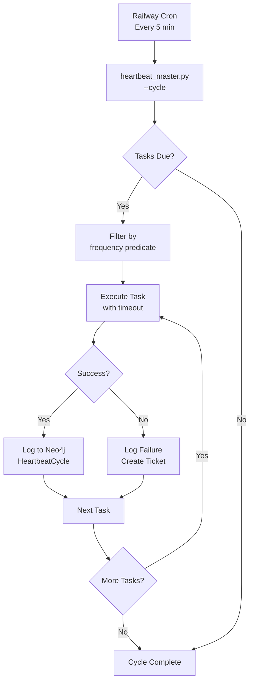

# Kurultai Unified Heartbeat Architecture

## System Overview

### What is the Unified Heartbeat?

The Unified Heartbeat is a consolidated background task scheduler that drives all agent operations in the Kurultai multi-agent system. It replaces the previous fragmented approach where each agent had separate scheduling mechanisms with a single 5-minute heartbeat cycle that coordinates all 6 agents and their 13 distinct background tasks.

### Why It Was Created

The unified heartbeat consolidates functionality from two major legacy systems:

1. **kurultai_0.3.md** - The original 4-tier curation system with complex 15-query operations
2. **JOCHI_TEST_AUTOMATION.md** - The separate test automation schedule

**Problems with the old approach:**
- Multiple schedulers competing for resources
- Overlapping cron jobs creating race conditions
- Unclear task ownership and responsibilities
- No centralized visibility into background operations
- Token budgets managed per-agent without system-wide coordination

### Key Benefits

| Benefit | Description |
|---------|-------------|
| **Single Scheduler** | One 5-minute cycle drives all background tasks, eliminating race conditions |
| **Clear Responsibilities** | Each agent has defined tasks with explicit frequency and token budgets |
| **Token Budgeting** | System-wide token allocation prevents runaway costs (~6,500 tokens/cycle max) |
| **Centralized Logging** | All task results logged to Neo4j with `HeartbeatCycle` and `TaskResult` nodes |
| **Failure Handling** | Automatic ticket creation for critical test failures |
| **Simplified Curation** | 4 operations instead of 15, with clear safety rules |

---

## Component Architecture

### UnifiedHeartbeat Class

**Location:** `/Users/kurultai/molt/tools/kurultai/heartbeat_master.py`

The core orchestrator that manages the heartbeat lifecycle.

```python
class UnifiedHeartbeat:
    CYCLE_MINUTES = 5
    DEFAULT_TIMEOUT_SECONDS = 60

    def __init__(self, neo4j_driver, project_root: Optional[str] = None):
        self.tasks: List[HeartbeatTask] = []
        self.cycle_count = 0
```

**Key Methods:**

| Method | Purpose |
|--------|---------|
| `register(task)` | Add a `HeartbeatTask` to the registry |
| `run_cycle()` | Execute one heartbeat cycle, running all due tasks |
| `_log_cycle(result)` | Persist cycle results to Neo4j |
| `run_daemon()` | Continuous daemon mode with 5-minute intervals |

### HeartbeatTask Dataclass

**Location:** `/Users/kurultai/molt/tools/kurultai/heartbeat_master.py`

Defines a task that runs on heartbeat with frequency-based scheduling.

```python
@dataclass
class HeartbeatTask:
    name: str                    # Task identifier
    agent: str                   # Agent owner (kublai, jochi, etc.)
    frequency_minutes: int       # 5, 15, 60, 360, 1440, 10080
    max_tokens: int              # Token budget for this task
    handler: Callable            # Async function(driver) -> result
    description: str             # Human-readable description
    enabled: bool = True         # Can be disabled per task
```

**Frequency Predicate:**
```python
def should_run(self, cycle_count: int) -> bool:
    if not self.enabled:
        return False
    return cycle_count % (self.frequency_minutes // 5) == 0
```

### Agent Task Registry

**Location:** `/Users/kurultai/molt/tools/kurultai/agent_tasks.py`

Registers all 13 background tasks across 6 agents.

### SimpleCuration Class

**Location:** `/Users/kurultai/molt/tools/kurultai/curation_simple.py`

Replaces the complex 15-query curation system with 4 simple, maintainable operations.

```python
class SimpleCuration:
    HOT_TOKENS = 1600
    WARM_TOKENS = 400
    COLD_TOKENS = 200

    MIN_AGE_HOURS = 24
    HIGH_CONFIDENCE = 0.9
```

**Safety Rules (NEVER delete):**
- Agent nodes
- Active tasks (in_progress, pending)
- High-confidence beliefs (>= 0.9)
- Entries < 24 hours old
- SystemConfig, AgentKey, Migration nodes

**Curation Operations:**

| Operation | Frequency | Purpose |
|-----------|-----------|---------|
| `curation_rapid()` | 5 min | Enforce budgets, clean notifications/sessions |
| `curation_standard()` | 15 min | Archive completed tasks, demote stale HOT |
| `curation_hourly()` | 60 min | Promote COLD entries, decay confidence |
| `curation_deep()` | 6 hours | Delete orphans, purge tombstones, archive COLD |

---

## Agent Background Task Registry

### Complete Task Listing

| Agent | Task Name | Frequency | Token Budget | Description |
|-------|-----------|-----------|--------------|-------------|
| **Ögedei** | health_check | 5 min | 150 | Check Neo4j, agent heartbeats, disk space |
| **Ögedei** | file_consistency | 15 min | 200 | Verify file consistency across agent workspaces |
| **Jochi** | memory_curation_rapid | 5 min | 300 | Enforce token budgets, clean notifications |
| **Jochi** | smoke_tests | 15 min | 800 | Run quick smoke tests via test runner |
| **Jochi** | full_tests | 60 min | 1500 | Run full test suite with remediation |
| **Jochi** | deep_curation | 6 hours | 2000 | Clean orphans, archive old data |
| **Chagatai** | reflection_consolidation | 30 min | 500 | Consolidate reflections when system idle |
| **Möngke** | knowledge_gap_analysis | 24 hours | 600 | Identify sparse knowledge areas |
| **Möngke** | ordo_sacer_research | 24 hours | 1200 | Research esoteric concepts for Ordo Sacer Astaci |
| **Möngke** | ecosystem_intelligence | 7 days | 2000 | Track OpenClaw/Clawdbot/Moltbot ecosystem |
| **Kublai** | status_synthesis | 5 min | 200 | Synthesize agent status, escalate critical issues |
| **System** | notion_sync | 60 min | 800 | Bidirectional Notion↔Neo4j task sync |

### Task Distribution by Frequency

```
Every 5 minutes (3 tasks):
  - Ögedei: health_check (150 tokens)
  - Jochi: memory_curation_rapid (300 tokens)
  - Kublai: status_synthesis (200 tokens)
  Subtotal: 650 tokens

Every 15 minutes (2 tasks):
  - Ögedei: file_consistency (200 tokens)
  - Jochi: smoke_tests (800 tokens)
  Subtotal: 1000 tokens

Every 30 minutes (1 task):
  - Chagatai: reflection_consolidation (500 tokens)
  Subtotal: 500 tokens

Every 60 minutes (2 tasks):
  - Jochi: full_tests (1500 tokens)
  - System: notion_sync (800 tokens)
  Subtotal: 2300 tokens

Every 6 hours (1 task):
  - Jochi: deep_curation (2000 tokens)
  Subtotal: 2000 tokens

Every 24 hours (2 tasks):
  - Möngke: knowledge_gap_analysis (600 tokens)
  - Möngke: ordo_sacer_research (1200 tokens)
  Subtotal: 1800 tokens

Every 7 days (1 task):
  - Möngke: ecosystem_intelligence (2000 tokens)
  Subtotal: 2000 tokens
```

### Peak Token Usage

The maximum token usage occurs at cycle numbers divisible by 288 (every 24 hours, when all frequencies align):

- **5-min tasks:** 650 tokens
- **15-min tasks:** 1000 tokens
- **30-min tasks:** 500 tokens
- **60-min tasks:** 2300 tokens
- **6-hour tasks:** 2000 tokens (if aligned)
- **24-hour tasks:** 1800 tokens

**Peak per cycle:** ~8,250 tokens (worst case, once per day)
**Average per cycle:** ~1,500 tokens

---

## Data Flow

### Heartbeat Execution Flow



### Neo4j Schema

**HeartbeatCycle Node:**
```cypher
CREATE (hc:HeartbeatCycle {
    id: "cycle-{number}-{timestamp}",
    cycle_number: 1234,
    started_at: datetime(),
    completed_at: datetime(),
    tasks_run: 5,
    tasks_succeeded: 4,
    tasks_failed: 1,
    total_tokens: 2450,
    duration_seconds: 45.2
})
```

**TaskResult Node:**
```cypher
CREATE (tr:TaskResult {
    agent: "jochi",
    task_name: "smoke_tests",
    status: "success",
    started_at: datetime(),
    summary: "Smoke tests: PASSED"
})
CREATE (hc)-[:HAS_RESULT]->(tr)
```

### Cycle Result Structure

```python
@dataclass
class CycleResult:
    cycle_number: int
    started_at: datetime
    completed_at: datetime
    tasks_run: int
    tasks_succeeded: int
    tasks_failed: int
    results: List[Dict]
    total_tokens: int
```

---

## Integration Points

### Railway Cron Configuration

**Schedule:** Every 5 minutes

```toml
# railway.toml
cronSchedule = "*/5 * * * *"
```

Or via Railway dashboard:
- **Schedule:** `*/5 * * * *`
- **Command:** `python tools/kurultai/heartbeat_master.py --cycle`

### Neo4j Integration

**Connection:**
- URI: `bolt://localhost:7687` (or `NEO4J_URI` env var)
- Auth: Username/password from environment

**Required Indexes:**
```cypher
CREATE INDEX heartbeat_cycle_number IF NOT EXISTS
FOR (hc:HeartbeatCycle) ON (hc.cycle_number);

CREATE INDEX task_result_agent IF NOT EXISTS
FOR (tr:TaskResult) ON (tr.agent);

CREATE INDEX task_result_status IF NOT EXISTS
FOR (tr:TaskResult) ON (tr.status);
```

### Ticket System Integration

**Critical Finding → Ticket Creation:**

When `jochi_full_tests` finds critical issues, it automatically creates tickets:

```python
async def _create_tickets_from_report(driver, report: Dict):
    tm = TicketManager(project_root)
    for finding in report.get("findings", {}).get("details", [])[:5]:
        if finding.get("severity") == "critical":
            tm.create_ticket(
                title=finding.get("title", "Critical Issue"),
                description=finding.get("description", ""),
                severity="critical",
                category=finding.get("category", "infrastructure"),
                source_agent="jochi",
                assign_to="temüjin" if finding.get("category") == "correctness" else "ögedei"
            )
```

### Notion Sync Integration

**Hourly bidirectional sync:**
- Pulls tasks from Notion into Neo4j
- Pushes Neo4j task updates to Notion
- Processes users with `notion_integration_enabled: true`

---

## Deployment Configuration

### Environment Variables

| Variable | Required | Default | Description |
|----------|----------|---------|-------------|
| `NEO4J_URI` | No | `bolt://localhost:7687` | Neo4j connection URI |
| `NEO4J_USER` | No | `neo4j` | Neo4j username |
| `NEO4J_PASSWORD` | **Yes** | - | Neo4j password |
| `PROJECT_ROOT` | No | `os.getcwd()` | Project root directory |

### File Paths

| Component | Path |
|-----------|------|
| Heartbeat Master | `/Users/kurultai/molt/tools/kurultai/heartbeat_master.py` |
| Agent Tasks | `/Users/kurultai/molt/tools/kurultai/agent_tasks.py` |
| Simple Curation | `/Users/kurultai/molt/tools/kurultai/curation_simple.py` |
| Test Runner | `/Users/kurultai/molt/tools/kurultai/test_runner_orchestrator.py` |
| Ticket Manager | `/Users/kurultai/molt/tools/kurultai/ticket_manager.py` |
| Notion Sync | `/Users/kurultai/molt/tools/notion_sync.py` |

### CLI Usage

```bash
# Register all tasks (run once at startup)
python tools/kurultai/heartbeat_master.py --setup

# Run one cycle (for cron/systemd)
python tools/kurultai/heartbeat_master.py --cycle

# Run continuous daemon
python tools/kurultai/heartbeat_master.py --daemon

# List all registered tasks
python tools/kurultai/heartbeat_master.py --list-tasks

# Run tasks for specific agent only
python tools/kurultai/heartbeat_master.py --cycle --agent jochi

# Output as JSON
python tools/kurultai/heartbeat_master.py --cycle --json
```

### railway.toml Example

```toml
[deploy]
cronSchedule = "*/5 * * * *"

[build]
builder = "nixpacks"

[env]
NEO4J_URI = "bolt://neo4j:7687"
NEO4J_USER = "neo4j"
```

---

## Agent Task Details

### Ögedei (Operations)

**health_check (5 min):**
- Verifies Neo4j connectivity
- Checks agent heartbeats (infra tier, 120s threshold)
- Monitors disk space (>90% critical, >75% warning)
- Returns health status with issue list

**file_consistency (15 min):**
- Scans all 6 agent workspaces
- Uses `OgedeiFileMonitor` for config drift detection
- Creates `FileConsistencyCheck` nodes in Neo4j
- Reports issues found per agent

### Jochi (Analyst)

**memory_curation_rapid (5 min):**
- Enforces HOT tier budget (1600 tokens)
- Deletes read notifications > 7 days
- Cleans inactive sessions > 24 hours

**smoke_tests (15 min):**
- Runs via `test_runner_orchestrator.py --phase integration`
- 5-minute timeout
- Quick health check on critical paths

**full_tests (60 min):**
- Runs via `test_runner_orchestrator.py --phase all`
- 15-minute timeout
- Creates tickets for critical findings
- Generates JSON reports

**deep_curation (6 hours):**
- Deletes orphaned nodes (no relationships, > 7 days)
- Purges tombstoned entries > 30 days
- Archives COLD tier to ARCHIVE

### Chagatai (Writer)

**reflection_consolidation (30 min):**
- Only runs when system idle (no active tasks in 30 min)
- Finds unconsolidated reflections
- Marks them as consolidated with timestamp

### Möngke (Researcher)

**knowledge_gap_analysis (24 hours):**
- Identifies topics with < 3 research findings
- Creates `KnowledgeGap` nodes with priority

**ordo_sacer_research (24 hours):**
- Rotates through 10 esoteric topics daily
- Creates `ResearchTask` nodes with tag `ordo_sacer`

**ecosystem_intelligence (7 days):**
- Tracks OpenClaw/Clawdbot/Moltbot developments
- Creates `IntelligenceReport` nodes
- Counts recent findings for metrics

### Kublai (Orchestrator)

**status_synthesis (5 min):**
- Aggregates last 12 heartbeat cycles (1 hour)
- Gets agent statuses from Neo4j
- Creates `StatusSynthesis` nodes
- Escalates if failures detected

### System

**notion_sync (60 min):**
- Bidirectional sync between Notion and Neo4j
- Processes users with Notion integration enabled
- Syncs task priorities, statuses, and new tasks

---

## Monitoring and Observability

### Key Metrics

| Metric | Source | Alert Threshold |
|--------|--------|-----------------|
| Cycle duration | `HeartbeatCycle.duration_seconds` | > 120s |
| Task failure rate | `tasks_failed / tasks_run` | > 10% |
| Token usage | `HeartbeatCycle.total_tokens` | > 5000/cycle |
| Agent heartbeat age | `Agent.infra_heartbeat` | > 120s |

### Query Examples

**Get last 10 cycles:**
```cypher
MATCH (hc:HeartbeatCycle)
RETURN hc.cycle_number, hc.tasks_run, hc.tasks_failed, hc.total_tokens
ORDER BY hc.cycle_number DESC
LIMIT 10;
```

**Get failed tasks:**
```cypher
MATCH (hc:HeartbeatCycle)-[:HAS_RESULT]->(tr:TaskResult)
WHERE tr.status = "error"
RETURN tr.agent, tr.task_name, tr.summary, hc.cycle_number
ORDER BY hc.cycle_number DESC
LIMIT 20;
```

**Get agent health over time:**
```cypher
MATCH (tr:TaskResult {agent: "jochi", task_name: "smoke_tests"})
RETURN tr.started_at, tr.status
ORDER BY tr.started_at DESC
LIMIT 100;
```

---

## Related Documentation

- [Two-Tier Heartbeat System](two-tier-heartbeat-system.md) - Infrastructure vs functional heartbeats
- [OpenClaw Gateway Architecture](openclaw-gateway-architecture.md) - WebSocket messaging layer
- [Delegation Protocol](delegation-protocol.md) - Task routing and agent selection
- [Golden Horde Consensus: Heartbeat Background Tasks](golden-horde-consensus-heartbeat-tasks.md) - Design deliberation process
