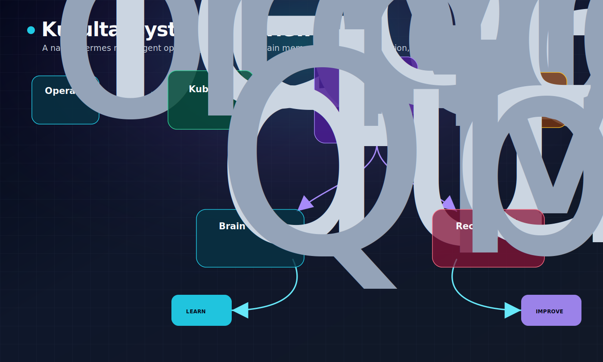
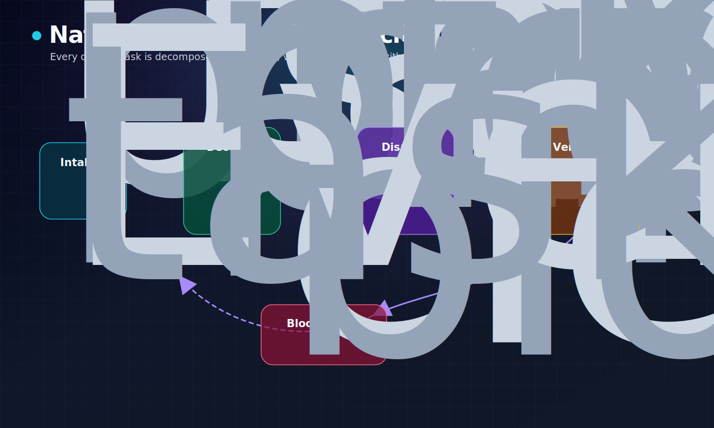
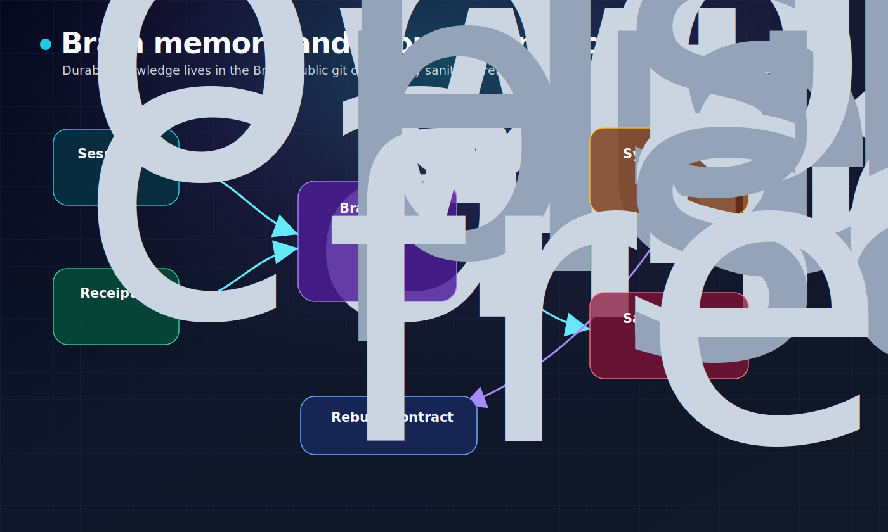
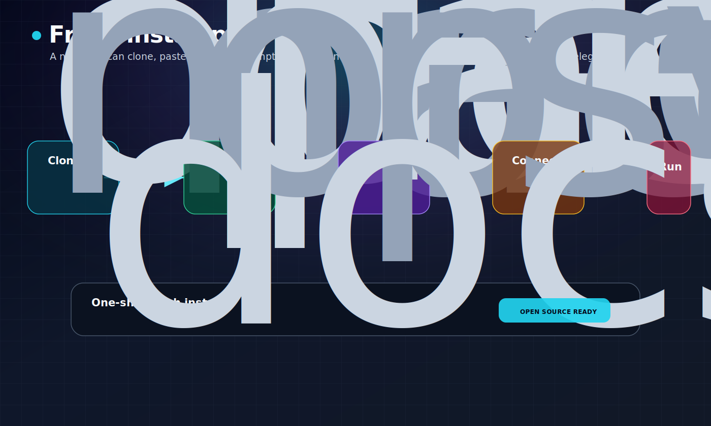
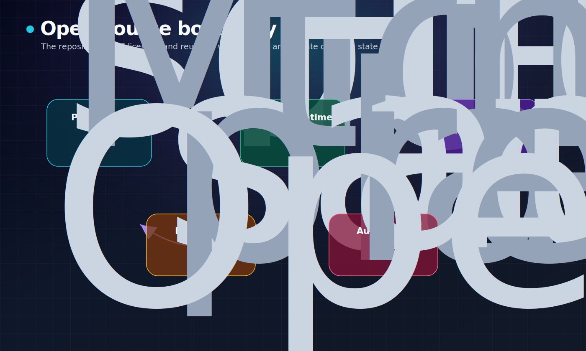

# Kurultai

[](LICENSE)
[](CONTRIBUTING.md)
[](https://hermes-agent.nousresearch.com/docs)

**Kurultai is an open-source operating layer for Hermes Agent and a Brain wiki.**

It packages the current Kublai/Kurultai way of running Hermes: a chair profile, specialist Hermes profiles, native Hermes Kanban, a durable Brain, cron-backed continuity, reusable skills, recovery receipts, and a safe rebuild contract that keeps private runtime state out of git.



## What Kurultai provides

- **Hermes-native multi-agent coordination** — profiles, tools, skills, sessions, gateway, cron, and native Kanban remain the runtime substrate.
- **Kublai as chair** — Kublai routes work, keeps synthesis coherent, verifies receipts, and reports one concise operator-facing result.
- **Specialist profiles** — Chagatai, Jochi, Temujin, Mongke, Ogedei, and Tolui handle research, analysis, implementation, review, operations, and local lightweight triage.
- **Brain wiki** — durable plans, receipts, research, synthesis, operations notes, and public/private index contracts.
- **Rebuildable configuration** — sanitized templates and manifests describe how to recreate the system without publishing secrets or live private state.
- **Recovery loop** — canaries, drift checks, low-token monitors, and review gates keep the system moving without turning automation into recklessness.

## Native Kanban lifecycle

Every meaningful piece of work gets a durable task record. The board is both the queue and the audit trail.



A normal task flow is:

1. Intake a user request, proposal, bug, research question, or runtime signal.
2. Decompose it into an explicit graph with owners and parent dependencies.
3. Dispatch ready tasks to capable Hermes profiles.
4. Capture logs, comments, blockers, child tasks, reviews, and completion receipts.
5. Fan results back into Kublai for one concise operator-facing synthesis.

Blocked tasks are not terminal. Kublai or an assigned resolver clears safe blockers, reassigns, splits work, or escalates with evidence.

## Brain and rebuild contract

Kurultai separates durable public architecture from private runtime state.



The Brain contains the long-term operating memory: plans, receipts, proposals, analyses, content artifacts, and status surfaces. This repository contains the **sanitized rebuild contract** for that system:

- `config/runtime-config/hermes.template.yaml` — non-secret Hermes runtime contract.
- `config/runtime-config/profiles.yaml` — Kurultai profile roster and model map.
- `config/runtime-config/kurultai.yaml` — native coordination contract.
- `config/runtime-config/brain.yaml` — Brain root, index, and gateway contract.
- `config/runtime-config/cron.manifest.json` — sanitized cron manifest.
- `config/runtime-config/skills.manifest.json` — skill inventory without secret-bearing state.
- `config/runtime-config/kanban.schema.json` — Kanban schema only, not live tasks.
- `config/runtime-config/brain.manifest.json` — directory inventory, not private note contents.

## Fresh install path

A fresh user can clone this repository and paste a single prompt into Claude Code, Codex, or another local coding agent. That prompt performs the setup while preserving the secret boundary.



```bash
git clone https://github.com/Danservfinn/kurultai.git
cd kurultai
```

Then paste this file into Claude Code or Codex:

```text
docs/operations/fresh-install-agent-prompt.md
```

The prompt covers:

- macOS, Linux, and Windows-native PowerShell installation.
- Hermes Agent installation and verification.
- frontier model configuration for Kublai and tool-capable profiles.
- Brain directory creation and index setup.
- Kurultai profile creation.
- local LLM lane selection for Tolui.
- Telegram BotFather and Hermes gateway setup.
- sanitized cron, skills, Kanban, receipt, and verification setup.

The installer must never commit secrets.

## Open-source boundary

Kurultai is open source under the MIT License. The project is designed so the useful system can be inspected, forked, and rebuilt without exposing private operator state.



Public repository contents include:

- source and scripts for the rebuild contract,
- docs and diagrams,
- runtime templates,
- sanitized manifests,
- runbooks,
- skill inventories.

Local/private contents must stay outside git:

- API keys and OAuth tokens,
- Telegram bot tokens and private chat IDs,
- live Hermes sessions,
- live Kanban databases,
- private Brain indexes,
- cookies, credentials, keys, and delivery targets,
- private operator memory.

See `.gitignore`, `docs/operations/kurultai-rebuild-runbook.md`, and `config/runtime-config/README.md` for the exact boundary.

## Profile roster

| Profile | Role | Default lane |
|---|---|---|
| `kublai` | caretaker / orchestrator / synthesis | frontier model |
| `chagatai` | research, writing, synthesis, content | frontier model |
| `jochi` | analysis, audit, scouting, alternatives | frontier model |
| `temujin` | implementation, tests, code repair | frontier model |
| `mongke` | review, risk, quality gates | frontier model |
| `ogedei` | operations, integration, runbooks | frontier model |
| `tolui` | local lightweight triage and summarization | local model, no tool-required work until verified |

## Repository map

```text
config/runtime-config/      sanitized runtime templates and manifests
docs/operations/            rebuild runbooks and fresh-install prompt
docs/assets/readme/         README diagrams
scripts/                    manifest export and rebuild staging helpers
```

## Development

Useful commands:

```bash
python3 scripts/bootstrap_kurultai_runtime.py --dry-run
python3 scripts/export_runtime_config_manifest.py
python3 scripts/export_rebuild_manifests.py
```

Before changing runtime contracts, inspect live Hermes and Brain state, preserve the secret boundary, and update the README diagrams when architecture changes.

## Contributing

Contributions are welcome. Keep these rules:

1. Do not commit secrets or live private runtime files.
2. Keep Hermes native profiles and Kanban as the coordination substrate unless a future architecture decision explicitly changes it.
3. Prefer sanitized templates, manifests, tests, and runbooks over local machine snapshots.
4. Preserve reversibility and auditable receipts for runtime-changing work.
5. Update diagrams and README when architecture changes.

See `CONTRIBUTING.md` for the contributor guide.

## License

MIT. See [`LICENSE`](LICENSE).
