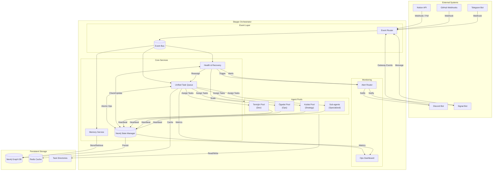
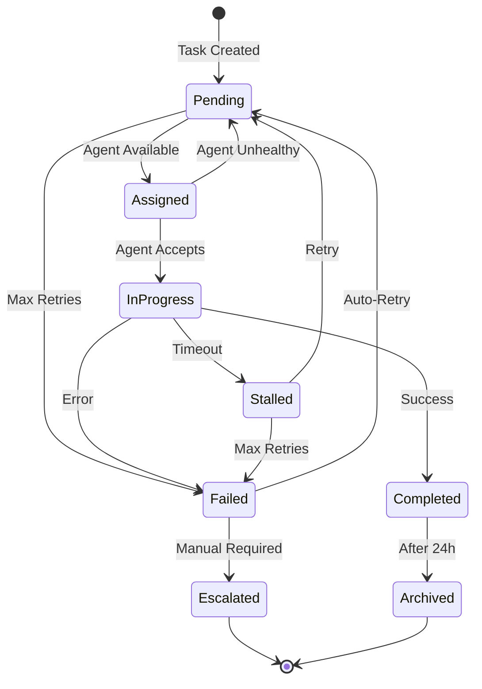
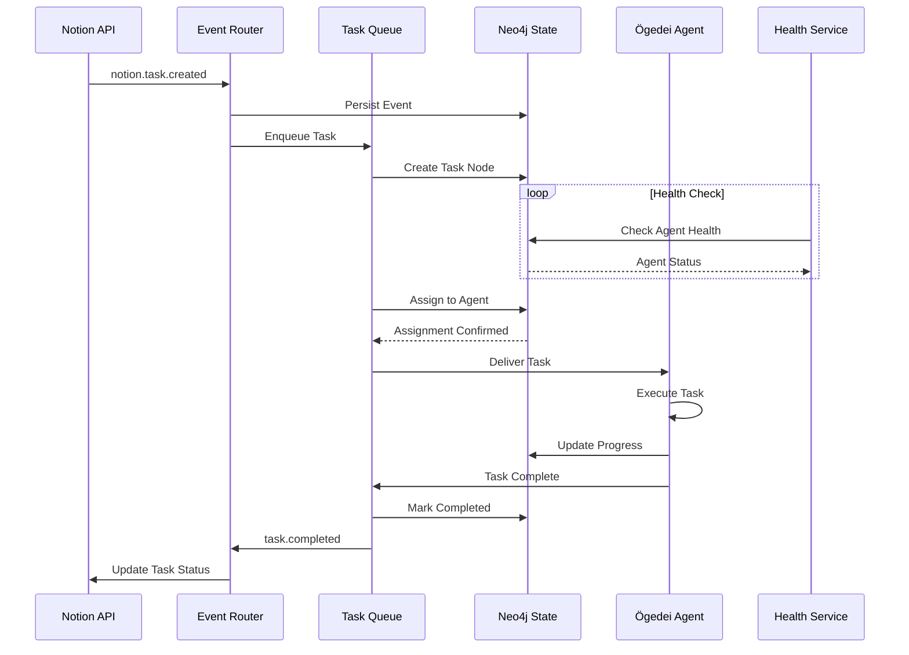
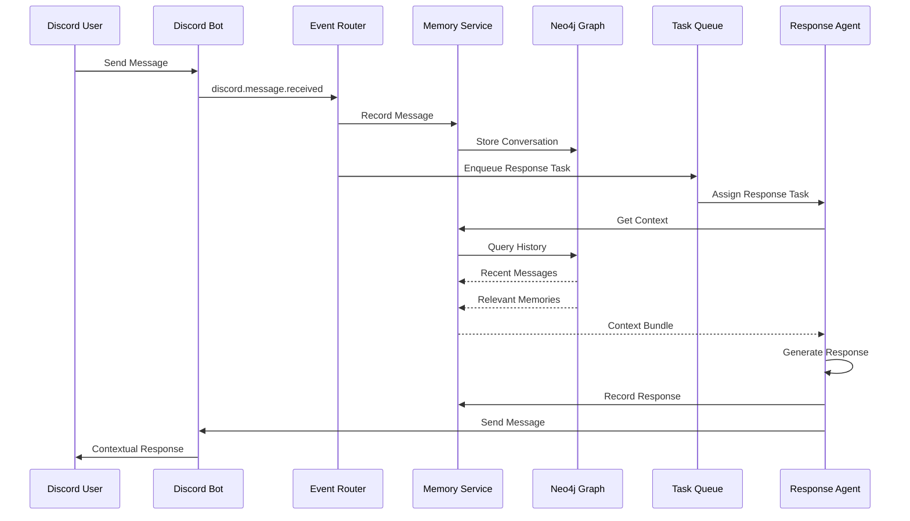
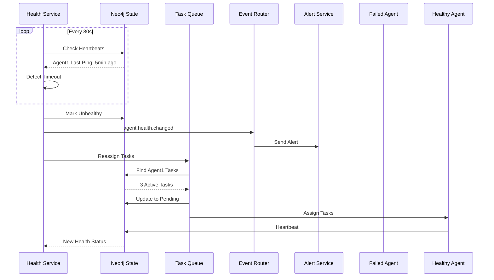
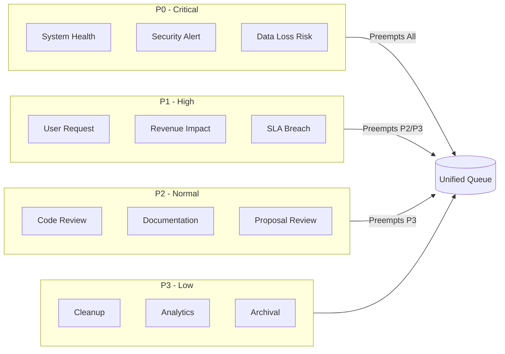
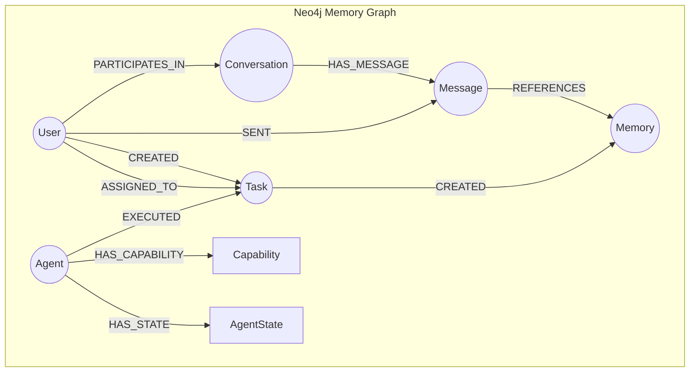
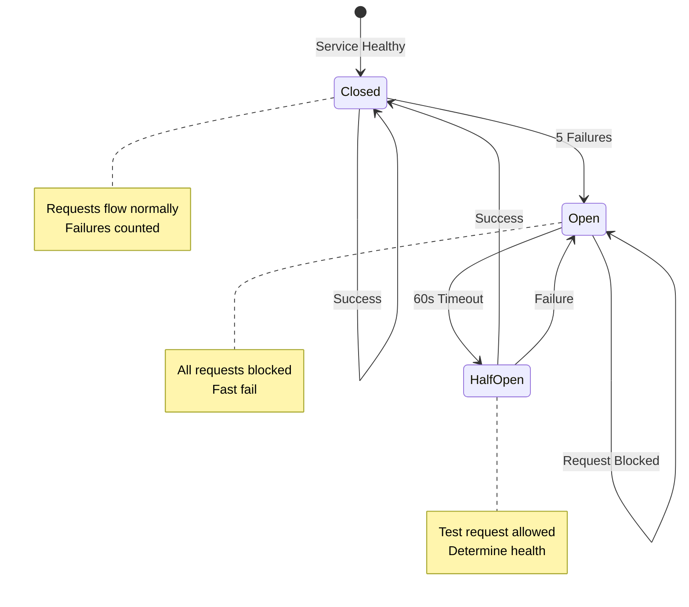
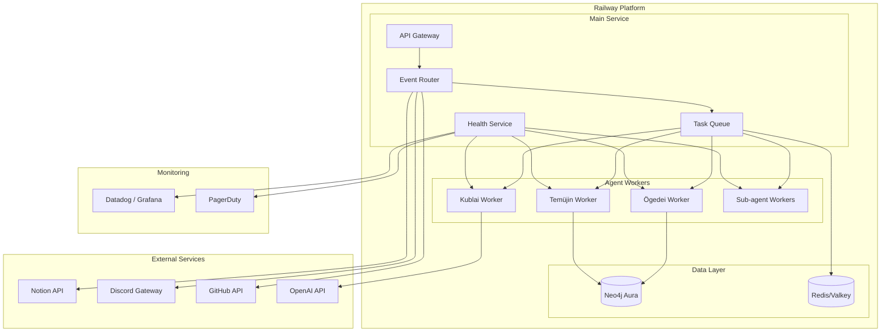
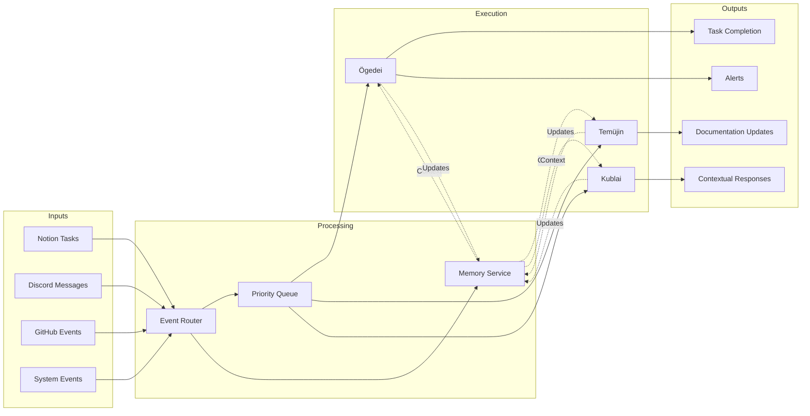

# Steppe Orchestrator - Architecture Diagram

## System Overview

## Task Lifecycle

## Event Flow Examples

### Notion Task → Agent Execution

### Discord Message → Contextual Response

### Health Failure → Auto-Recovery

## Priority Queue Structure

## Memory Graph Schema

## Circuit Breaker Pattern

## Deployment Architecture

## Data Flow Summary

