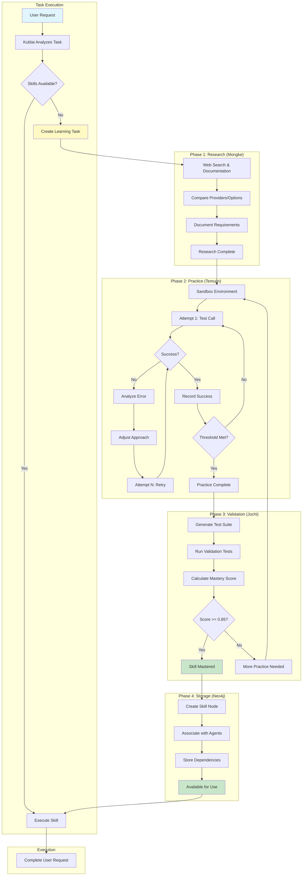
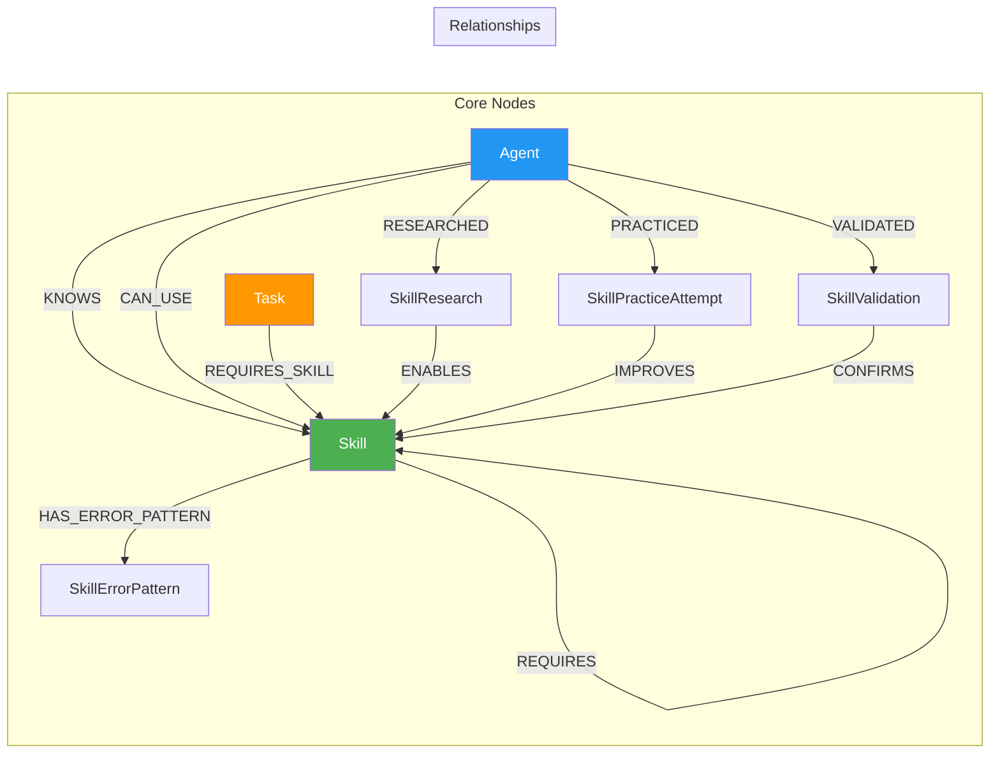
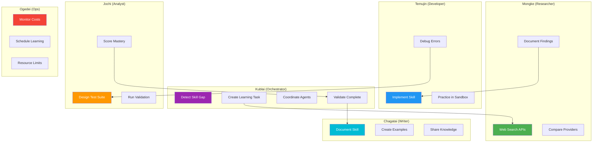
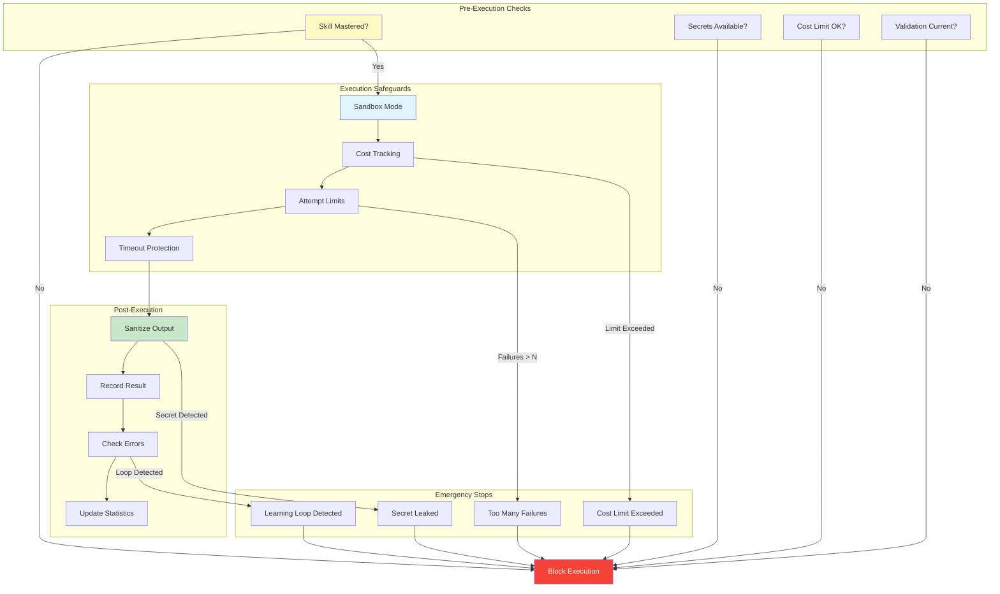
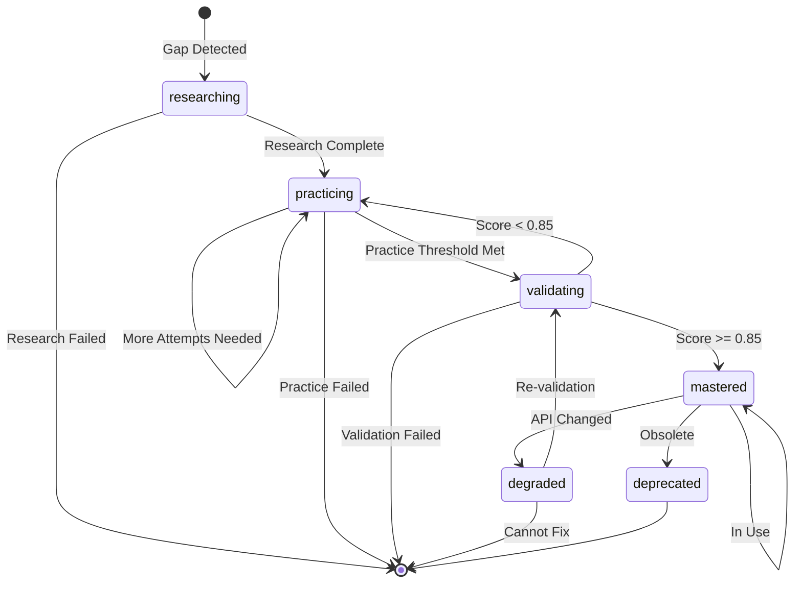
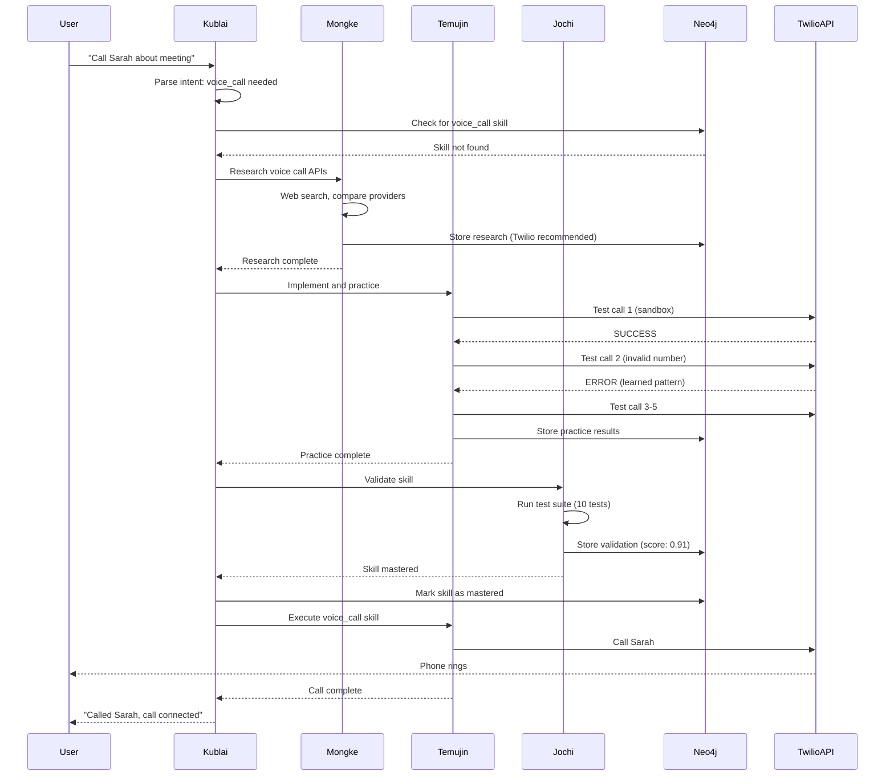
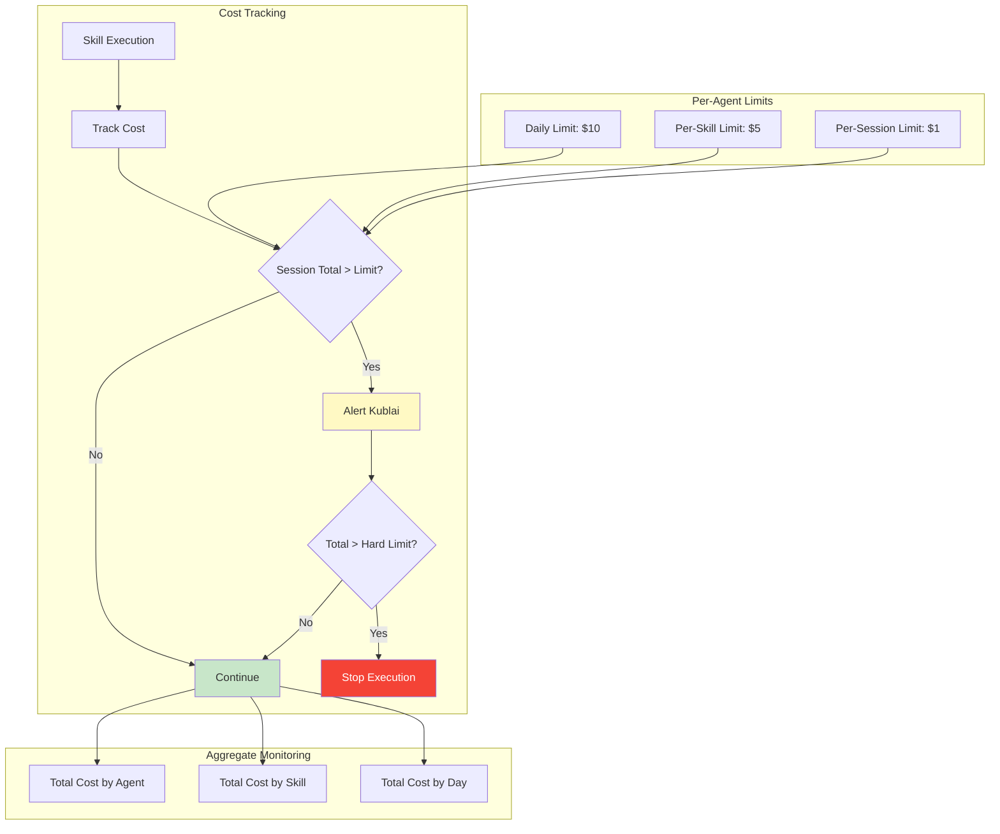

# Autonomous Skill Acquisition - System Architecture Diagrams

## 1. Complete Learning Loop Architecture

## 2. Neo4j Skill Schema

## 3. Agent Roles in Skill Learning

## 4. Safety Guardrails

## 5. Skill Lifecycle State Machine

## 6. Example: Learning to Call Someone

## 7. Cost Monitoring Architecture

