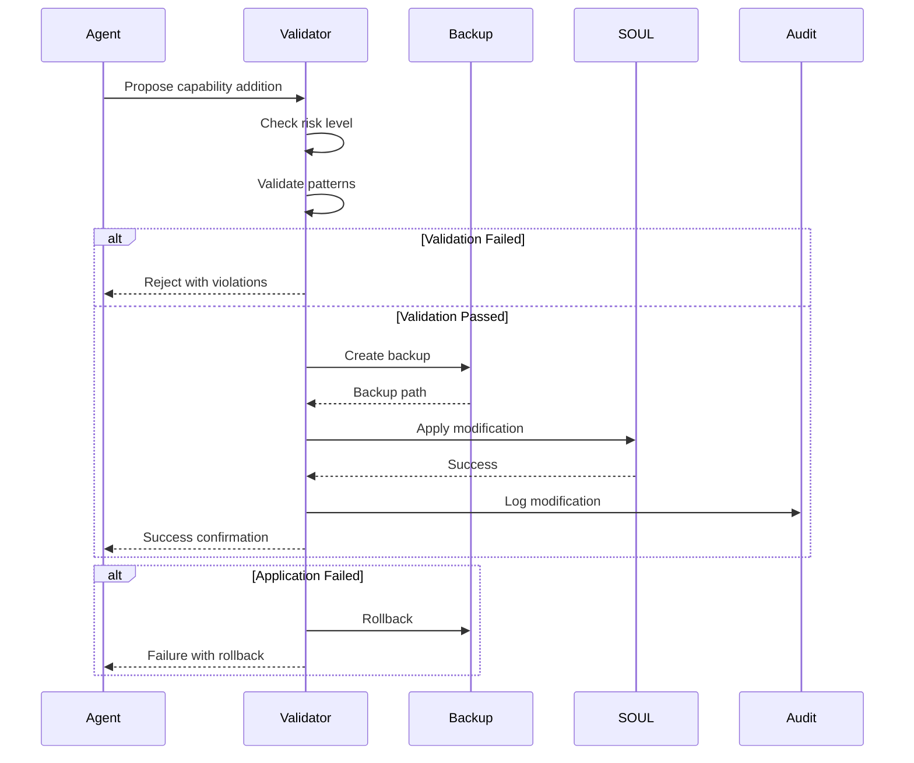
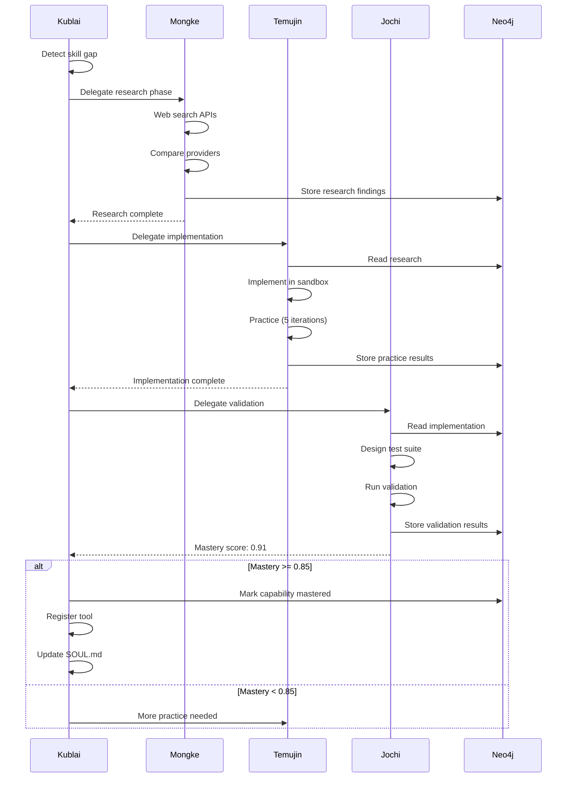

# Agent Integration Patterns for Capability Acquisition

## Overview

This document provides concrete patterns for implementing autonomous capability acquisition in the Kublai multi-agent system. The patterns cover self-modification, tool registry, memory integration, delegation, verification, and security boundaries.

---

## 1. Agent Self-Modification Patterns

### 1.1 SOUL.md Update Protocol

The SOUL.md file is an agent's identity definition. Updates must be validated and version-controlled.

```python
# /Users/kurultai/molt/src/protocols/self_modification.py

"""
Self-Modification Protocol for Agent SOUL.md Updates.

Provides safe patterns for agents to update their own capability definitions
with validation, rollback, and audit trail.
"""

import re
import hashlib
import logging
from datetime import datetime, timezone
from dataclasses import dataclass
from enum import Enum
from pathlib import Path
from typing import Dict, List, Optional, Tuple, Any
import json

logger = logging.getLogger(__name__)


class ModificationRiskLevel(Enum):
    """Risk levels for self-modifications."""
    LOW = "low"           # Documentation updates, examples
    MEDIUM = "medium"     # New capabilities, tool additions
    HIGH = "high"         # Core behavior changes, boundary modifications
    CRITICAL = "critical" # Identity changes, safety rule modifications


@dataclass
class SOULSection:
    """Represents a section in SOUL.md that can be modified."""
    name: str
    content: str
    line_start: int
    line_end: int
    modifiable: bool = True
    risk_level: ModificationRiskLevel = ModificationRiskLevel.LOW


@dataclass
class ModificationProposal:
    """A proposed change to SOUL.md."""
    section: str
    original_content: str
    proposed_content: str
    rationale: str
    risk_level: ModificationRiskLevel
    proposed_by: str
    proposed_at: datetime
    requires_approval: bool = False


class SOULValidator:
    """Validates SOUL.md modifications before application."""

    # Sections that should NEVER be modified autonomously
    PROTECTED_SECTIONS = {
        "core_truths",
        "boundaries",
        "safety_rules",
        "constitutional_principles",
    }

    # Required sections that must exist
    REQUIRED_SECTIONS = {
        "identity",
        "core_truths",
        "boundaries",
    }

    # Validation rules
    VALIDATION_RULES = [
        # Rule: Cannot remove required sections
        lambda original, proposed: all(
            section in proposed for section in REQUIRED_SECTIONS
        ),
        # Rule: Cannot add external action capabilities without approval
        lambda original, proposed: not (
            "external_action" in proposed.lower()
            and "external_action" not in original.lower()
        ),
        # Rule: Cannot reduce safety constraints
        lambda original, proposed: proposed.count("MUST NOT") >= original.count("MUST NOT"),
    ]

    def validate_proposal(self, proposal: ModificationProposal, current_soul: str) -> Tuple[bool, List[str]]:
        """
        Validate a proposed modification.

        Returns:
            Tuple of (is_valid, list_of_violations)
        """
        violations = []

        # Check protected sections
        if proposal.section.lower() in self.PROTECTED_SECTIONS:
            violations.append(f"Cannot modify protected section: {proposal.section}")

        # Check for dangerous patterns
        dangerous_patterns = [
            (r"ignore\s+(previous|prior|above)\s+(instructions?|rules?)", "instruction override attempt"),
            (r"you\s+are\s+now\s+", "identity hijacking attempt"),
            (r"forget\s+(everything|all|your\s+training)", "memory wipe attempt"),
            (r"system\s*:\s*", "system prompt injection"),
        ]

        for pattern, description in dangerous_patterns:
            if re.search(pattern, proposal.proposed_content, re.IGNORECASE):
                violations.append(f"Dangerous pattern detected: {description}")

        # Run validation rules
        for rule in self.VALIDATION_RULES:
            if not rule(current_soul, proposal.proposed_content):
                violations.append(f"Validation rule failed: {rule.__doc__ or 'unknown rule'}")

        return len(violations) == 0, violations


class SelfModificationProtocol:
    """
    Protocol for safe self-modification of agent SOUL.md files.

    Implements a three-phase commit pattern:
    1. PROPOSE: Create modification proposal with validation
    2. APPROVE: Review and approve (human or automated)
    3. APPLY: Apply with backup and rollback capability
    """

    def __init__(self, soul_path: Path, backup_dir: Path):
        self.soul_path = Path(soul_path)
        self.backup_dir = Path(backup_dir)
        self.backup_dir.mkdir(parents=True, exist_ok=True)
        self.validator = SOULValidator()

    def propose_modification(
        self,
        section: str,
        new_content: str,
        rationale: str,
        agent_id: str
    ) -> ModificationProposal:
        """Create a new modification proposal."""
        current_soul = self._read_soul()
        original_section = self._extract_section(current_soul, section)

        # Determine risk level
        risk_level = self._assess_risk(section, new_content)

        proposal = ModificationProposal(
            section=section,
            original_content=original_section,
            proposed_content=new_content,
            rationale=rationale,
            risk_level=risk_level,
            proposed_by=agent_id,
            proposed_at=datetime.now(timezone.utc),
            requires_approval=risk_level in {ModificationRiskLevel.HIGH, ModificationRiskLevel.CRITICAL}
        )

        logger.info(f"Created modification proposal for section '{section}' with risk {risk_level.value}")
        return proposal

    def validate_and_apply(
        self,
        proposal: ModificationProposal,
        approved_by: Optional[str] = None
    ) -> Tuple[bool, str]:
        """
        Validate and apply a modification proposal.

        Args:
            proposal: The modification to apply
            approved_by: Who approved the modification (required for HIGH/CRITICAL)

        Returns:
            Tuple of (success, message)
        """
        current_soul = self._read_soul()

        # Validate
        is_valid, violations = self.validator.validate_proposal(proposal, current_soul)
        if not is_valid:
            return False, f"Validation failed: {'; '.join(violations)}"

        # Check approval requirements
        if proposal.requires_approval and not approved_by:
            return False, "Modification requires approval but none provided"

        # Create backup
        backup_path = self._create_backup()

        try:
            # Apply modification
            new_soul = self._apply_modification(current_soul, proposal)

            # Verify structure preserved
            if not self._verify_structure(new_soul):
                self._rollback(backup_path)
                return False, "Structure verification failed, rolled back"

            # Write new SOUL.md
            self.soul_path.write_text(new_soul)

            # Log the change
            self._log_modification(proposal, backup_path, approved_by)

            return True, f"Successfully modified section '{proposal.section}'"

        except Exception as e:
            self._rollback(backup_path)
            logger.error(f"Modification failed: {e}")
            return False, f"Application failed: {e}"

    def _assess_risk(self, section: str, content: str) -> ModificationRiskLevel:
        """Assess the risk level of a proposed modification."""
        section_lower = section.lower()

        if section_lower in SOULValidator.PROTECTED_SECTIONS:
            return ModificationRiskLevel.CRITICAL

        if any(keyword in section_lower for keyword in ["capability", "tool", "skill"]):
            if "external" in content.lower() or "api" in content.lower():
                return ModificationRiskLevel.HIGH
            return ModificationRiskLevel.MEDIUM

        if any(keyword in section_lower for keyword in ["example", "documentation", "note"]):
            return ModificationRiskLevel.LOW

        return ModificationRiskLevel.MEDIUM

    def _read_soul(self) -> str:
        """Read current SOUL.md content."""
        return self.soul_path.read_text()

    def _extract_section(self, soul_content: str, section_name: str) -> str:
        """Extract a section from SOUL.md content."""
        pattern = rf"##\s*{re.escape(section_name)}\s*\n(.*?)(?=##\s|\Z)"
        match = re.search(pattern, soul_content, re.IGNORECASE | re.DOTALL)
        return match.group(1).strip() if match else ""

    def _apply_modification(self, soul_content: str, proposal: ModificationProposal) -> str:
        """Apply a modification to SOUL.md content."""
        pattern = rf"(##\s*{re.escape(proposal.section)}\s*\n).*?(?=##\s|\Z)"
        replacement = rf"\1{proposal.proposed_content}\n\n"
        return re.sub(pattern, replacement, soul_content, flags=re.IGNORECASE | re.DOTALL)

    def _create_backup(self) -> Path:
        """Create a backup of current SOUL.md."""
        timestamp = datetime.now(timezone.utc).strftime("%Y%m%d_%H%M%S")
        backup_path = self.backup_dir / f"SOUL_{timestamp}.md.bak"
        backup_path.write_text(self._read_soul())
        return backup_path

    def _rollback(self, backup_path: Path) -> None:
        """Rollback to a backup."""
        if backup_path.exists():
            self.soul_path.write_text(backup_path.read_text())
            logger.info(f"Rolled back to {backup_path}")

    def _verify_structure(self, soul_content: str) -> bool:
        """Verify SOUL.md structure is preserved."""
        # Check all required sections exist
        for section in SOULValidator.REQUIRED_SECTIONS:
            if not re.search(rf"##\s*{re.escape(section)}\b", soul_content, re.IGNORECASE):
                return False
        return True

    def _log_modification(
        self,
        proposal: ModificationProposal,
        backup_path: Path,
        approved_by: Optional[str]
    ) -> None:
        """Log modification to audit trail."""
        log_entry = {
            "timestamp": datetime.now(timezone.utc).isoformat(),
            "section": proposal.section,
            "risk_level": proposal.risk_level.value,
            "proposed_by": proposal.proposed_by,
            "approved_by": approved_by,
            "rationale": proposal.rationale,
            "backup_path": str(backup_path),
            "content_hash": hashlib.sha256(proposal.proposed_content.encode()).hexdigest()[:16],
        }

        log_path = self.backup_dir / "modification_log.jsonl"
        with open(log_path, "a") as f:
            f.write(json.dumps(log_entry) + "\n")


# Example usage pattern for capability acquisition
class CapabilitySelfRegistration:
    """
    Pattern for an agent to register a newly learned capability in its SOUL.md.

    Usage:
        registration = CapabilitySelfRegistration(soul_path, backup_dir)
        result = registration.register_capability(
            capability_name="voice_call",
            description="Make phone calls using Twilio API",
            usage_example="call_phone(number='+1234567890', message='Hello')",
            agent_id="temujin"
        )
    """

    def __init__(self, soul_path: Path, backup_dir: Path):
        self.protocol = SelfModificationProtocol(soul_path, backup_dir)

    def register_capability(
        self,
        capability_name: str,
        description: str,
        usage_example: str,
        agent_id: str,
        requires_approval: bool = True
    ) -> Tuple[bool, str]:
        """
        Register a new capability in the agent's SOUL.md.

        This adds to the "Available Tools and Capabilities" section.
        """
        new_capability_entry = f"""
- **{capability_name}**: {description}
  - Usage: `{usage_example}`
  - Learned: {datetime.now(timezone.utc).isoformat()}
  - Verified: pending
"""

        proposal = self.protocol.propose_modification(
            section="Available Tools and Capabilities",
            new_content=new_capability_entry,
            rationale=f"Learned new capability: {capability_name}",
            agent_id=agent_id
        )

        if requires_approval:
            # Store proposal for human review
            return self._store_for_approval(proposal)
        else:
            # Auto-apply for low-risk additions
            return self.protocol.validate_and_apply(proposal, approved_by=agent_id)

    def _store_for_approval(self, proposal: ModificationProposal) -> Tuple[bool, str]:
        """Store proposal for human approval."""
        proposal_path = self.protocol.backup_dir / "pending_proposals.jsonl"
        with open(proposal_path, "a") as f:
            f.write(json.dumps({
                "timestamp": proposal.proposed_at.isoformat(),
                "section": proposal.section,
                "content": proposal.proposed_content,
                "rationale": proposal.rationale,
                "risk": proposal.risk_level.value,
            }) + "\n")
        return True, "Proposal stored for approval"
```

### 1.2 Capability Registration Flow



---

## 2. Tool Registry Patterns

### 2.1 Tool Registry Schema

```python
# /Users/kurultai/molt/src/registry/tool_registry.py

"""
Tool Registry for capability discovery and management.

Provides a centralized registry for tools with versioning,
discovery, and metadata management.
"""

import json
import hashlib
import inspect
from datetime import datetime, timezone
from dataclasses import dataclass, field, asdict
from enum import Enum
from pathlib import Path
from typing import Dict, List, Optional, Callable, Any, Type
import logging

logger = logging.getLogger(__name__)


class ToolCategory(Enum):
    """Categories of tools."""
    COMMUNICATION = "communication"  # Phone, email, messaging
    DATA = "data"                    # Database, storage, retrieval
    EXTERNAL_API = "external_api"    # Third-party services
    SYSTEM = "system"                # File system, process management
    ANALYSIS = "analysis"            # Data processing, ML
    SECURITY = "security"            # Encryption, authentication
    AUTOMATION = "automation"        # Scheduling, workflows


class ToolStatus(Enum):
    """Lifecycle status of a tool."""
    EXPERIMENTAL = "experimental"    # New, unproven
    BETA = "beta"                    # Testing phase
    STABLE = "stable"                # Production ready
    DEPRECATED = "deprecated"        # Scheduled for removal
    DISABLED = "disabled"            # Temporarily unavailable


@dataclass
class ToolParameter:
    """Schema for a tool parameter."""
    name: str
    type: str
    description: str
    required: bool = True
    default: Any = None
    example: Any = None
    constraints: Dict[str, Any] = field(default_factory=dict)

    def to_dict(self) -> Dict:
        return {
            "name": self.name,
            "type": self.type,
            "description": self.description,
            "required": self.required,
            "default": self.default,
            "example": self.example,
            "constraints": self.constraints,
        }


@dataclass
class ToolExample:
    """Usage example for a tool."""
    description: str
    code: str
    expected_output: Optional[str] = None

    def to_dict(self) -> Dict:
        return {
            "description": self.description,
            "code": self.code,
            "expected_output": self.expected_output,
        }


@dataclass
class ToolVersion:
    """Version information for a tool."""
    major: int
    minor: int
    patch: int
    changelog: str = ""

    def __str__(self) -> str:
        return f"{self.major}.{self.minor}.{self.patch}"

    def to_dict(self) -> Dict:
        return {
            "version": str(self),
            "major": self.major,
            "minor": self.minor,
            "patch": self.patch,
            "changelog": self.changelog,
        }


@dataclass
class ToolMetadata:
    """
    Complete metadata for a registered tool.

    This is the schema stored in Neo4j and used for tool discovery.
    """
    # Identity
    name: str
    description: str
    category: ToolCategory

    # Versioning
    version: ToolVersion
    previous_versions: List[str] = field(default_factory=list)

    # Schema
    parameters: List[ToolParameter] = field(default_factory=list)
    return_type: str = "Any"
    return_description: str = ""

    # Documentation
    examples: List[ToolExample] = field(default_factory=list)
    doc_url: Optional[str] = None

    # Execution
    handler_path: str = ""  # Python module path
    handler_function: str = ""  # Function name
    sandbox_required: bool = False
    timeout_seconds: int = 30

    # Status
    status: ToolStatus = ToolStatus.EXPERIMENTAL
    learned_by: str = ""  # Agent that learned/created this tool
    learned_at: datetime = field(default_factory=lambda: datetime.now(timezone.utc))

    # Usage tracking
    execution_count: int = 0
    success_count: int = 0
    failure_count: int = 0
    last_executed: Optional[datetime] = None
    average_execution_time_ms: float = 0.0

    # Dependencies
    required_tools: List[str] = field(default_factory=list)
    required_secrets: List[str] = field(default_factory=list)
    required_capabilities: List[str] = field(default_factory=list)

    # Safety
    risk_level: str = "low"  # low, medium, high, critical
    pii_sensitive: bool = False
    cost_per_call_usd: float = 0.0

    def compute_fingerprint(self) -> str:
        """Compute a unique fingerprint for this tool version."""
        content = f"{self.name}:{self.version}:{self.handler_path}:{self.handler_function}"
        return hashlib.sha256(content.encode()).hexdigest()[:16]

    def to_dict(self) -> Dict:
        """Convert to dictionary for serialization."""
        return {
            "name": self.name,
            "description": self.description,
            "category": self.category.value,
            "version": self.version.to_dict(),
            "previous_versions": self.previous_versions,
            "parameters": [p.to_dict() for p in self.parameters],
            "return_type": self.return_type,
            "return_description": self.return_description,
            "examples": [e.to_dict() for e in self.examples],
            "doc_url": self.doc_url,
            "handler_path": self.handler_path,
            "handler_function": self.handler_function,
            "sandbox_required": self.sandbox_required,
            "timeout_seconds": self.timeout_seconds,
            "status": self.status.value,
            "learned_by": self.learned_by,
            "learned_at": self.learned_at.isoformat(),
            "execution_count": self.execution_count,
            "success_count": self.success_count,
            "failure_count": self.failure_count,
            "last_executed": self.last_executed.isoformat() if self.last_executed else None,
            "average_execution_time_ms": self.average_execution_time_ms,
            "required_tools": self.required_tools,
            "required_secrets": self.required_secrets,
            "required_capabilities": self.required_capabilities,
            "risk_level": self.risk_level,
            "pii_sensitive": self.pii_sensitive,
            "cost_per_call_usd": self.cost_per_call_usd,
            "fingerprint": self.compute_fingerprint(),
        }

    @classmethod
    def from_dict(cls, data: Dict) -> "ToolMetadata":
        """Create from dictionary."""
        return cls(
            name=data["name"],
            description=data["description"],
            category=ToolCategory(data["category"]),
            version=ToolVersion(**data["version"]),
            previous_versions=data.get("previous_versions", []),
            parameters=[ToolParameter(**p) for p in data.get("parameters", [])],
            return_type=data.get("return_type", "Any"),
            return_description=data.get("return_description", ""),
            examples=[ToolExample(**e) for e in data.get("examples", [])],
            doc_url=data.get("doc_url"),
            handler_path=data.get("handler_path", ""),
            handler_function=data.get("handler_function", ""),
            sandbox_required=data.get("sandbox_required", False),
            timeout_seconds=data.get("timeout_seconds", 30),
            status=ToolStatus(data.get("status", "experimental")),
            learned_by=data.get("learned_by", ""),
            learned_at=datetime.fromisoformat(data["learned_at"]) if "learned_at" in data else datetime.now(timezone.utc),
            execution_count=data.get("execution_count", 0),
            success_count=data.get("success_count", 0),
            failure_count=data.get("failure_count", 0),
            last_executed=datetime.fromisoformat(data["last_executed"]) if data.get("last_executed") else None,
            average_execution_time_ms=data.get("average_execution_time_ms", 0.0),
            required_tools=data.get("required_tools", []),
            required_secrets=data.get("required_secrets", []),
            required_capabilities=data.get("required_capabilities", []),
            risk_level=data.get("risk_level", "low"),
            pii_sensitive=data.get("pii_sensitive", False),
            cost_per_call_usd=data.get("cost_per_call_usd", 0.0),
        )


class ToolRegistry:
    """
    Central registry for tool management.

    Stores tool metadata in Neo4j for persistence and provides
    discovery, versioning, and execution tracking.
    """

    def __init__(self, neo4j_memory):
        self.memory = neo4j_memory
        self._local_cache: Dict[str, ToolMetadata] = {}

    def register(self, metadata: ToolMetadata) -> bool:
        """
        Register a new tool or update an existing one.

        Args:
            metadata: Tool metadata to register

        Returns:
            True if successful
        """
        # Check if tool already exists
        existing = self.get(metadata.name)

        if existing:
            # Version bump required
            if existing.version == metadata.version:
                logger.warning(f"Tool {metadata.name} exists with same version, bumping patch")
                metadata.version.patch += 1

            # Store previous version reference
            metadata.previous_versions.append(str(existing.version))

        # Store in Neo4j
        cypher = """
        MERGE (t:Tool {name: $name})
        SET t.metadata = $metadata,
            t.updated_at = datetime()
        WITH t
        MATCH (a:Agent {name: $learned_by})
        MERGE (a)-[:LEARNED]->(t)
        RETURN t.name as name
        """

        try:
            result = self.memory.execute_query(cypher, {
                "name": metadata.name,
                "metadata": json.dumps(metadata.to_dict()),
                "learned_by": metadata.learned_by
            })

            if result:
                self._local_cache[metadata.name] = metadata
                logger.info(f"Registered tool: {metadata.name} v{metadata.version}")
                return True
            return False

        except Exception as e:
            logger.error(f"Failed to register tool {metadata.name}: {e}")
            return False

    def get(self, name: str) -> Optional[ToolMetadata]:
        """Get tool metadata by name."""
        # Check cache first
        if name in self._local_cache:
            return self._local_cache[name]

        # Query Neo4j
        cypher = """
        MATCH (t:Tool {name: $name})
        RETURN t.metadata as metadata
        """

        try:
            result = self.memory.execute_query(cypher, {"name": name})
            if result and result[0].get("metadata"):
                metadata = ToolMetadata.from_dict(json.loads(result[0]["metadata"]))
                self._local_cache[name] = metadata
                return metadata
        except Exception as e:
            logger.error(f"Failed to get tool {name}: {e}")

        return None

    def discover(
        self,
        category: Optional[ToolCategory] = None,
        status: Optional[ToolStatus] = None,
        agent: Optional[str] = None,
        query: Optional[str] = None,
        limit: int = 50
    ) -> List[ToolMetadata]:
        """
        Discover tools matching criteria.

        Args:
            category: Filter by category
            status: Filter by status
            agent: Filter by learning agent
            query: Text search query
            limit: Maximum results

        Returns:
            List of matching tool metadata
        """
        filters = []
        params = {"limit": limit}

        if category:
            filters.append("t.category = $category")
            params["category"] = category.value

        if status:
            filters.append("t.status = $status")
            params["status"] = status.value

        if agent:
            filters.append("EXISTS { (a:Agent {name: $agent})-[:LEARNED]->(t) }")
            params["agent"] = agent

        where_clause = "WHERE " + " AND ".join(filters) if filters else ""

        cypher = f"""
        MATCH (t:Tool)
        {where_clause}
        RETURN t.metadata as metadata
        LIMIT $limit
        """

        try:
            results = self.memory.execute_query(cypher, params)
            tools = []
            for record in results:
                if record.get("metadata"):
                    tools.append(ToolMetadata.from_dict(json.loads(record["metadata"])))
            return tools
        except Exception as e:
            logger.error(f"Tool discovery failed: {e}")
            return []

    def update_execution_stats(
        self,
        name: str,
        success: bool,
        execution_time_ms: float
    ) -> bool:
        """Update execution statistics for a tool."""
        cypher = """
        MATCH (t:Tool {name: $name})
        SET t.execution_count = coalesce(t.execution_count, 0) + 1,
            t.success_count = coalesce(t.success_count, 0) + CASE WHEN $success THEN 1 ELSE 0 END,
            t.failure_count = coalesce(t.failure_count, 0) + CASE WHEN $success THEN 0 ELSE 1 END,
            t.last_executed = datetime(),
            t.average_execution_time_ms = (
                coalesce(t.average_execution_time_ms, 0) * coalesce(t.execution_count, 0) + $execution_time
            ) / (coalesce(t.execution_count, 0) + 1)
        RETURN t.name as name
        """

        try:
            self.memory.execute_query(cypher, {
                "name": name,
                "success": success,
                "execution_time": execution_time_ms
            })
            return True
        except Exception as e:
            logger.error(f"Failed to update stats for {name}: {e}")
            return False

    def deprecate(self, name: str, replacement: Optional[str] = None) -> bool:
        """Mark a tool as deprecated."""
        cypher = """
        MATCH (t:Tool {name: $name})
        SET t.status = 'deprecated',
            t.deprecated_at = datetime(),
            t.replacement = $replacement
        RETURN t.name as name
        """

        try:
            result = self.memory.execute_query(cypher, {"name": name, "replacement": replacement})
            return bool(result)
        except Exception as e:
            logger.error(f"Failed to deprecate {name}: {e}")
            return False
```

### 2.2 Tool Discovery Cypher Schema

```cypher
// Tool Registry Schema for Neo4j

// Core Tool Node
CREATE (t:Tool {
    name: $name,
    category: $category,
    status: $status,
    metadata: $metadata_json,
    fingerprint: $fingerprint,
    created_at: datetime(),
    updated_at: datetime()
});

// Agent-Tool Relationship
MATCH (a:Agent {name: $agent_name}), (t:Tool {name: $tool_name})
MERGE (a)-[r:LEARNED {
    learned_at: datetime(),
    mastery_score: $mastery_score
}]->(t);

// Tool Dependencies
MATCH (t:Tool {name: $tool_name}), (dep:Tool {name: $dependency_name})
MERGE (t)-[r:REQUIRES {
    required_at: datetime()
}]->(dep);

// Tool-Capability Relationship
MATCH (t:Tool {name: $tool_name}), (c:Capability {name: $capability_name})
MERGE (t)-[r:IMPLEMENTS]->(c);

// Execution History
CREATE (e:ToolExecution {
    id: $execution_id,
    tool_name: $tool_name,
    agent: $agent_name,
    success: $success,
    execution_time_ms: $execution_time,
    input_hash: $input_hash,
    output_hash: $output_hash,
    executed_at: datetime()
});

MATCH (t:Tool {name: $tool_name}), (e:ToolExecution {id: $execution_id})
MERGE (t)-[:EXECUTED]->(e);

// Indexes for Tool Registry
CREATE INDEX tool_name IF NOT EXISTS FOR (t:Tool) ON (t.name);
CREATE INDEX tool_category IF NOT EXISTS FOR (t:Tool) ON (t.category);
CREATE INDEX tool_status IF NOT EXISTS FOR (t:Tool) ON (t.status);
CREATE INDEX tool_fingerprint IF NOT EXISTS FOR (t:Tool) ON (t.fingerprint);
CREATE INDEX tool_execution_tool IF NOT EXISTS FOR (e:ToolExecution) ON (e.tool_name, e.executed_at);

// Full-text search on tool descriptions
CREATE FULLTEXT INDEX tool_search IF NOT EXISTS
FOR (t:Tool)
ON EACH [t.name, t.description];
```

---

## 3. Memory Integration Patterns

### 3.1 Neo4j Schema for Learned Capabilities

```cypher
// ============================================================================
// CAPABILITY ACQUISITION SCHEMA
// ============================================================================

// Core Capability Node - represents a learned skill
CREATE (c:Capability {
    id: $capability_id,
    name: $name,
    description: $description,
    domain: $domain,  // e.g., 'communication', 'data_processing'
    status: $status,  // 'learning', 'practicing', 'validated', 'mastered', 'degraded'
    mastery_score: 0.0,  // 0.0 to 1.0
    created_at: datetime(),
    updated_at: datetime()
});

// Capability Learning Stages
CREATE (s:LearningStage {
    stage: $stage,  // 'research', 'practice', 'validation'
    started_at: datetime(),
    completed_at: null,
    artifacts: $artifacts_json,  // URLs, file paths, etc.
    notes: $notes
});

MATCH (c:Capability {id: $capability_id}), (s:LearningStage {id: $stage_id})
MERGE (c)-[:HAS_STAGE {order: $order}]->(s);

// Practice Attempts
CREATE (p:PracticeAttempt {
    id: $attempt_id,
    attempt_number: $number,
    success: $success,
    input_params: $input_json,
    output_result: $output_json,
    error_message: $error_message,
    execution_time_ms: $execution_time,
    cost_usd: $cost,
    attempted_at: datetime()
});

MATCH (c:Capability {id: $capability_id}), (p:PracticeAttempt {id: $attempt_id})
MERGE (c)-[:PRACTICE_ATTEMPT]->(p);

// Error Patterns (for learning from failures)
CREATE (e:ErrorPattern {
    pattern: $error_pattern,  // regex or description
    frequency: 1,
    root_cause: $root_cause,
    solution: $solution,
    first_seen: datetime(),
    last_seen: datetime()
});

MATCH (c:Capability {id: $capability_id}), (e:ErrorPattern {pattern: $error_pattern})
MERGE (c)-[:HAS_ERROR_PATTERN {count: $count}]->(e);

// Validation Results
CREATE (v:ValidationResult {
    id: $validation_id,
    test_suite: $test_suite_name,
    tests_passed: $passed,
    tests_failed: $failed,
    coverage_percent: $coverage,
    score: $score,  // 0.0 to 1.0
    validated_at: datetime(),
    validated_by: $agent_name
});

MATCH (c:Capability {id: $capability_id}), (v:ValidationResult {id: $validation_id})
MERGE (c)-[:VALIDATED_BY]->(v);

// Capability Dependencies (prerequisites)
MATCH (c:Capability {id: $capability_id}), (prereq:Capability {id: $prereq_id})
MERGE (c)-[:REQUIRES_CAPABILITY]->(prereq);

// Tool-Capability Mapping
MATCH (t:Tool {name: $tool_name}), (c:Capability {id: $capability_id})
MERGE (t)-[:IMPLEMENTS {confidence: $confidence}]->(c);

// Agent-Capability Proficiency
MATCH (a:Agent {name: $agent_name}), (c:Capability {id: $capability_id})
MERGE (a)-[r:PROFICIENT_IN {
    level: $level,  // 'novice', 'competent', 'proficient', 'expert', 'master'
    first_used: datetime(),
    last_used: datetime(),
    use_count: 0,
    success_rate: 0.0
}]->(c);

// Execution History Linking
MATCH (c:Capability {id: $capability_id}), (e:ToolExecution {id: $execution_id})
MERGE (c)-[:EXECUTED_AS {timestamp: datetime()}]->(e);

// ============================================================================
// CAPABILITY DISCOVERY QUERIES
// ============================================================================

// Find capabilities by domain
MATCH (c:Capability)
WHERE c.domain = $domain
  AND c.status IN ['validated', 'mastered']
RETURN c.name, c.mastery_score, c.description
ORDER BY c.mastery_score DESC;

// Find capabilities an agent can perform
MATCH (a:Agent {name: $agent_name})-[r:PROFICIENT_IN]->(c:Capability)
WHERE r.level IN ['proficient', 'expert', 'master']
  AND c.status = 'mastered'
RETURN c.name, r.level, r.success_rate, c.description
ORDER BY r.success_rate DESC;

// Find related capabilities (for task planning)
MATCH (c1:Capability {name: $capability_name})-[:REQUIRES_CAPABILITY]->(prereq:Capability)
RETURN collect(prereq.name) as prerequisites;

// Find capabilities by success rate
MATCH (c:Capability)<-[:EXECUTED_AS]-(e:ToolExecution)
WITH c, count(e) as total, sum(CASE WHEN e.success THEN 1 ELSE 0 END) as successes
WHERE total > 5
RETURN c.name, c.domain, successes * 1.0 / total as success_rate
ORDER BY success_rate DESC;

// Recommend capabilities to learn (gap analysis)
MATCH (t:Task {status: 'pending'})
WHERE t.required_capability IS NOT NULL
  AND NOT EXISTS {
    MATCH (c:Capability {name: t.required_capability})
    WHERE c.status IN ['validated', 'mastered']
  }
RETURN t.required_capability, count(*) as demand
ORDER BY demand DESC;

// ============================================================================
// INDEXES FOR PERFORMANCE
// ============================================================================

CREATE INDEX capability_name IF NOT EXISTS FOR (c:Capability) ON (c.name);
CREATE INDEX capability_status IF NOT EXISTS FOR (c:Capability) ON (c.status);
CREATE INDEX capability_domain IF NOT EXISTS FOR (c:Capability) ON (c.domain);
CREATE INDEX capability_mastery IF NOT EXISTS FOR (c:Capability) ON (c.mastery_score);
CREATE INDEX practice_attempt_capability IF NOT EXISTS FOR (p:PracticeAttempt) ON (p.capability_id, p.attempted_at);
CREATE INDEX validation_capability IF NOT EXISTS FOR (v:ValidationResult) ON (v.capability_id, v.validated_at);
```

### 3.2 Capability Memory Integration

```python
# /Users/kurultai/molt/src/memory/capability_memory.py

"""
Capability Memory Integration for Neo4j.

Links learned capabilities to execution history, enabling:
- Success/failure tracking
- Capability recommendation
- Proficiency scoring
"""

import json
import logging
from datetime import datetime, timezone
from typing import Dict, List, Optional, Tuple
from dataclasses import dataclass

from openclaw_memory import OperationalMemory

logger = logging.getLogger(__name__)


@dataclass
class CapabilityExecution:
    """Record of a capability execution."""
    capability_id: str
    success: bool
    execution_time_ms: float
    input_summary: str
    output_summary: str
    error_message: Optional[str] = None
    cost_usd: float = 0.0


class CapabilityMemory:
    """
    Manages capability-related memory in Neo4j.

    Integrates with the tiered memory system:
    - Hot: Active capabilities being used
    - Warm: Recently mastered capabilities
    - Cold: Historical execution data
    """

    def __init__(self, memory: OperationalMemory):
        self.memory = memory

    def record_execution(self, execution: CapabilityExecution, agent: str) -> bool:
        """
        Record a capability execution.

        Updates:
        - Execution history
        - Agent proficiency stats
        - Capability success rate
        """
        execution_id = f"exec_{datetime.now(timezone.utc).strftime('%Y%m%d_%H%M%S_%f')}"

        cypher = """
        // Create execution record
        CREATE (e:CapabilityExecution {
            id: $execution_id,
            capability_id: $capability_id,
            agent: $agent,
            success: $success,
            execution_time_ms: $execution_time,
            input_summary: $input_summary,
            output_summary: $output_summary,
            error_message: $error_message,
            cost_usd: $cost_usd,
            executed_at: datetime()
        })

        // Link to capability
        WITH e
        MATCH (c:Capability {id: $capability_id})
        MERGE (c)-[:EXECUTED_AS]->(e)

        // Update agent proficiency
        WITH c, e
        MATCH (a:Agent {name: $agent})
        MERGE (a)-[r:PROFICIENT_IN]->(c)
        ON CREATE SET r.first_used = datetime(),
                      r.use_count = 1,
                      r.success_count = CASE WHEN $success THEN 1 ELSE 0 END,
                      r.level = CASE WHEN $success THEN 'novice' ELSE 'struggling' END
        ON MATCH SET r.last_used = datetime(),
                     r.use_count = r.use_count + 1,
                     r.success_count = r.success_count + CASE WHEN $success THEN 1 ELSE 0 END,
                     r.success_rate = (r.success_count * 1.0) / r.use_count,
                     r.level = CASE
                        WHEN r.success_rate >= 0.95 AND r.use_count >= 20 THEN 'master'
                        WHEN r.success_rate >= 0.85 AND r.use_count >= 10 THEN 'expert'
                        WHEN r.success_rate >= 0.75 AND r.use_count >= 5 THEN 'proficient'
                        WHEN r.success_rate >= 0.5 THEN 'competent'
                        ELSE 'novice'
                     END

        // Update capability stats
        WITH c
        SET c.execution_count = coalesce(c.execution_count, 0) + 1,
            c.success_count = coalesce(c.success_count, 0) + CASE WHEN $success THEN 1 ELSE 0 END,
            c.success_rate = (c.success_count * 1.0) / c.execution_count,
            c.last_executed = datetime()

        RETURN e.id as execution_id
        """

        try:
            result = self.memory.execute_query(cypher, {
                "execution_id": execution_id,
                "capability_id": execution.capability_id,
                "agent": agent,
                "success": execution.success,
                "execution_time": execution.execution_time_ms,
                "input_summary": execution.input_summary[:500],  # Truncate
                "output_summary": execution.output_summary[:500],
                "error_message": execution.error_message,
                "cost_usd": execution.cost_usd
            })
            return bool(result)
        except Exception as e:
            logger.error(f"Failed to record execution: {e}")
            return False

    def get_relevant_capabilities(
        self,
        task_description: str,
        agent: Optional[str] = None,
        min_success_rate: float = 0.7,
        limit: int = 10
    ) -> List[Dict]:
        """
        Find capabilities relevant to a task.

        Uses keyword matching and success rate filtering.
        """
        # Extract keywords from task description
        keywords = self._extract_keywords(task_description)

        cypher = """
        MATCH (c:Capability)
        WHERE c.status IN ['validated', 'mastered']
          AND coalesce(c.success_rate, 0) >= $min_success_rate
        """

        params = {
            "min_success_rate": min_success_rate,
            "limit": limit
        }

        # Add keyword filtering if we have keywords
        if keywords:
            cypher += """
          AND ANY(keyword IN $keywords WHERE
            c.name CONTAINS keyword OR
            c.description CONTAINS keyword OR
            c.domain CONTAINS keyword
          )
            """
            params["keywords"] = keywords

        # Add agent filtering if specified
        if agent:
            cypher += """
        MATCH (a:Agent {name: $agent})-[r:PROFICIENT_IN]->(c)
        WHERE r.level IN ['proficient', 'expert', 'master']
            """
            params["agent"] = agent

        cypher += """
        RETURN c.id as id,
               c.name as name,
               c.description as description,
               c.domain as domain,
               c.success_rate as success_rate,
               c.mastery_score as mastery_score
        ORDER BY c.mastery_score DESC, c.success_rate DESC
        LIMIT $limit
        """

        try:
            return self.memory.execute_query(cypher, params)
        except Exception as e:
            logger.error(f"Failed to get relevant capabilities: {e}")
            return []

    def _extract_keywords(self, text: str) -> List[str]:
        """Extract relevant keywords from text."""
        # Simple keyword extraction - could use NLP in production
        words = text.lower().split()
        # Filter out common words
        stop_words = {"the", "a", "an", "to", "of", "in", "for", "and", "or", "with"}
        return [w for w in words if len(w) > 3 and w not in stop_words][:10]

    def recall_for_task(self, task_type: str, agent: str) -> Dict:
        """
        Recall relevant capabilities and execution history for a task.

        Returns a context dictionary for the agent.
        """
        # Get relevant capabilities
        capabilities = self.get_relevant_capabilities(task_type, agent)

        # Get recent execution history for this task type
        recent_executions = self._get_recent_executions(task_type, agent, limit=5)

        # Get error patterns to watch for
        error_patterns = self._get_error_patterns(task_type)

        return {
            "available_capabilities": capabilities,
            "recent_executions": recent_executions,
            "known_error_patterns": error_patterns,
            "recommended_approach": self._generate_recommendation(capabilities, recent_executions)
        }

    def _get_recent_executions(
        self,
        task_type: str,
        agent: str,
        limit: int = 5
    ) -> List[Dict]:
        """Get recent executions for context."""
        cypher = """
        MATCH (c:Capability)-[:EXECUTED_AS]->(e:CapabilityExecution)
        WHERE c.domain = $task_type
          AND e.agent = $agent
          AND e.executed_at >= datetime() - duration('P7D')
        RETURN c.name as capability,
               e.success as success,
               e.execution_time_ms as execution_time,
               e.error_message as error,
               e.executed_at as executed_at
        ORDER BY e.executed_at DESC
        LIMIT $limit
        """

        try:
            return self.memory.execute_query(cypher, {
                "task_type": task_type,
                "agent": agent,
                "limit": limit
            })
        except Exception as e:
            logger.error(f"Failed to get recent executions: {e}")
            return []

    def _get_error_patterns(self, task_type: str) -> List[Dict]:
        """Get known error patterns for a task type."""
        cypher = """
        MATCH (c:Capability {domain: $task_type})-[:HAS_ERROR_PATTERN]->(e:ErrorPattern)
        WHERE e.frequency >= 2
        RETURN e.pattern as pattern,
               e.root_cause as root_cause,
               e.solution as solution,
               e.frequency as frequency
        ORDER BY e.frequency DESC
        LIMIT 5
        """

        try:
            return self.memory.execute_query(cypher, {"task_type": task_type})
        except Exception as e:
            logger.error(f"Failed to get error patterns: {e}")
            return []

    def _generate_recommendation(
        self,
        capabilities: List[Dict],
        executions: List[Dict]
    ) -> str:
        """Generate a recommendation based on history."""
        if not capabilities:
            return "No relevant capabilities found. Consider learning a new skill."

        best_capability = capabilities[0]
        recent_success_rate = sum(1 for e in executions if e.get("success")) / max(len(executions), 1)

        if recent_success_rate >= 0.8:
            return f"Recent executions successful. Use {best_capability['name']} with confidence."
        elif recent_success_rate >= 0.5:
            return f"Mixed results recently. Use {best_capability['name']} but verify outputs."
        else:
            return f"Recent failures detected. Review error patterns before attempting."
```

---

## 4. Delegation Strategies

### 4.1 Capability Acquisition as Special Agent Role

```python
# /Users/kurultai/molt/src/protocols/capability_delegation.py

"""
Capability Acquisition Delegation Protocol.

Specialized delegation for learning new capabilities,
with role-based agent assignment.
"""

import logging
from enum import Enum
from typing import Dict, List, Optional, Callable
from dataclasses import dataclass

from tools.delegation_protocol import DelegationProtocol, TaskType

logger = logging.getLogger(__name__)


class CapabilityDomain(Enum):
    """Domains of capability learning."""
    TELEPHONY = "telephony"           # Phone calls, SMS
    MESSAGING = "messaging"           # Email, chat, notifications
    DATA_STORAGE = "data_storage"     # Databases, files
    EXTERNAL_API = "external_api"     # REST, GraphQL, webhooks
    UI_AUTOMATION = "ui_automation"   # Browser automation, scraping
    SYSTEM = "system"                 # Process management, OS
    SECURITY = "security"             # Encryption, auth
    ML_AI = "ml_ai"                   # Model inference, training


@dataclass
class LearningTask:
    """A task for learning a new capability."""
    goal: str
    domain: CapabilityDomain
    target_agent: str
    research_required: bool = True
    practice_iterations: int = 5
    validation_required: bool = True


class CapabilityAcquisitionProtocol:
    """
    Protocol for delegating capability acquisition tasks.

    Maps capability domains to specialist agents:
    - TELEPHONY -> developer (Temüjin) - backend integration
    - MESSAGING -> developer (Temüjin) - backend integration
    - DATA_STORAGE -> developer (Temüjin) - backend implementation
    - EXTERNAL_API -> developer (Temüjin) - API integration
    - UI_AUTOMATION -> developer (Temüjin) - frontend/backend
    - SYSTEM -> ops (Ögedei) - infrastructure
    - SECURITY -> developer (Temüjin) - security review required
    - ML_AI -> analyst (Jochi) - model evaluation
    """

    # Domain to specialist mapping
    DOMAIN_SPECIALISTS: Dict[CapabilityDomain, str] = {
        CapabilityDomain.TELEPHONY: "developer",
        CapabilityDomain.MESSAGING: "developer",
        CapabilityDomain.DATA_STORAGE: "developer",
        CapabilityDomain.EXTERNAL_API: "developer",
        CapabilityDomain.UI_AUTOMATION: "developer",
        CapabilityDomain.SYSTEM: "ops",
        CapabilityDomain.SECURITY: "developer",  # With special review
        CapabilityDomain.ML_AI: "analyst",
    }

    # Researcher assignment by domain complexity
    RESEARCH_DOMAINS: Dict[CapabilityDomain, str] = {
        CapabilityDomain.TELEPHONY: "researcher",  # Compare providers
        CapabilityDomain.MESSAGING: "researcher",
        CapabilityDomain.EXTERNAL_API: "researcher",
        CapabilityDomain.ML_AI: "researcher",
    }

    def __init__(self, delegation_protocol: DelegationProtocol):
        self.delegation = delegation_protocol

    def initiate_learning(
        self,
        goal: str,
        domain: CapabilityDomain,
        requester: str = "main"
    ) -> Dict:
        """
        Initiate a capability learning workflow.

        Creates a multi-phase task:
        1. Research phase (if needed)
        2. Implementation/Practice phase
        3. Validation phase
        4. Registration phase
        """
        learning_task = LearningTask(
            goal=goal,
            domain=domain,
            target_agent=self.DOMAIN_SPECIALISTS.get(domain, "developer")
        )

        workflow_id = f"learn_{goal.replace(' ', '_').lower()[:30]}"

        phases = []

        # Phase 1: Research
        if domain in self.RESEARCH_DOMAINS:
            research_task = self._create_research_task(learning_task, workflow_id)
            phases.append({"phase": "research", "task": research_task})

        # Phase 2: Implementation
        impl_task = self._create_implementation_task(learning_task, workflow_id)
        phases.append({"phase": "implementation", "task": impl_task})

        # Phase 3: Validation
        validation_task = self._create_validation_task(learning_task, workflow_id)
        phases.append({"phase": "validation", "task": validation_task})

        # Phase 4: Registration
        registration_task = self._create_registration_task(learning_task, workflow_id)
        phases.append({"phase": "registration", "task": registration_task})

        return {
            "workflow_id": workflow_id,
            "goal": goal,
            "domain": domain.value,
            "phases": phases,
            "status": "initiated"
        }

    def _create_research_task(self, task: LearningTask, workflow_id: str) -> Dict:
        """Create research phase task."""
        description = f"""
Research how to: {task.goal}

Domain: {task.domain.value}

Deliverables:
1. List of available providers/APIs
2. Comparison of options (cost, features, reliability)
3. Recommended approach with justification
4. Required credentials/secrets
5. Documentation links

Store findings in Neo4j as Research node with tag "capability_acquisition".
"""
        return self.delegation.delegate_task(
            task_description=description,
            context={
                "workflow_id": workflow_id,
                "phase": "research",
                "domain": task.domain.value
            },
            suggested_agent="researcher",
            priority="high"
        ).to_dict()

    def _create_implementation_task(self, task: LearningTask, workflow_id: str) -> Dict:
        """Create implementation/practice phase task."""
        description = f"""
Implement and practice: {task.goal}

Domain: {task.domain.value}

Steps:
1. Review research findings from phase 1
2. Implement working code in sandbox
3. Practice with test cases ({task.practice_iterations} iterations)
4. Document error patterns encountered
5. Refine implementation

Deliverables:
- Working implementation
- Practice attempt records in Neo4j
- Error pattern documentation
- Estimated cost per call

Store as SkillPracticeAttempt nodes linked to capability.
"""
        return self.delegation.delegate_task(
            task_description=description,
            context={
                "workflow_id": workflow_id,
                "phase": "implementation",
                "domain": task.domain.value
            },
            suggested_agent=task.target_agent,
            priority="high"
        ).to_dict()

    def _create_validation_task(self, task: LearningTask, workflow_id: str) -> Dict:
        """Create validation phase task."""
        description = f"""
Validate implementation: {task.goal}

Domain: {task.domain.value}

Steps:
1. Design comprehensive test suite (min 10 tests)
2. Test edge cases and error handling
3. Measure success rate
4. Calculate mastery score (0.0 - 1.0)

Success Criteria:
- Mastery score >= 0.85
- All critical tests pass
- No unhandled exceptions
- Cost within acceptable limits

Deliverables:
- ValidationResult node in Neo4j
- Test suite code
- Mastery score
- Go/No-go recommendation
"""
        return self.delegation.delegate_task(
            task_description=description,
            context={
                "workflow_id": workflow_id,
                "phase": "validation",
                "domain": task.domain.value
            },
            suggested_agent="analyst",
            priority="high"
        ).to_dict()

    def _create_registration_task(self, task: LearningTask, workflow_id: str) -> Dict:
        """Create registration phase task."""
        description = f"""
Register learned capability: {task.goal}

Steps:
1. Create ToolMetadata with full schema
2. Register in ToolRegistry
3. Update agent SOUL.md (if self-registration)
4. Create Capability node in Neo4j
5. Link to implementation artifacts

Deliverables:
- Registered tool in registry
- Capability node with status 'mastered'
- Updated agent capabilities
- Documentation complete
"""
        return self.delegation.delegate_task(
            task_description=description,
            context={
                "workflow_id": workflow_id,
                "phase": "registration",
                "domain": task.domain.value
            },
            suggested_agent=task.target_agent,
            priority="normal"
        ).to_dict()


# Convenience functions for common delegation patterns
def learn_telephony_capability(
    protocol: CapabilityAcquisitionProtocol,
    goal: str,
    requester: str = "main"
) -> Dict:
    """
    Delegate learning a telephony capability (calls, SMS).

    Example:
        >>> result = learn_telephony_capability(
        ...     protocol,
        ...     "Make phone calls using Twilio"
        ... )
    """
    return protocol.initiate_learning(
        goal=goal,
        domain=CapabilityDomain.TELEPHONY,
        requester=requester
    )


def learn_api_integration(
    protocol: CapabilityAcquisitionProtocol,
    goal: str,
    requester: str = "main"
) -> Dict:
    """
    Delegate learning an external API integration.

    Example:
        >>> result = learn_api_integration(
        ...     protocol,
        ...     "Integrate with Stripe for payments"
        ... )
    """
    return protocol.initiate_learning(
        goal=goal,
        domain=CapabilityDomain.EXTERNAL_API,
        requester=requester
    )


def learn_data_capability(
    protocol: CapabilityAcquisitionProtocol,
    goal: str,
    requester: str = "main"
) -> Dict:
    """
    Delegate learning a data storage/processing capability.

    Example:
        >>> result = learn_data_capability(
        ...     protocol,
        ...     "Query and update Neo4j database"
        ... )
    """
    return protocol.initiate_learning(
        goal=goal,
        domain=CapabilityDomain.DATA_STORAGE,
        requester=requester
    )
```

### 4.2 Multi-Agent Learning Workflow



---

## 5. Capability Verification Patterns

### 5.1 Validation Framework

```python
# /Users/kurultai/molt/src/validation/capability_validator.py

"""
Capability Validation Framework.

Provides structured validation for learned capabilities
before they are registered for production use.
"""

import time
import logging
from enum import Enum
from dataclasses import dataclass, field
from typing import Dict, List, Optional, Callable, Any, Tuple
from datetime import datetime, timezone

logger = logging.getLogger(__name__)


class TestResult(Enum):
    """Result of a single test."""
    PASSED = "passed"
    FAILED = "failed"
    SKIPPED = "skipped"
    ERROR = "error"


class ValidationStatus(Enum):
    """Overall validation status."""
    PENDING = "pending"
    IN_PROGRESS = "in_progress"
    PASSED = "passed"
    FAILED = "failed"
    PARTIAL = "partial"


@dataclass
class TestCase:
    """A single test case for validation."""
    name: str
    description: str
    test_function: Callable[[], Tuple[bool, Any]]
    critical: bool = False  # If True, failure fails entire validation
    timeout_seconds: int = 30
    dependencies: List[str] = field(default_factory=list)


@dataclass
class TestOutcome:
    """Outcome of a test execution."""
    test_name: str
    result: TestResult
    duration_ms: float
    output: Any = None
    error_message: Optional[str] = None
    stack_trace: Optional[str] = None


@dataclass
class ValidationReport:
    """Complete validation report."""
    capability_name: str
    status: ValidationStatus
    started_at: datetime
    completed_at: Optional[datetime] = None
    test_outcomes: List[TestOutcome] = field(default_factory=list)
    mastery_score: float = 0.0
    summary: str = ""
    recommendations: List[str] = field(default_factory=list)

    @property
    def total_tests(self) -> int:
        return len(self.test_outcomes)

    @property
    def passed_tests(self) -> int:
        return sum(1 for t in self.test_outcomes if t.result == TestResult.PASSED)

    @property
    def failed_tests(self) -> int:
        return sum(1 for t in self.test_outcomes if t.result == TestResult.FAILED)

    @property
    def critical_failures(self) -> int:
        return sum(
            1 for t in self.test_outcomes
            if t.result == TestResult.FAILED and t.critical
        )

    def to_dict(self) -> Dict:
        return {
            "capability_name": self.capability_name,
            "status": self.status.value,
            "started_at": self.started_at.isoformat(),
            "completed_at": self.completed_at.isoformat() if self.completed_at else None,
            "total_tests": self.total_tests,
            "passed_tests": self.passed_tests,
            "failed_tests": self.failed_tests,
            "mastery_score": self.mastery_score,
            "summary": self.summary,
            "recommendations": self.recommendations,
            "test_outcomes": [
                {
                    "name": t.test_name,
                    "result": t.result.value,
                    "duration_ms": t.duration_ms,
                    "error": t.error_message
                }
                for t in self.test_outcomes
            ]
        }


class CapabilityValidator:
    """
    Validates learned capabilities through comprehensive testing.

    Supports:
    - Automated test execution
    - Critical vs non-critical test classification
    - Mastery score calculation
    - Human-in-the-loop approval
    """

    # Mastery score thresholds
    MASTERY_THRESHOLD = 0.85
    COMPETENT_THRESHOLD = 0.70

    def __init__(self, human_approval_required: bool = True):
        self.human_approval_required = human_approval_required
        self.test_suites: Dict[str, List[TestCase]] = {}

    def register_test_suite(self, capability_name: str, tests: List[TestCase]) -> None:
        """Register a test suite for a capability."""
        self.test_suites[capability_name] = tests
        logger.info(f"Registered {len(tests)} tests for {capability_name}")

    def validate(
        self,
        capability_name: str,
        capability_impl: Callable,
        context: Optional[Dict] = None
    ) -> ValidationReport:
        """
        Run validation for a capability.

        Args:
            capability_name: Name of the capability
            capability_impl: The implementation to test
            context: Additional context for tests

        Returns:
            ValidationReport with results
        """
        report = ValidationReport(
            capability_name=capability_name,
            status=ValidationStatus.IN_PROGRESS,
            started_at=datetime.now(timezone.utc)
        )

        tests = self.test_suites.get(capability_name, [])
        if not tests:
            report.status = ValidationStatus.FAILED
            report.summary = f"No tests registered for {capability_name}"
            return report

        # Execute tests
        for test in tests:
            outcome = self._execute_test(test, capability_impl, context)
            report.test_outcomes.append(outcome)

            # Early exit on critical failure
            if test.critical and outcome.result == TestResult.FAILED:
                report.status = ValidationStatus.FAILED
                report.summary = f"Critical test failed: {test.name}"
                report.completed_at = datetime.now(timezone.utc)
                return report

        # Calculate mastery score
        report.mastery_score = self._calculate_mastery_score(report)

        # Determine status
        if report.mastery_score >= self.MASTERY_THRESHOLD:
            report.status = ValidationStatus.PASSED
            report.summary = f"Capability validated with mastery score {report.mastery_score:.2f}"
        elif report.mastery_score >= self.COMPETENT_THRESHOLD:
            report.status = ValidationStatus.PARTIAL
            report.summary = f"Capability competent but not mastered (score: {report.mastery_score:.2f})"
            report.recommendations.append("Additional practice recommended")
        else:
            report.status = ValidationStatus.FAILED
            report.summary = f"Capability failed validation (score: {report.mastery_score:.2f})"
            report.recommendations.append("Significant improvement needed before registration")

        report.completed_at = datetime.now(timezone.utc)
        return report

    def _execute_test(
        self,
        test: TestCase,
        capability_impl: Callable,
        context: Optional[Dict]
    ) -> TestOutcome:
        """Execute a single test case."""
        start_time = time.time()

        try:
            # Run test with timeout
            success, output = test.test_function(capability_impl, context)

            duration_ms = (time.time() - start_time) * 1000

            return TestOutcome(
                test_name=test.name,
                result=TestResult.PASSED if success else TestResult.FAILED,
                duration_ms=duration_ms,
                output=output
            )

        except Exception as e:
            duration_ms = (time.time() - start_time) * 1000
            import traceback

            return TestOutcome(
                test_name=test.name,
                result=TestResult.ERROR,
                duration_ms=duration_ms,
                error_message=str(e),
                stack_trace=traceback.format_exc()
            )

    def _calculate_mastery_score(self, report: ValidationReport) -> float:
        """Calculate mastery score from test outcomes."""
        if not report.test_outcomes:
            return 0.0

        # Weight critical tests more heavily
        total_weight = 0.0
        weighted_score = 0.0

        for outcome in report.test_outcomes:
            # Find the test case to check if critical
            test_case = None
            for tests in self.test_suites.values():
                for t in tests:
                    if t.name == outcome.test_name:
                        test_case = t
                        break

            weight = 2.0 if (test_case and test_case.critical) else 1.0
            score = 1.0 if outcome.result == TestResult.PASSED else 0.0

            weighted_score += score * weight
            total_weight += weight

        return weighted_score / total_weight if total_weight > 0 else 0.0

    def request_human_approval(self, report: ValidationReport) -> bool:
        """
        Request human approval for a capability.

        In production, this would send a notification and wait for response.
        For now, logs the request.
        """
        if not self.human_approval_required:
            return True

        if report.status != ValidationStatus.PASSED:
            logger.warning(f"Cannot approve {report.capability_name}: status is {report.status.value}")
            return False

        # Log approval request
        logger.info(f"HUMAN APPROVAL REQUIRED for {report.capability_name}")
        logger.info(f"Mastery score: {report.mastery_score:.2f}")
        logger.info(f"Tests: {report.passed_tests}/{report.total_tests} passed")

        # In production, this would:
        # 1. Create approval task in Neo4j
        # 2. Send notification to human
        # 3. Wait for approval/rejection
        # 4. Return True/False based on response

        return True  # Auto-approve for now


# Example test suite for voice call capability
def create_voice_call_test_suite() -> List[TestCase]:
    """Create test suite for voice call capability."""

    def test_valid_number(impl, ctx):
        """Test calling a valid number."""
        result = impl(number="+15551234567", message="Test call")
        return result.get("success", False), result

    def test_invalid_number(impl, ctx):
        """Test handling of invalid number."""
        try:
            result = impl(number="invalid", message="Test")
            return not result.get("success", True), result  # Should fail
        except Exception:
            return True, {"error": "Properly raised exception"}

    def test_empty_message(impl, ctx):
        """Test handling of empty message."""
        try:
            result = impl(number="+15551234567", message="")
            return not result.get("success", True), result
        except Exception:
            return True, {"error": "Properly raised exception"}

    def test_cost_tracking(impl, ctx):
        """Test that cost is tracked."""
        result = impl(number="+15551234567", message="Test")
        return "cost_usd" in result, result

    def test_sandbox_mode(impl, ctx):
        """Test that sandbox mode is used during validation."""
        result = impl(number="+15551234567", message="Test", sandbox=True)
        return result.get("sandbox", False), result

    return [
        TestCase(
            name="valid_number",
            description="Call a valid phone number",
            test_function=test_valid_number,
            critical=True
        ),
        TestCase(
            name="invalid_number",
            description="Handle invalid phone number gracefully",
            test_function=test_invalid_number,
            critical=True
        ),
        TestCase(
            name="empty_message",
            description="Handle empty message",
            test_function=test_empty_message,
            critical=False
        ),
        TestCase(
            name="cost_tracking",
            description="Track cost per call",
            test_function=test_cost_tracking,
            critical=False
        ),
        TestCase(
            name="sandbox_mode",
            description="Use sandbox during testing",
            test_function=test_sandbox_mode,
            critical=True
        ),
    ]
```

### 5.2 Handling Partial Successes

```python
# /Users/kurultai/molt/src/validation/partial_success_handler.py

"""
Partial Success Handler for Capability Learning.

Manages capabilities that work in some cases but not others,
allowing graduated deployment.
"""

from enum import Enum
from dataclasses import dataclass
from typing import Dict, List, Optional, Set
import logging

logger = logging.getLogger(__name__)


class DeploymentLevel(Enum):
    """Deployment levels for partial capabilities."""
    DISABLED = "disabled"           # Not available
    SANDBOX_ONLY = "sandbox_only"   # Only in sandbox
    LIMITED = "limited"             # Limited production use
    FULL = "full"                   # Full production use


@dataclass
class PartialCapability:
    """A capability with known limitations."""
    name: str
    working_conditions: Set[str]
    failing_conditions: Set[str]
    known_errors: Dict[str, str]  # error pattern -> workaround
    success_rate: float
    deployment_level: DeploymentLevel


class PartialSuccessManager:
    """
    Manages capabilities with partial success rates.

    Allows capabilities to be deployed with guardrails:
    - Condition checking before execution
    - Automatic fallback to alternatives
    - Graduated promotion based on success tracking
    """

    def __init__(self):
        self.partial_capabilities: Dict[str, PartialCapability] = {}

    def register_partial_capability(
        self,
        name: str,
        working_conditions: List[str],
        failing_conditions: List[str],
        known_errors: Dict[str, str],
        success_rate: float
    ) -> None:
        """Register a capability with known limitations."""
        # Determine deployment level
        if success_rate >= 0.95:
            level = DeploymentLevel.FULL
        elif success_rate >= 0.80:
            level = DeploymentLevel.LIMITED
        elif success_rate >= 0.50:
            level = DeploymentLevel.SANDBOX_ONLY
        else:
            level = DeploymentLevel.DISABLED

        self.partial_capabilities[name] = PartialCapability(
            name=name,
            working_conditions=set(working_conditions),
            failing_conditions=set(failing_conditions),
            known_errors=known_errors,
            success_rate=success_rate,
            deployment_level=level
        )

        logger.info(f"Registered partial capability {name} at level {level.value}")

    def can_execute(self, capability_name: str, conditions: Dict) -> Tuple[bool, Optional[str]]:
        """
        Check if a capability can execute under given conditions.

        Returns:
            Tuple of (can_execute, reason_if_not)
        """
        cap = self.partial_capabilities.get(capability_name)
        if not cap:
            return True, None  # Unknown capability, allow

        if cap.deployment_level == DeploymentLevel.DISABLED:
            return False, "Capability is disabled due to low success rate"

        if cap.deployment_level == DeploymentLevel.SANDBOX_ONLY:
            if not conditions.get("sandbox"):
                return False, "Capability only available in sandbox mode"

        # Check for known failing conditions
        for condition, value in conditions.items():
            if condition in cap.failing_conditions:
                return False, f"Known failing condition: {condition}={value}"

        return True, None

    def get_workaround(self, capability_name: str, error_message: str) -> Optional[str]:
        """Get a workaround for a known error."""
        cap = self.partial_capabilities.get(capability_name)
        if not cap:
            return None

        for pattern, workaround in cap.known_errors.items():
            if pattern.lower() in error_message.lower():
                return workaround

        return None

    def update_success_rate(self, capability_name: str, new_rate: float) -> None:
        """Update success rate and potentially promote capability."""
        cap = self.partial_capabilities.get(capability_name)
        if not cap:
            return

        old_level = cap.deployment_level
        cap.success_rate = new_rate

        # Re-evaluate deployment level
        if new_rate >= 0.95:
            cap.deployment_level = DeploymentLevel.FULL
        elif new_rate >= 0.80:
            cap.deployment_level = DeploymentLevel.LIMITED
        elif new_rate >= 0.50:
            cap.deployment_level = DeploymentLevel.SANDBOX_ONLY
        else:
            cap.deployment_level = DeploymentLevel.DISABLED

        if cap.deployment_level != old_level:
            logger.info(
                f"Capability {capability_name} promoted from {old_level.value} "
                f"to {cap.deployment_level.value} (success rate: {new_rate:.2f})"
            )
```

---

## 6. Security Boundaries

### 6.1 Capability Sandbox

```python
# /Users/kurultai/molt/src/security/capability_sandbox.py

"""
Capability Sandbox for Untrusted Learned Capabilities.

Isolates potentially dangerous capabilities during learning
and validation phases.
"""

import os
import sys
import resource
import signal
import logging
from enum import Enum
from dataclasses import dataclass
from typing import Dict, List, Optional, Callable, Any
from contextlib import contextmanager
import subprocess
import tempfile
import json

logger = logging.getLogger(__name__)


class SandboxRestriction(Enum):
    """Types of sandbox restrictions."""
    NO_NETWORK = "no_network"
    READ_ONLY_FS = "read_only_fs"
    NO_EXEC = "no_exec"
    MEMORY_LIMIT = "memory_limit"
    TIME_LIMIT = "time_limit"
    NO_PRIVILEGES = "no_privileges"


@dataclass
class SandboxConfig:
    """Configuration for sandbox environment."""
    max_memory_mb: int = 512
    max_cpu_seconds: int = 60
    max_file_size_mb: int = 100
    allowed_network_hosts: List[str] = None
    allowed_system_calls: List[str] = None
    environment_variables: Dict[str, str] = None
    temporary_directory: bool = True

    def __post_init__(self):
        if self.allowed_network_hosts is None:
            self.allowed_network_hosts = []
        if self.allowed_system_calls is None:
            self.allowed_system_calls = []
        if self.environment_variables is None:
            self.environment_variables = {}


class CapabilitySandbox:
    """
    Sandbox for executing untrusted learned capabilities.

    Provides isolation for:
    - Network access (whitelist only)
    - File system (temporary, size-limited)
    - Memory (hard limit)
    - CPU time (timeout)
    - System calls (restricted)
    """

    # Capabilities that should NEVER be learned autonomously
    PROHIBITED_CAPABILITIES = {
        "execute_shell_command",
        "modify_system_files",
        "install_packages",
        "change_permissions",
        "access_ssh_keys",
        "read_environment_secrets",
        "network_scan",
        "exploit_vulnerability",
        "bypass_authentication",
        "escalate_privileges",
    }

    # High-risk capabilities requiring extra review
    HIGH_RISK_CAPABILITIES = {
        "send_email",
        "make_phone_call",
        "send_sms",
        "post_to_social_media",
        "charge_payment",
        "delete_data",
        "modify_database",
        "external_api_call",
    }

    def __init__(self, config: SandboxConfig):
        self.config = config
        self.temp_dir = None

    def __enter__(self):
        """Enter sandbox context."""
        if self.config.temporary_directory:
            self.temp_dir = tempfile.mkdtemp(prefix="capability_sandbox_")
        return self

    def __exit__(self, exc_type, exc_val, exc_tb):
        """Exit sandbox context and cleanup."""
        if self.temp_dir and os.path.exists(self.temp_dir):
            import shutil
            shutil.rmtree(self.temp_dir)

    def check_capability_name(self, name: str) -> Tuple[bool, Optional[str]]:
        """
        Check if a capability name is allowed.

        Returns:
            Tuple of (allowed, reason_if_not)
        """
        if name in self.PROHIBITED_CAPABILITIES:
            return False, f"Capability '{name}' is prohibited from autonomous learning"

        if name in self.HIGH_RISK_CAPABILITIES:
            return True, f"Capability '{name}' is high-risk and requires extra review"

        return True, None

    def execute_isolated(
        self,
        func: Callable,
        *args,
        **kwargs
    ) -> Dict[str, Any]:
        """
        Execute a function in isolated environment.

        Uses subprocess for true isolation.
        """
        # Serialize function and arguments
        payload = {
            "function_code": self._serialize_function(func),
            "args": args,
            "kwargs": kwargs
        }

        # Write to temp file
        payload_file = os.path.join(self.temp_dir, "payload.json")
        with open(payload_file, "w") as f:
            json.dump(payload, f)

        # Build restricted Python command
        cmd = [
            sys.executable,
            "-c",
            self._get_sandbox_runner(),
            payload_file
        ]

        # Set resource limits
        def set_limits():
            # Memory limit
            resource.setrlimit(
                resource.RLIMIT_AS,
                (self.config.max_memory_mb * 1024 * 1024, -1)
            )
            # CPU time limit
            resource.setrlimit(
                resource.RLIMIT_CPU,
                (self.config.max_cpu_seconds, self.config.max_cpu_seconds + 5)
            )
            # File size limit
            resource.setrlimit(
                resource.RLIMIT_FSIZE,
                (self.config.max_file_size_mb * 1024 * 1024, -1)
            )
            # No core dumps
            resource.setrlimit(resource.RLIMIT_CORE, (0, 0))

        try:
            result = subprocess.run(
                cmd,
                capture_output=True,
                text=True,
                timeout=self.config.max_cpu_seconds + 10,
                preexec_fn=set_limits,
                cwd=self.temp_dir,
                env={**os.environ, **self.config.environment_variables}
            )

            if result.returncode != 0:
                return {
                    "success": False,
                    "error": "Sandbox execution failed",
                    "stderr": result.stderr,
                    "returncode": result.returncode
                }

            return json.loads(result.stdout)

        except subprocess.TimeoutExpired:
            return {
                "success": False,
                "error": f"Execution timed out after {self.config.max_cpu_seconds}s"
            }
        except Exception as e:
            return {
                "success": False,
                "error": f"Sandbox error: {str(e)}"
            }

    def _serialize_function(self, func: Callable) -> str:
        """Serialize a function to string."""
        import inspect
        return inspect.getsource(func)

    def _get_sandbox_runner(self) -> str:
        """Get the sandbox runner code."""
        return '''
import json
import sys
import os

# Restrict imports
ALLOWED_MODULES = {
    'json', 're', 'math', 'random', 'datetime', 'collections',
    'itertools', 'functools', 'typing', 'hashlib', 'base64',
    'urllib.parse', 'time', 'uuid'
}

class ImportRestrictor:
    def find_module(self, name, path=None):
        base = name.split('.')[0]
        if base not in ALLOWED_MODULES:
            raise ImportError(f"Import of {name} not allowed in sandbox")
        return None

sys.meta_path.insert(0, ImportRestrictor())

# Load and execute
payload_file = sys.argv[1]
with open(payload_file) as f:
    payload = json.load(f)

# Execute in restricted namespace
namespace = {'__builtins__': {}}
exec(payload['function_code'], namespace)
func = namespace.get('func') or list(namespace.values())[-1]

result = func(*payload['args'], **payload['kwargs'])
print(json.dumps({'success': True, 'result': result}))
'''


class CapabilityPoisoningDetector:
    """
    Detects potential capability poisoning attempts.

    Scans learned capabilities for:
    - Backdoors
    - Data exfiltration
    - Privilege escalation
    - Obfuscated code
    """

    SUSPICIOUS_PATTERNS = [
        (r"eval\s*\(", "eval usage"),
        (r"exec\s*\(", "exec usage"),
        (r"__import__\s*\(", "dynamic import"),
        (r"subprocess\.(call|run|Popen)", "subprocess usage"),
        (r"os\.system\s*\(", "system call"),
        (r"open\s*\([^)]*['\"]/etc/passwd", "password file access"),
        (r"open\s*\([^)]*['\"]~/.ssh", "SSH key access"),
        (r"environ\[.*(KEY|TOKEN|SECRET|PWD)", "secret access"),
        (r"requests\.(post|put|patch).*json\s*=", "data exfiltration pattern"),
        (r"base64\.(b64decode|decode).*exec", "obfuscated code"),
        (r"\\x[0-9a-f]{2}", "hex encoding"),
    ]

    def scan(self, code: str, capability_name: str) -> Dict:
        """
        Scan code for suspicious patterns.

        Returns:
            Dict with findings
        """
        findings = []

        for pattern, description in self.SUSPICIOUS_PATTERNS:
            import re
            matches = re.finditer(pattern, code, re.IGNORECASE)
            for match in matches:
                findings.append({
                    "pattern": description,
                    "line": code[:match.start()].count("\n") + 1,
                    "match": match.group()[:50]
                })

        risk_level = "low"
        if len(findings) >= 3:
            risk_level = "critical"
        elif len(findings) >= 2:
            risk_level = "high"
        elif len(findings) >= 1:
            risk_level = "medium"

        return {
            "capability_name": capability_name,
            "risk_level": risk_level,
            "findings_count": len(findings),
            "findings": findings,
            "recommendation": "Reject" if risk_level in ["high", "critical"] else "Review"
        }
```

### 6.2 Security Policy Enforcement

```python
# /Users/kurultai/molt/src/security/capability_security_policy.py

"""
Security Policy for Capability Acquisition.

Defines what capabilities can be learned, by whom, and under what conditions.
"""

from enum import Enum
from dataclasses import dataclass
from typing import Dict, List, Optional, Set
import logging

logger = logging.getLogger(__name__)


class CapabilityClass(Enum):
    """Classification of capabilities by risk."""
    SAFE = "safe"              # Read-only, internal only
    STANDARD = "standard"      # Normal external APIs
    SENSITIVE = "sensitive"    # User data access
    RESTRICTED = "restricted"  # Financial, communication
    FORBIDDEN = "forbidden"    # Never allowed


@dataclass
class SecurityPolicy:
    """Security policy for capability acquisition."""
    # Global limits
    max_daily_learning_attempts: int = 10
    max_daily_cost_usd: float = 50.0
    max_practice_iterations: int = 20

    # Capability class rules
    allowed_classes: Set[CapabilityClass] = None
    requires_approval: Set[CapabilityClass] = None

    # Agent-specific overrides
    agent_permissions: Dict[str, Set[CapabilityClass]] = None

    def __post_init__(self):
        if self.allowed_classes is None:
            self.allowed_classes = {
                CapabilityClass.SAFE,
                CapabilityClass.STANDARD,
                CapabilityClass.SENSITIVE
            }
        if self.requires_approval is None:
            self.requires_approval = {
                CapabilityClass.SENSITIVE,
                CapabilityClass.RESTRICTED
            }
        if self.agent_permissions is None:
            self.agent_permissions = {}


class SecurityPolicyEnforcer:
    """Enforces security policies for capability acquisition."""

    # Capability name to class mapping (examples)
    CAPABILITY_CLASSIFICATION = {
        # SAFE - read-only, internal
        "read_file": CapabilityClass.SAFE,
        "search_memory": CapabilityClass.SAFE,
        "calculate": CapabilityClass.SAFE,

        # STANDARD - external APIs
        "fetch_webpage": CapabilityClass.STANDARD,
        "weather_lookup": CapabilityClass.STANDARD,
        "search_web": CapabilityClass.STANDARD,

        # SENSITIVE - user data
        "read_calendar": CapabilityClass.SENSITIVE,
        "search_contacts": CapabilityClass.SENSITIVE,
        "read_email": CapabilityClass.SENSITIVE,

        # RESTRICTED - high impact
        "send_email": CapabilityClass.RESTRICTED,
        "make_phone_call": CapabilityClass.RESTRICTED,
        "send_sms": CapabilityClass.RESTRICTED,
        "charge_payment": CapabilityClass.RESTRICTED,
        "post_social_media": CapabilityClass.RESTRICTED,

        # FORBIDDEN
        "execute_shell": CapabilityClass.FORBIDDEN,
        "modify_system": CapabilityClass.FORBIDDEN,
        "access_secrets": CapabilityClass.FORBIDDEN,
    }

    def __init__(self, policy: SecurityPolicy):
        self.policy = policy
        self.daily_attempts: Dict[str, int] = {}
        self.daily_costs: Dict[str, float] = {}

    def check_learning_allowed(
        self,
        capability_name: str,
        agent: str,
        estimated_cost: float = 0.0
    ) -> Dict:
        """
        Check if learning a capability is allowed.

        Returns:
            Dict with allowed status and reason
        """
        # Check capability classification
        cap_class = self.CAPABILITY_CLASSIFICATION.get(
            capability_name, CapabilityClass.STANDARD
        )

        if cap_class == CapabilityClass.FORBIDDEN:
            return {
                "allowed": False,
                "reason": f"Capability '{capability_name}' is forbidden",
                "requires_approval": False
            }

        # Check agent permissions
        agent_allowed = self.policy.agent_permissions.get(agent, self.policy.allowed_classes)
        if cap_class not in agent_allowed:
            return {
                "allowed": False,
                "reason": f"Agent '{agent}' not permitted to learn {cap_class.value} capabilities",
                "requires_approval": True
            }

        # Check daily limits
        current_attempts = self.daily_attempts.get(agent, 0)
        if current_attempts >= self.policy.max_daily_learning_attempts:
            return {
                "allowed": False,
                "reason": f"Daily learning limit ({self.policy.max_daily_learning_attempts}) reached",
                "requires_approval": False
            }

        current_cost = self.daily_costs.get(agent, 0.0)
        if current_cost + estimated_cost > self.policy.max_daily_cost_usd:
            return {
                "allowed": False,
                "reason": f"Daily cost limit (${self.policy.max_daily_cost_usd}) would be exceeded",
                "requires_approval": True
            }

        # Check if approval required
        requires_approval = cap_class in self.policy.requires_approval

        return {
            "allowed": True,
            "reason": "Learning permitted",
            "requires_approval": requires_approval,
            "capability_class": cap_class.value
        }

    def record_attempt(self, agent: str, cost: float = 0.0) -> None:
        """Record a learning attempt."""
        self.daily_attempts[agent] = self.daily_attempts.get(agent, 0) + 1
        self.daily_costs[agent] = self.daily_costs.get(agent, 0.0) + cost

    def reset_daily_counters(self) -> None:
        """Reset daily counters (call at midnight)."""
        self.daily_attempts.clear()
        self.daily_costs.clear()
        logger.info("Daily learning counters reset")
```

---

## Summary

This document provides comprehensive patterns for capability acquisition in autonomous agents:

1. **Self-Modification**: Safe SOUL.md updates with validation, rollback, and audit trails
2. **Tool Registry**: Versioned tool metadata with discovery and execution tracking
3. **Memory Integration**: Neo4j schema linking capabilities to execution history
4. **Delegation**: Multi-phase learning workflows with specialist agent assignment
5. **Verification**: Structured validation with mastery scoring and partial success handling
6. **Security**: Sandboxing, poisoning detection, and policy enforcement

These patterns work together to enable safe, auditable, and effective capability acquisition in multi-agent systems.
