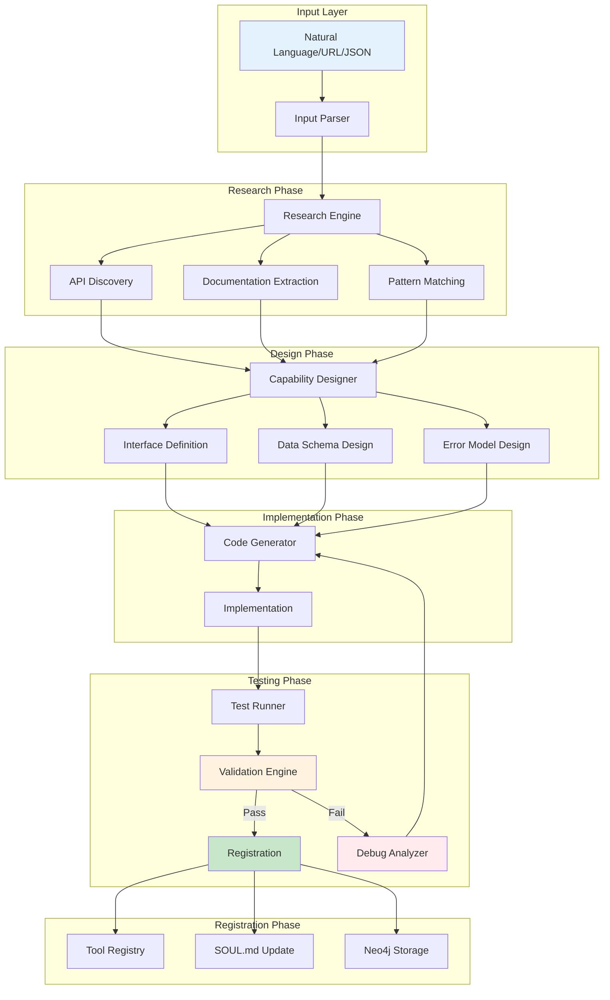
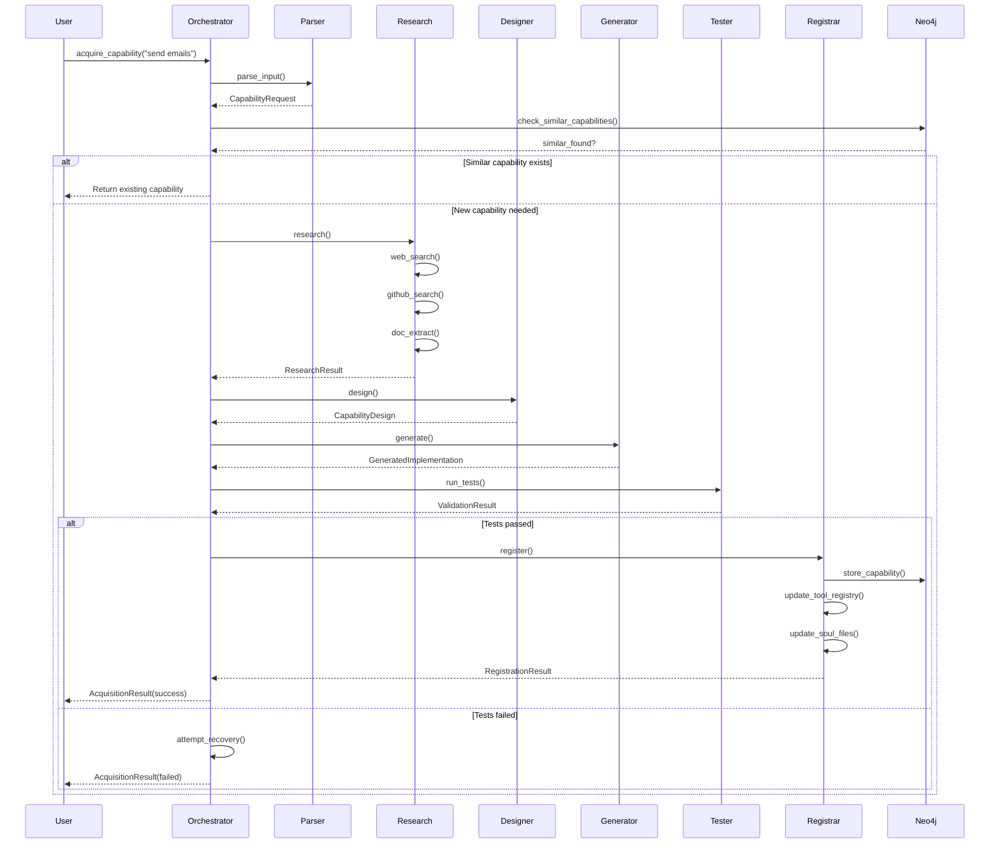
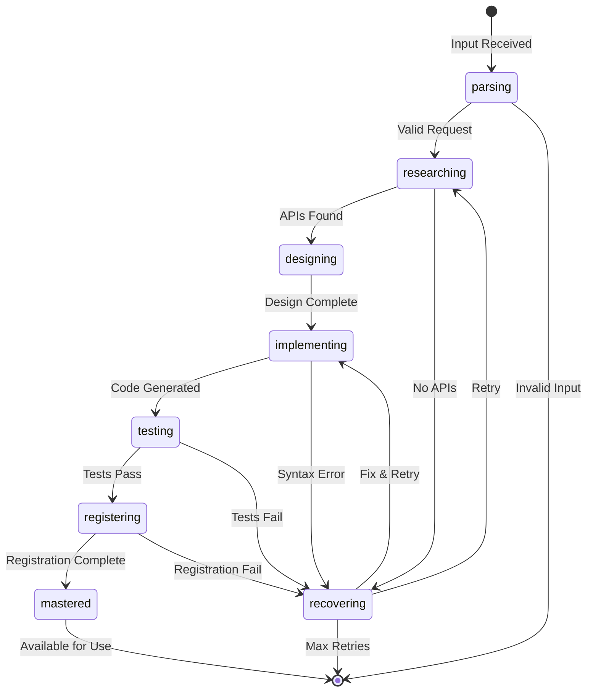

# Capability Acquisition System - Technical Architecture

## Executive Summary

This document provides a comprehensive technical architecture for evolving the horde-learn skill from "extract insights from text" to a generalized **capability acquisition system**. The system can learn any new task (e.g., "call phones", "send emails", "book calendar") and produce working implementations through automated research, design, implementation, testing, and registration.

**Key Capabilities:**
- Natural language to structured requirement parsing
- Automated API/library discovery and research
- Code generation with error handling and retry logic
- Integration with tool registry, SOUL.md, and Neo4j memory
- Comprehensive failure recovery and rollback mechanisms

---

## 1. Core Pipeline Architecture

### 1.1 Pipeline Stages Overview



### 1.2 Stage Details

#### Stage 1: Input Parsing (Requirement Extraction)

**Purpose:** Transform unstructured input into structured capability requirements.

**Data Structure:**
```python
@dataclass
class CapabilityRequest:
    """Structured capability request."""
    request_id: str
    raw_input: str
    input_type: InputType  # NATURAL_LANGUAGE, URL, STRUCTURED

    # Extracted requirements
    capability_name: str
    description: str
    action_verbs: List[str]  # ["call", "dial", "connect"]
    target_objects: List[str]  # ["phone", "number", "contact"]

    # Constraints
    constraints: List[Constraint]
    required_integrations: List[str]  # ["twilio", "sendgrid"]

    # Metadata
    source_url: Optional[str]
    confidence_score: float
    extracted_at: datetime

@dataclass
class Constraint:
    """Capability constraint."""
    constraint_type: str  # "cost", "latency", "privacy", "security"
    description: str
    threshold: Optional[str]
    priority: int  # 1-5
```

**Implementation:**
```python
class InputParser:
    """Parse various input types into structured capability requests."""

    def __init__(self, nlp_model=None):
        self.nlp = nlp_model or spacy.load("en_core_web_sm")
        self.intent_classifier = self._load_intent_classifier()

    async def parse(self, input_data: Union[str, Dict, URL]) -> CapabilityRequest:
        """Main entry point for input parsing."""
        if isinstance(input_data, str):
            if self._is_url(input_data):
                return await self._parse_url(input_data)
            return await self._parse_natural_language(input_data)
        elif isinstance(input_data, dict):
            return self._parse_structured(input_data)

    async def _parse_natural_language(self, text: str) -> CapabilityRequest:
        """Extract requirements from natural language."""
        # Step 1: Extract action verbs and objects
        doc = self.nlp(text)
        action_verbs = [token.lemma_ for token in doc if token.pos_ == "VERB"]
        target_objects = [token.text for token in doc if token.pos_ in ["NOUN", "PROPN"]]

        # Step 2: Classify intent
        intent = self.intent_classifier.predict(text)

        # Step 3: Extract constraints
        constraints = self._extract_constraints(text)

        # Step 4: Generate capability name
        capability_name = self._generate_capability_name(action_verbs, target_objects)

        return CapabilityRequest(
            request_id=generate_uuid(),
            raw_input=text,
            input_type=InputType.NATURAL_LANGUAGE,
            capability_name=capability_name,
            description=text,
            action_verbs=action_verbs,
            target_objects=target_objects,
            constraints=constraints,
            required_integrations=self._infer_integrations(intent, target_objects),
            source_url=None,
            confidence_score=self._calculate_confidence(intent, action_verbs),
            extracted_at=datetime.utcnow()
        )
```

#### Stage 2: Research Engine

**Purpose:** Discover relevant APIs, libraries, and patterns for the capability.

**Data Structure:**
```python
@dataclass
class ResearchResult:
    """Results from capability research."""
    research_id: str
    capability_request_id: str

    # Discovered APIs
    apis: List[APIDiscovery]

    # Documentation
    documentation: List[DocumentationSource]

    # Code patterns
    patterns: List[CodePattern]

    # Recommendations
    recommended_approach: str
    fallback_approaches: List[str]

    # Confidence
    confidence_score: float
    research_timestamp: datetime

@dataclass
class APIDiscovery:
    """Discovered API/provider."""
    provider_name: str
    api_name: str
    documentation_url: str
    sdk_languages: List[str]
    pricing_model: str
    rate_limits: Optional[Dict]
    authentication_type: str
    example_code: Optional[str]
    popularity_score: float
    reliability_score: float
    cost_estimate: str
```

**Implementation:**
```python
class ResearchEngine:
    """Research and discover APIs/libraries for capabilities."""

    def __init__(self):
        self.web_search = WebSearchClient()
        self.github_client = GitHubClient()
        self.doc_scraper = DocumentationScraper()
        self.pattern_extractor = PatternExtractor()

    async def research(self, request: CapabilityRequest) -> ResearchResult:
        """Execute full research pipeline."""
        # Parallel research tasks
        api_task = self._discover_apis(request)
        doc_task = self._scrape_documentation(request)
        pattern_task = self._extract_patterns(request)

        apis, docs, patterns = await asyncio.gather(
            api_task, doc_task, pattern_task
        )

        # Rank and select best approach
        recommended = self._rank_approaches(apis, docs, patterns)

        return ResearchResult(
            research_id=generate_uuid(),
            capability_request_id=request.request_id,
            apis=apis,
            documentation=docs,
            patterns=patterns,
            recommended_approach=recommended.primary,
            fallback_approaches=recommended.fallbacks,
            confidence_score=recommended.confidence,
            research_timestamp=datetime.utcnow()
        )

    async def _discover_apis(self, request: CapabilityRequest) -> List[APIDiscovery]:
        """Discover relevant APIs through multiple sources."""
        apis = []

        # Source 1: Web search for "best X API"
        search_query = f"best {request.capability_name} API python"
        search_results = await self.web_search.search(search_query)

        for result in search_results[:5]:
            api_info = await self._extract_api_info(result)
            if api_info:
                apis.append(api_info)

        # Source 2: GitHub for popular libraries
        github_results = await self.github_client.search_repos(
            query=f"{request.capability_name} python",
            sort="stars",
            limit=5
        )

        for repo in github_results:
            api_info = await self._extract_github_api_info(repo)
            if api_info:
                apis.append(api_info)

        # Source 3: Package registries (PyPI, npm, etc.)
        package_results = await self._search_package_registries(request)
        apis.extend(package_results)

        return self._deduplicate_and_rank(apis)
```

#### Stage 3: Capability Designer

**Purpose:** Design the interface, schema, and error model for the capability.

**Data Structure:**
```python
@dataclass
class CapabilityDesign:
    """Complete capability design specification."""
    design_id: str
    capability_request_id: str
    research_result_id: str

    # Interface definition
    interface: InterfaceDefinition

    # Data schemas
    input_schema: JSONSchema
    output_schema: JSONSchema
    config_schema: JSONSchema

    # Error model
    error_model: ErrorModel

    # Dependencies
    dependencies: List[Dependency]

    # Implementation guidance
    implementation_notes: str
    test_strategy: TestStrategy

@dataclass
class InterfaceDefinition:
    """Capability interface specification."""
    function_name: str
    description: str
    parameters: List[Parameter]
    return_type: str
    return_description: str
    async_required: bool

@dataclass
class Parameter:
    """Function parameter."""
    name: str
    type: str
    description: str
    required: bool
    default_value: Optional[Any]
    validation_rules: List[str]
```

#### Stage 4: Code Generator

**Purpose:** Generate implementation code based on design specification.

**Data Structure:**
```python
@dataclass
class GeneratedImplementation:
    """Generated capability implementation."""
    implementation_id: str
    design_id: str

    # Code artifacts
    main_code: str
    test_code: str
    requirements: List[str]

    # Metadata
    language: str
    framework: Optional[str]
    generated_at: datetime

    # Validation
    syntax_valid: bool
    static_analysis_passed: bool

@dataclass
class CodeTemplate:
    """Template for code generation."""
    template_id: str
    name: str
    language: str
    template_string: str
    required_placeholders: List[str]
    optional_placeholders: List[str]
```

**Implementation:**
```python
class CodeGenerator:
    """Generate capability implementation code."""

    def __init__(self):
        self.template_engine = Jinja2Environment()
        self.llm_client = LLMClient()
        self.validator = CodeValidator()

    async def generate(
        self,
        design: CapabilityDesign,
        research: ResearchResult
    ) -> GeneratedImplementation:
        """Generate complete implementation."""

        # Step 1: Select or create template
        template = await self._select_template(design)

        # Step 2: Generate main implementation
        main_code = await self._generate_main_code(design, research, template)

        # Step 3: Generate tests
        test_code = await self._generate_tests(design, main_code)

        # Step 4: Validate syntax
        syntax_valid = self.validator.check_syntax(main_code)

        # Step 5: Static analysis
        analysis_passed = self.validator.static_analysis(main_code)

        return GeneratedImplementation(
            implementation_id=generate_uuid(),
            design_id=design.design_id,
            main_code=main_code,
            test_code=test_code,
            requirements=self._extract_requirements(design),
            language="python",
            framework=self._detect_framework(main_code),
            generated_at=datetime.utcnow(),
            syntax_valid=syntax_valid,
            static_analysis_passed=analysis_passed
        )

    async def _generate_main_code(
        self,
        design: CapabilityDesign,
        research: ResearchResult,
        template: CodeTemplate
    ) -> str:
        """Generate main implementation using LLM + templates."""

        # Build context for LLM
        context = {
            "interface": design.interface,
            "input_schema": design.input_schema,
            "output_schema": design.output_schema,
            "error_model": design.error_model,
            "recommended_api": research.recommended_approach,
            "api_examples": [api.example_code for api in research.apis[:3]],
            "template": template.template_string
        }

        # Generate with LLM
        prompt = self._build_generation_prompt(context)
        generated_code = await self.llm_client.generate(
            prompt=prompt,
            temperature=0.2,
            max_tokens=2000
        )

        # Post-process
        cleaned_code = self._post_process_code(generated_code)

        return cleaned_code
```

#### Stage 5: Test Runner & Validator

**Purpose:** Execute tests and validate the implementation.

**Data Structure:**
```python
@dataclass
class ValidationResult:
    """Result of capability validation."""
    validation_id: str
    implementation_id: str

    # Test results
    test_results: List[TestResult]

    # Scores
    functional_score: float  # 0-1
    reliability_score: float
    security_score: float
    performance_score: float
    overall_score: float

    # Status
    passed: bool
    mastery_threshold_met: bool

    # Issues
    critical_issues: List[Issue]
    warnings: List[Issue]

    validated_at: datetime

@dataclass
class TestResult:
    """Individual test result."""
    test_name: str
    test_type: str  # "unit", "integration", "security"
    passed: bool
    duration_ms: float
    error_message: Optional[str]
    stack_trace: Optional[str]
```

#### Stage 6: Registration

**Purpose:** Register the capability across all integration points.

---

## 2. Input Handling Architecture

### 2.1 Natural Language Parsing

```python
class NaturalLanguageParser:
    """Parse natural language into structured requirements."""

    def __init__(self):
        self.nlp = spacy.load("en_core_web_sm")
        self.intent_patterns = self._load_intent_patterns()

    async def parse(self, text: str) -> ParsedRequirement:
        """Parse natural language text."""
        doc = self.nlp(text)

        # Extract components
        actions = self._extract_actions(doc)
        entities = self._extract_entities(doc)
        constraints = self._extract_constraints(doc)

        # Map to capability taxonomy
        capability_type = self._classify_capability(actions, entities)

        return ParsedRequirement(
            actions=actions,
            entities=entities,
            constraints=constraints,
            capability_type=capability_type,
            confidence=self._calculate_confidence(doc, actions, entities)
        )

    def _extract_actions(self, doc) -> List[Action]:
        """Extract action verbs and their modifiers."""
        actions = []

        for token in doc:
            if token.pos_ == "VERB":
                # Find direct objects
                dobj = None
                for child in token.children:
                    if child.dep_ == "dobj":
                        dobj = child.text

                # Find modifiers
                modifiers = [
                    child.text for child in token.children
                    if child.dep_ in ["advmod", "amod"]
                ]

                actions.append(Action(
                    verb=token.lemma_,
                    direct_object=dobj,
                    modifiers=modifiers,
                    negated=any(
                        child.dep_ == "neg" for child in token.children
                    )
                ))

        return actions
```

### 2.2 URL Input Processing

```python
class URLInputProcessor:
    """Process documentation URLs."""

    def __init__(self):
        self.scraper = DocumentationScraper()
        self.extractor = APIExtractor()

    async def process(self, url: str) -> ParsedRequirement:
        """Process URL input."""
        # Fetch and parse documentation
        content = await self.scraper.fetch(url)

        # Extract API specifications
        api_spec = await self.extractor.extract(content)

        # Convert to capability requirement
        return self._convert_to_requirement(api_spec, url)

    async def _extract_from_openapi(self, url: str) -> ParsedRequirement:
        """Extract from OpenAPI/Swagger documentation."""
        spec = await self._fetch_openapi_spec(url)

        return ParsedRequirement(
            actions=self._extract_actions_from_spec(spec),
            entities=self._extract_entities_from_spec(spec),
            constraints=self._extract_constraints_from_spec(spec),
            capability_type=self._infer_capability_type(spec),
            source_url=url,
            confidence=0.9
        )
```

### 2.3 Structured Request Processing

```python
class StructuredRequestProcessor:
    """Process structured JSON/YAML requests."""

    SCHEMA = {
        "type": "object",
        "required": ["capability_name", "actions"],
        "properties": {
            "capability_name": {"type": "string"},
            "description": {"type": "string"},
            "actions": {
                "type": "array",
                "items": {
                    "type": "object",
                    "properties": {
                        "verb": {"type": "string"},
                        "target": {"type": "string"},
                        "parameters": {"type": "object"}
                    }
                }
            },
            "constraints": {"type": "array"},
            "integrations": {"type": "array"},
            "examples": {"type": "array"}
        }
    }

    def process(self, data: Dict) -> ParsedRequirement:
        """Process structured request."""
        # Validate schema
        jsonschema.validate(data, self.SCHEMA)

        return ParsedRequirement(
            capability_name=data["capability_name"],
            actions=[Action(**a) for a in data["actions"]],
            constraints=[Constraint(**c) for c in data.get("constraints", [])],
            examples=data.get("examples", []),
            confidence=1.0  # Structured input is fully confident
        )
```

---

## 3. Research Phase Architecture

### 3.1 API Discovery System

```python
class APIDiscoveryEngine:
    """Multi-source API discovery."""

    SOURCES = [
        "web_search",
        "github",
        "package_registries",
        "api_directories",
        "documentation"
    ]

    async def discover(
        self,
        requirement: ParsedRequirement
    ) -> List[APIDiscovery]:
        """Discover APIs from multiple sources."""

        # Parallel discovery from all sources
        tasks = [
            self._search_web(requirement),
            self._search_github(requirement),
            self._search_package_registries(requirement),
            self._search_api_directories(requirement),
            self._search_documentation(requirement)
        ]

        results = await asyncio.gather(*tasks)

        # Merge and deduplicate
        all_apis = []
        for result in results:
            all_apis.extend(result)

        return self._rank_apis(self._deduplicate(all_apis), requirement)

    async def _search_web(self, requirement: ParsedRequirement) -> List[APIDiscovery]:
        """Search web for API recommendations."""
        queries = self._generate_search_queries(requirement)

        discoveries = []
        for query in queries:
            results = await self.web_search.search(query)
            for result in results:
                api = await self._extract_api_from_result(result)
                if api:
                    discoveries.append(api)

        return discoveries

    async def _search_github(
        self,
        requirement: ParsedRequirement
    ) -> List[APIDiscovery]:
        """Search GitHub for relevant libraries."""
        query = f"{requirement.capability_name} language:python stars:>100"

        repos = await self.github.search_repositories(query, limit=10)

        discoveries = []
        for repo in repos:
            api = APIDiscovery(
                provider_name=repo.owner.login,
                api_name=repo.name,
                documentation_url=repo.html_url,
                sdk_languages=["python"],
                pricing_model="open_source",
                popularity_score=repo.stargazers_count / 10000,
                reliability_score=self._calculate_reliability(repo),
                example_code=await self._extract_example_code(repo)
            )
            discoveries.append(api)

        return discoveries
```

### 3.2 Documentation Extraction

```python
class DocumentationExtractor:
    """Extract patterns from documentation."""

    async def extract_patterns(
        self,
        url: str,
        requirement: ParsedRequirement
    ) -> List[CodePattern]:
        """Extract code patterns from documentation."""

        # Fetch documentation
        content = await self._fetch_documentation(url)

        # Extract code blocks
        code_blocks = self._extract_code_blocks(content)

        # Analyze patterns
        patterns = []
        for block in code_blocks:
            pattern = await self._analyze_pattern(block, requirement)
            if pattern:
                patterns.append(pattern)

        return patterns

    async def _analyze_pattern(
        self,
        code: str,
        requirement: ParsedRequirement
    ) -> Optional[CodePattern]:
        """Analyze a code block for relevant patterns."""

        # Parse code
        try:
            tree = ast.parse(code)
        except SyntaxError:
            return None

        # Extract function calls
        calls = self._extract_function_calls(tree)

        # Check relevance
        relevance_score = self._calculate_relevance(
            calls, requirement
        )

        if relevance_score < 0.5:
            return None

        return CodePattern(
            code=code,
            function_calls=calls,
            relevance_score=relevance_score,
            complexity=self._calculate_complexity(tree),
            dependencies=self._extract_dependencies(code)
        )
```

### 3.3 Pattern Matching System

```python
class PatternMatchingEngine:
    """Match requirements against known patterns."""

    def __init__(self, neo4j_client):
        self.neo4j = neo4j_client
        self.embedding_model = SentenceTransformer('all-MiniLM-L6-v2')

    async def find_similar_capabilities(
        self,
        requirement: ParsedRequirement
    ) -> List[SimilarCapability]:
        """Find similar existing capabilities."""

        # Generate embedding for requirement
        embedding = self.embedding_model.encode(
            requirement.description
        )

        # Search Neo4j for similar capabilities
        query = """
        CALL db.index.vector.queryNodes(
            'capability_embedding',
            $top_k,
            $embedding
        ) YIELD node, score
        WHERE score >= $min_score
        RETURN node.id as capability_id,
               node.name as name,
               node.description as description,
               score as similarity
        """

        results = await self.neo4j.run(query, {
            "embedding": embedding.tolist(),
            "top_k": 5,
            "min_score": 0.7
        })

        return [
            SimilarCapability(
                capability_id=r["capability_id"],
                name=r["name"],
                description=r["description"],
                similarity_score=r["similarity"]
            )
            for r in results
        ]
```

---

## 4. Implementation Phase Architecture

### 4.1 Code Generation Patterns

```python
class CodeGenerationEngine:
    """Generate implementation code."""

    TEMPLATES = {
        "api_client": """
class {{ capability_name }}Client:
    """{{ description }}"""

    def __init__(self, config: {{ config_type }}):
        self.config = config
        self.session = aiohttp.ClientSession()

    async def {{ function_name }}(
        self,
        
        {{ param.name }}: {{ param.type }} = {{ param.default }},
        
    ) -> {{ return_type }}:
        """{{ function_description }}"""

        # Validate inputs
        {{ validation_code }}

        # Build request
        {{ request_building_code }}

        # Execute with retry
        {{ execution_code }}

        # Handle response
        {{ response_handling_code }}

    async def close(self):
        await self.session.close()
""",
        "tool_wrapper": """
async def {{ tool_name }}(
    
    {{ param.name }}: {{ param.type }} = {{ param.default }},
    
) -> Dict[str, Any]:
    """{{ description }}"""

    # Initialize client
    client = {{ capability_name }}Client(
        config=load_config()
    )

    try:
        # Execute capability
        result = await client.{{ function_name }}(
            
            {{ param.name }}={{ param.name }},
            
        )

        return {
            "success": True,
            "result": result,
            "metadata": {
                "timestamp": datetime.utcnow().isoformat(),
                "capability": "{{ capability_name }}"
            }
        }

    except {{ capability_name }}Error as e:
        return {
            "success": False,
            "error": str(e),
            "error_type": e.__class__.__name__,
            "recoverable": e.recoverable
        }
    finally:
        await client.close()
"""
    }

    async def generate(
        self,
        design: CapabilityDesign,
        template_type: str = "api_client"
    ) -> str:
        """Generate code from template."""

        template = self.TEMPLATES[template_type]

        # Render template
        rendered = self._render_template(template, design)

        # Post-process with LLM for refinement
        refined = await self._refine_with_llm(rendered, design)

        return refined
```

### 4.2 Error Handling & Retry Logic

```python
class ErrorHandlingGenerator:
    """Generate error handling code."""

    ERROR_PATTERNS = {
        "network": {
            "exceptions": ["aiohttp.ClientError", "asyncio.TimeoutError"],
            "retry_strategy": "exponential_backoff",
            "max_retries": 3
        },
        "authentication": {
            "exceptions": ["AuthenticationError"],
            "retry_strategy": "none",
            "action": "refresh_token"
        },
        "rate_limit": {
            "exceptions": ["RateLimitError"],
            "retry_strategy": "fixed_delay",
            "delay": 60
        }
    }

    def generate_error_handling(
        self,
        error_model: ErrorModel
    ) -> str:
        """Generate error handling code."""

        code_parts = []

        # Generate exception classes
        for error in error_model.errors:
            code_parts.append(self._generate_exception_class(error))

        # Generate retry decorator
        code_parts.append(self._generate_retry_decorator(error_model))

        # Generate error handler
        code_parts.append(self._generate_error_handler(error_model))

        return "\n\n".join(code_parts)

    def _generate_retry_decorator(self, error_model: ErrorModel) -> str:
        """Generate retry decorator code."""

        return '''
def with_retry(max_retries=3, backoff_factor=2):
    """Retry decorator with exponential backoff."""

    def decorator(func):
        @functools.wraps(func)
        async def wrapper(*args, **kwargs):
            last_exception = None

            for attempt in range(max_retries):
                try:
                    return await func(*args, **kwargs)

                except tuple(RETRYABLE_EXCEPTIONS) as e:
                    last_exception = e

                    if attempt < max_retries - 1:
                        delay = backoff_factor ** attempt
                        logger.warning(
                            f"Attempt {attempt + 1} failed: {e}. "
                            f"Retrying in {delay}s..."
                        )
                        await asyncio.sleep(delay)
                    else:
                        raise MaxRetriesExceeded(
                            f"Failed after {max_retries} attempts"
                        ) from e

                except NonRetryableError as e:
                    # Don't retry non-retryable errors
                    raise

            raise last_exception

        return wrapper
    return decorator
'''
```

### 4.3 Testing Strategy

```python
class TestGenerationEngine:
    """Generate comprehensive test suites."""

    TEST_CATEGORIES = [
        "unit",
        "integration",
        "error_handling",
        "security",
        "performance"
    ]

    async def generate_test_suite(
        self,
        design: CapabilityDesign,
        implementation: str
    ) -> TestSuite:
        """Generate complete test suite."""

        tests = []

        # Generate unit tests
        unit_tests = await self._generate_unit_tests(design, implementation)
        tests.extend(unit_tests)

        # Generate integration tests
        integration_tests = await self._generate_integration_tests(design)
        tests.extend(integration_tests)

        # Generate error handling tests
        error_tests = self._generate_error_tests(design.error_model)
        tests.extend(error_tests)

        # Generate security tests
        security_tests = self._generate_security_tests(design)
        tests.extend(security_tests)

        return TestSuite(
            tests=tests,
            coverage_target=0.9,
            required_pass_rate=0.85
        )

    async def _generate_unit_tests(
        self,
        design: CapabilityDesign,
        implementation: str
    ) -> List[TestCase]:
        """Generate unit tests for each function."""

        tests = []

        for param in design.interface.parameters:
            # Happy path test
            tests.append(TestCase(
                name=f"test_{param.name}_valid",
                test_type="unit",
                input_data=self._generate_valid_input(param),
                expected_output="success",
                assertions=["result is not None", "no exception raised"]
            ))

            # Invalid input tests
            tests.append(TestCase(
                name=f"test_{param.name}_invalid",
                test_type="unit",
                input_data=self._generate_invalid_input(param),
                expected_output="error",
                assertions=["ValidationError raised", "error message contains 'invalid'"]
            ))

            # Edge case tests
            tests.append(TestCase(
                name=f"test_{param.name}_edge_cases",
                test_type="unit",
                input_data=self._generate_edge_cases(param),
                expected_output="depends",
                assertions=["handled gracefully"]
            ))

        return tests
```

---

## 5. Registration Phase Architecture

### 5.1 Tool Registry Integration

```python
class ToolRegistryIntegration:
    """Integrate with Kublai's tool registry."""

    def __init__(self, registry_path: str = "tools/registry"):
        self.registry_path = Path(registry_path)
        self.registry_file = self.registry_path / "tools.json"

    async def register_capability(
        self,
        implementation: GeneratedImplementation,
        design: CapabilityDesign
    ) -> RegistrationResult:
        """Register capability in tool registry."""

        # Load existing registry
        registry = await self._load_registry()

        # Create tool entry
        tool_entry = {
            "id": generate_uuid(),
            "name": design.interface.function_name,
            "description": design.interface.description,
            "category": self._categorize_tool(design),
            "entry_point": f"tools.generated.{design.interface.function_name}",
            "parameters": [
                {
                    "name": p.name,
                    "type": p.type,
                    "required": p.required,
                    "description": p.description
                }
                for p in design.interface.parameters
            ],
            "return_type": design.interface.return_type,
            "dependencies": design.dependencies,
            "created_at": datetime.utcnow().isoformat(),
            "version": "1.0.0",
            "status": "active"
        }

        # Add to registry
        registry["tools"].append(tool_entry)

        # Save registry
        await self._save_registry(registry)

        # Write implementation file
        impl_path = await self._write_implementation_file(implementation)

        return RegistrationResult(
            tool_id=tool_entry["id"],
            registry_path=self.registry_file,
            implementation_path=impl_path,
            registered_at=datetime.utcnow()
        )

    async def _write_implementation_file(
        self,
        implementation: GeneratedImplementation
    ) -> Path:
        """Write implementation to tools directory."""

        file_name = f"{implementation.design_id}.py"
        file_path = self.registry_path / "generated" / file_name

        # Ensure directory exists
        file_path.parent.mkdir(parents=True, exist_ok=True)

        # Write file with header
        header = f'''"""
Auto-generated capability implementation.
Generated: {implementation.generated_at.isoformat()}
Capability ID: {implementation.design_id}
DO NOT EDIT MANUALLY - Use capability acquisition system instead.
"""

'''

        file_path.write_text(header + implementation.main_code)

        return file_path
```

### 5.2 SOUL.md Update Strategy

```python
class SOULUpdater:
    """Update agent SOUL.md files with new capabilities."""

    SOUL_TEMPLATE = """
## Capability: {capability_name}

**Status:** {status}
**Added:** {added_date}
**Mastery Score:** {mastery_score}

### Description
{description}

### Usage
```python
{usage_example}
```

### Parameters
{parameters_table}

### Error Handling
{error_handling}

### Dependencies
{dependencies_list}

### Notes
- Auto-learned capability
- Tested with {test_count} test cases
- Success rate: {success_rate}%
"""

    async def update_soul(
        self,
        agent: str,
        capability: CapabilityDesign,
        validation: ValidationResult
    ) -> Path:
        """Update agent's SOUL.md with new capability."""

        soul_path = Path(f"data/workspace/souls/{agent}/SOUL.md")

        # Read existing SOUL
        existing_content = soul_path.read_text() if soul_path.exists() else ""

        # Generate capability section
        capability_section = self.SOUL_TEMPLATE.format(
            capability_name=capability.interface.function_name,
            status="Active" if validation.passed else "Experimental",
            added_date=datetime.utcnow().strftime("%Y-%m-%d"),
            mastery_score=f"{validation.overall_score:.2f}",
            description=capability.interface.description,
            usage_example=self._generate_usage_example(capability),
            parameters_table=self._generate_parameters_table(capability),
            error_handling=self._generate_error_handling_doc(capability),
            dependencies_list=self._generate_dependencies_list(capability),
            test_count=len(validation.test_results),
            success_rate=self._calculate_success_rate(validation)
        )

        # Insert or update in SOUL
        updated_content = self._insert_capability_section(
            existing_content,
            capability.interface.function_name,
            capability_section
        )

        # Write back
        soul_path.write_text(updated_content)

        return soul_path
```

### 5.3 Neo4j Memory Schema

```cypher
// ============================================================================
// CAPABILITY ACQUISITION SCHEMA FOR NEO4J
// ============================================================================

// Core capability node
(:Capability {
    id: string,
    name: string,
    description: string,
    version: string,
    status: string,              // "learning" | "practicing" | "validated" | "mastered" | "deprecated"

    // Input/Output schemas
    input_schema: map,
    output_schema: map,
    config_schema: map,

    // Implementation
    implementation_path: string,
    entry_point: string,
    language: string,

    // Metrics
    mastery_score: float,        // 0-1
    success_rate: float,
    total_invocations: int,
    avg_latency_ms: float,

    // Metadata
    created_at: datetime,
    updated_at: datetime,
    created_by: string,          // Agent that created it

    // Vector embedding for similarity search
    embedding: [float]
})

// Research phase tracking
(:CapabilityResearch {
    id: string,
    capability_id: string,
    research_phase: string,      // "api_discovery" | "doc_extraction" | "pattern_matching"
    sources_consulted: [string],
    apis_discovered: [map],
    patterns_found: [map],
    confidence_score: float,
    completed_at: datetime
})

// Practice/learning attempts
(:CapabilityPractice {
    id: string,
    capability_id: string,
    attempt_number: int,
    sandbox_environment: string,
    test_inputs: [map],
    expected_outputs: [map],
    actual_outputs: [map],
    success: boolean,
    error_patterns: [string],
    latency_ms: float,
    cost_usd: float,
    attempted_at: datetime
})

// Validation results
(:CapabilityValidation {
    id: string,
    capability_id: string,
    validation_suite: string,
    test_results: [map],
    functional_score: float,
    reliability_score: float,
    security_score: float,
    performance_score: float,
    overall_score: float,
    passed: boolean,
    validated_at: datetime,
    validated_by: string
})

// Error patterns for learning
(:CapabilityErrorPattern {
    id: string,
    pattern_name: string,
    error_type: string,
    error_message_pattern: string,
    root_cause: string,
    solution: string,
    occurrence_count: int,
    first_seen: datetime,
    last_seen: datetime
})

// Relationships
(:Capability)-[:HAS_RESEARCH]->(:CapabilityResearch)
(:Capability)-[:HAS_PRACTICE]->(:CapabilityPractice)
(:Capability)-[:HAS_VALIDATION]->(:CapabilityValidation)
(:Capability)-[:HAS_ERROR_PATTERN]->(:CapabilityErrorPattern)
(:Capability)-[:DEPENDS_ON]->(:Capability)
(:Capability)-[:REPLACES]->(:Capability)
(:Agent)-[:CREATED]->(:Capability)
(:Agent)-[:CAN_USE]->(:Capability)
(:Agent)-[:MASTERED]->(:Capability)

// Indexes
CREATE CONSTRAINT capability_id IF NOT EXISTS
FOR (c:Capability) REQUIRE c.id IS UNIQUE;

CREATE VECTOR INDEX capability_embedding IF NOT EXISTS
FOR (c:Capability) ON c.embedding
OPTIONS {
    indexConfig: {
        `vector.dimensions`: 384,
        `vector.similarity_function`: 'cosine'
    }
};

CREATE INDEX capability_status IF NOT EXISTS
FOR (c:Capability) ON (c.status, c.mastery_score);

CREATE INDEX capability_name IF NOT EXISTS
FOR (c:Capability) ON (c.name);
```

---

## 6. Failure Recovery Architecture

### 6.1 Research Failure Recovery

```python
class ResearchFailureRecovery:
    """Handle failures in research phase."""

    RECOVERY_STRATEGIES = {
        "no_apis_found": [
            "expand_search_terms",
            "try_alternative_sources",
            "broaden_constraints",
            "request_clarification"
        ],
        "documentation_inaccessible": [
            "try_archive_org",
            "search_for_mirrors",
            "use_github_readme",
            "infer_from_examples"
        ],
        "conflicting_information": [
            "cross_reference_sources",
            "prioritize_official_docs",
            "check_recency",
            "flag_for_review"
        ]
    }

    async def recover(
        self,
        failure: ResearchFailure,
        context: ResearchContext
    ) -> RecoveryResult:
        """Attempt to recover from research failure."""

        strategies = self.RECOVERY_STRATEGIES.get(failure.failure_type, [])

        for strategy in strategies:
            result = await self._apply_strategy(strategy, context)
            if result.success:
                return RecoveryResult(
                    success=True,
                    strategy_used=strategy,
                    new_context=result.context
                )

        # All strategies failed - escalate
        return RecoveryResult(
            success=False,
            escalation_required=True,
            reason="All recovery strategies exhausted"
        )

    async def _apply_strategy(
        self,
        strategy: str,
        context: ResearchContext
    ) -> StrategyResult:
        """Apply a specific recovery strategy."""

        if strategy == "expand_search_terms":
            # Add synonyms and related terms
            expanded_terms = await self._expand_terms(context.search_terms)
            new_context = context.with_search_terms(expanded_terms)
            return StrategyResult(success=True, context=new_context)

        elif strategy == "try_archive_org":
            # Try to access via Wayback Machine
            archived = await self._check_wayback_machine(context.url)
            if archived:
                new_context = context.with_url(archived)
                return StrategyResult(success=True, context=new_context)
            return StrategyResult(success=False)

        # ... more strategies
```

### 6.2 Implementation Failure Recovery

```python
class ImplementationFailureRecovery:
    """Handle failures in implementation phase."""

    async def recover(
        self,
        failure: ImplementationFailure,
        implementation: GeneratedImplementation,
        design: CapabilityDesign
    ) -> RecoveryResult:
        """Attempt to recover from implementation failure."""

        if failure.failure_type == "syntax_error":
            return await self._fix_syntax_error(failure, implementation)

        elif failure.failure_type == "test_failure":
            return await self._fix_test_failure(failure, implementation, design)

        elif failure.failure_type == "dependency_conflict":
            return await self._resolve_dependency_conflict(failure, implementation)

        elif failure.failure_type == "api_changed":
            return await self._adapt_to_api_change(failure, implementation)

        return RecoveryResult(
            success=False,
            escalation_required=True
        )

    async def _fix_test_failure(
        self,
        failure: ImplementationFailure,
        implementation: GeneratedImplementation,
        design: CapabilityDesign
    ) -> RecoveryResult:
        """Fix failing tests through iterative improvement."""

        max_attempts = 3
        current_impl = implementation

        for attempt in range(max_attempts):
            # Analyze test failures
            failure_analysis = await self._analyze_failures(failure.test_results)

            # Generate fix
            fixed_code = await self._generate_fix(
                current_impl,
                failure_analysis,
                design
            )

            # Validate fix
            validation = await self._validate_fix(fixed_code, design)

            if validation.passed:
                return RecoveryResult(
                    success=True,
                    new_implementation=fixed_code,
                    attempts=attempt + 1
                )

            current_impl = fixed_code

        return RecoveryResult(
            success=False,
            reason=f"Failed to fix after {max_attempts} attempts"
        )
```

### 6.3 Rollback Mechanisms

```python
class RollbackManager:
    """Manage rollback of partial implementations."""

    def __init__(self, neo4j_client, registry: ToolRegistryIntegration):
        self.neo4j = neo4j_client
        self.registry = registry
        self.backup_dir = Path("backups/capabilities")

    async def create_checkpoint(
        self,
        capability_id: str,
        phase: str
    ) -> Checkpoint:
        """Create a checkpoint before making changes."""

        checkpoint = Checkpoint(
            id=generate_uuid(),
            capability_id=capability_id,
            phase=phase,
            timestamp=datetime.utcnow()
        )

        # Backup registry state
        registry_backup = await self.registry.create_backup()
        checkpoint.registry_backup_path = registry_backup

        # Backup Neo4j state
        neo4j_backup = await self._backup_neo4j_state(capability_id)
        checkpoint.neo4j_backup = neo4j_backup

        # Backup files
        file_backup = await self._backup_files(capability_id)
        checkpoint.file_backup_path = file_backup

        return checkpoint

    async def rollback(
        self,
        checkpoint: Checkpoint,
        reason: str
    ) -> RollbackResult:
        """Rollback to checkpoint."""

        try:
            # Restore registry
            await self.registry.restore_backup(checkpoint.registry_backup_path)

            # Restore Neo4j
            await self._restore_neo4j_state(checkpoint.neo4j_backup)

            # Restore files
            await self._restore_files(checkpoint.file_backup_path)

            # Log rollback
            await self._log_rollback(checkpoint, reason)

            return RollbackResult(
                success=True,
                rolled_back_to=checkpoint.timestamp
            )

        except Exception as e:
            return RollbackResult(
                success=False,
                error=str(e),
                partial_state=True
            )
```

---

## 7. System Integration Architecture

### 7.1 Orchestration Flow

```python
class CapabilityAcquisitionOrchestrator:
    """Main orchestrator for capability acquisition."""

    def __init__(self):
        self.input_parser = InputParser()
        self.research_engine = ResearchEngine()
        self.designer = CapabilityDesigner()
        self.code_generator = CodeGenerator()
        self.test_runner = TestRunner()
        self.registrar = CapabilityRegistrar()
        self.rollback_manager = RollbackManager()

    async def acquire_capability(
        self,
        input_data: Union[str, Dict, URL],
        options: AcquisitionOptions = None
    ) -> AcquisitionResult:
        """Main entry point for capability acquisition."""

        options = options or AcquisitionOptions()
        capability_id = generate_uuid()

        try:
            # Phase 1: Parse Input
            request = await self.input_parser.parse(input_data)

            # Phase 2: Research
            checkpoint = await self.rollback_manager.create_checkpoint(
                capability_id, "research"
            )
            research = await self.research_engine.research(request)

            if not research.apis and not options.allow_no_api:
                recovery = await self._handle_research_failure(request)
                if not recovery.success:
                    return AcquisitionResult(
                        success=False,
                        phase="research",
                        error="No suitable APIs found"
                    )

            # Phase 3: Design
            checkpoint = await self.rollback_manager.create_checkpoint(
                capability_id, "design"
            )
            design = await self.designer.design(request, research)

            # Phase 4: Implement
            checkpoint = await self.rollback_manager.create_checkpoint(
                capability_id, "implementation"
            )
            implementation = await self.code_generator.generate(design, research)

            if not implementation.syntax_valid:
                recovery = await self._handle_syntax_error(implementation)
                if not recovery.success:
                    await self.rollback_manager.rollback(checkpoint, "syntax_error")
                    return AcquisitionResult(
                        success=False,
                        phase="implementation",
                        error="Could not generate valid code"
                    )

            # Phase 5: Test
            checkpoint = await self.rollback_manager.create_checkpoint(
                capability_id, "testing"
            )
            validation = await self.test_runner.run_tests(implementation, design)

            if not validation.mastery_threshold_met and options.require_mastery:
                recovery = await self._handle_test_failure(implementation, validation)
                if not recovery.success:
                    await self.rollback_manager.rollback(checkpoint, "test_failure")
                    return AcquisitionResult(
                        success=False,
                        phase="testing",
                        error="Could not achieve mastery threshold"
                    )

            # Phase 6: Register
            registration = await self.registrar.register(
                implementation=implementation,
                design=design,
                validation=validation
            )

            return AcquisitionResult(
                success=True,
                capability_id=capability_id,
                registration=registration,
                mastery_score=validation.overall_score
            )

        except Exception as e:
            # Emergency rollback
            if checkpoint:
                await self.rollback_manager.rollback(checkpoint, f"exception: {e}")

            return AcquisitionResult(
                success=False,
                error=str(e)
            )
```

### 7.2 Event Flow Diagram



---

## 8. Data Flow Summary

### 8.1 Data Flow Between Stages

| Stage | Input | Output | Storage |
|-------|-------|--------|---------|
| **Parse** | Raw input (text/URL/JSON) | CapabilityRequest | Neo4j:Request |
| **Research** | CapabilityRequest | ResearchResult | Neo4j:Research |
| **Design** | ResearchResult | CapabilityDesign | Neo4j:Design |
| **Implement** | CapabilityDesign | GeneratedImplementation | File system |
| **Test** | GeneratedImplementation | ValidationResult | Neo4j:Validation |
| **Register** | ValidationResult + Implementation | RegistrationResult | Registry + SOUL + Neo4j |

### 8.2 State Machine



---

## 9. Implementation Recommendations

### 9.1 Phase 1: Core Pipeline (Week 1-2)
- Implement InputParser with NLP
- Build basic ResearchEngine with web search
- Create simple CodeGenerator
- Implement basic TestRunner

### 9.2 Phase 2: Integration (Week 3-4)
- Integrate with Neo4j schema
- Build ToolRegistryIntegration
- Implement SOULUpdater
- Add RollbackManager

### 9.3 Phase 3: Resilience (Week 5-6)
- Implement failure recovery strategies
- Add comprehensive error handling
- Build monitoring and alerting
- Create rollback mechanisms

### 9.4 Phase 4: Optimization (Week 7-8)
- Add pattern matching from existing capabilities
- Implement caching for research results
- Optimize code generation with templates
- Add parallel processing where safe

---

## 10. Success Metrics

| Metric | Target | Measurement |
|--------|--------|-------------|
| **Acquisition Success Rate** | >80% | % of requests resulting in working capability |
| **Research Coverage** | >90% | % of capabilities with suitable API found |
| **Test Pass Rate** | >85% | % of generated capabilities passing tests |
| **Mastery Achievement** | >70% | % of capabilities achieving mastery threshold |
| **Average Acquisition Time** | <5 min | Time from request to registered capability |
| **Rollback Rate** | <10% | % of acquisitions requiring rollback |

---

**Document Version:** 1.0
**Last Updated:** 2026-02-04
**Status:** Architecture Complete - Ready for Implementation
