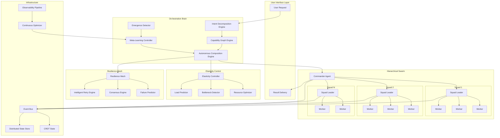

# Horde-Swarm Autonomous Orchestration: Ultimate Vision

> **Status**: Architectural Vision Document
> **Date**: 2026-02-04
> **Version**: 1.0 - The Infinite Swarm

---

## Executive Summary

This document presents the ultimate vision for horde-swarm's autonomous orchestration capabilities. When tokens are free and compute is infinite, horde-swarm becomes a **self-organizing, self-healing, self-optimizing agent collective** that operates with minimal human intervention. This is not incremental improvement—it is a fundamental transformation from manual orchestration to emergent intelligence.

### The Vision in One Sentence

> Horde-swarm becomes a living system that senses, decides, and acts—continuously optimizing its own composition, scale, and behavior to maximize task completion velocity while maintaining quality and resource efficiency.

---

## 1. Self-Determining Agent Composition

### 1.1 The Intent Decomposition Engine

Instead of requiring humans to specify agent teams, the system uses a multi-layer intent analysis pipeline:

```python
@dataclass
class IntentDecomposition:
    """
    Hierarchical decomposition of user intent into primitive operations.

    This is the foundation of autonomous composition—breaking down
    any request into its fundamental cognitive operations.
    """
    root_intent: str
    confidence: float

    # Layer 1: Domain Classification
    primary_domain: Domain  # e.g., SOFTWARE, RESEARCH, CREATIVE, ANALYSIS
    secondary_domains: List[Domain]

    # Layer 2: Cognitive Operations Required
    operations: List[CognitiveOperation]
    # Examples: REASONING, SYNTHESIS, GENERATION, VERIFICATION,
    #           RESEARCH, CRITIQUE, OPTIMIZATION, COORDINATION

    # Layer 3: Capability Requirements
    required_capabilities: CapabilityMatrix
    # Maps operations to specific agent capabilities with weights

    # Layer 4: Temporal Patterns
    execution_pattern: TemporalPattern
    # SEQUENTIAL, PARALLEL, ITERATIVE, RECURSIVE, ADAPTIVE

    # Layer 5: Quality Requirements
    quality_thresholds: QualityProfile
    # Accuracy, creativity, speed, thoroughness requirements


class IntentDecompositionEngine:
    """
    Multi-modal intent analysis using ensemble of techniques.

    Combines:
    - Semantic parsing (LLM-based)
    - Pattern matching (historical similarity)
    - Structural analysis (syntax trees)
    - Contextual inference (user history, current state)
    """

    async def decompose(self, user_request: str, context: ExecutionContext) -> IntentDecomposition:
        # Parallel analysis streams
        semantic_task = self._semantic_analysis(user_request)
        pattern_task = self._pattern_matching(user_request)
        structural_task = self._structural_analysis(user_request)
        contextual_task = self._contextual_inference(user_request, context)

        # Ensemble results
        results = await asyncio.gather(semantic_task, pattern_task, structural_task, contextual_task)

        # Weighted voting with confidence calibration
        return self._ensemble_decomposition(results)

    async def _semantic_analysis(self, request: str) -> DecompositionCandidate:
        """
        Use LLM to extract semantic structure.

        Prompt engineering with few-shot examples of:
        - Complex multi-domain tasks
        - Ambiguous requests requiring clarification
        - Implicit requirements extraction
        """
        pass

    async def _pattern_matching(self, request: str) -> DecompositionCandidate:
        """
        Match against historical task embeddings.

        Uses vector similarity to find similar past tasks
        and their successful compositions.
        """
        pass

    async def _structural_analysis(self, request: str) -> DecompositionCandidate:
        """
        Analyze syntactic structure for operation extraction.

        Identifies:
        - Multiple objectives ("and", "then", "also")
        - Conditional requirements ("if", "unless")
        - Comparative analysis needs ("vs", "compare")
        """
        pass
```

### 1.2 The Capability Graph

Agents are not just types—they exist in a high-dimensional capability space:

```python
@dataclass
class CapabilityVector:
    """
    Multi-dimensional capability representation.

    Each dimension represents a specific capability with:
    - Proficiency level (0.0 - 1.0)
    - Confidence interval (uncertainty)
    - Last verified timestamp
    - Contextual performance history
    """

    # Core cognitive dimensions
    reasoning_depth: float  # Complex problem solving
    creativity_index: float  # Novel solution generation
    precision: float  # Accuracy and attention to detail
    speed: float  # Execution velocity

    # Domain expertise dimensions (expandable)
    domain_expertise: Dict[Domain, float]

    # Tool proficiency
    tool_mastery: Dict[Tool, float]

    # Collaboration characteristics
    collaboration_style: CollaborationProfile
    communication_bandwidth: float  # Information throughput
    consensus_building: float  # Ability to integrate feedback

    # Meta-capabilities
    self_correction: float  # Ability to identify own errors
    learning_velocity: float  # Rate of improvement
    adaptability: float  # Performance under novel conditions


class CapabilityGraph:
    """
    Graph-based capability registry with relationships.

    Nodes: Agents with capability vectors
    Edges: Synergies, conflicts, dependencies between agents
    """

    def __init__(self):
        self.graph = nx.Graph()
        self.capability_index = AnnoyIndex(dimensions=384)  # Approximate nearest neighbors

    def find_optimal_team(
        self,
        required_capabilities: CapabilityMatrix,
        constraints: TeamConstraints,
        optimization_target: OptimizationTarget
    ) -> AgentTeam:
        """
        Solve the team composition optimization problem.

        This is a variant of the Set Cover problem with:
        - Multi-objective optimization (quality, speed, cost)
        - Synergy bonuses (certain agents work better together)
        - Conflict penalties (certain combinations are suboptimal)
        - Constraint satisfaction (budget, time, resource limits)

        Uses genetic algorithms + simulated annealing for large search spaces.
        """

        # Phase 1: Candidate generation
        candidates = self._find_capability_matches(required_capabilities)

        # Phase 2: Synergy-aware filtering
        synergistic_groups = self._identify_synergies(candidates)

        # Phase 3: Multi-objective optimization
        pareto_front = self._compute_pareto_front(
            synergistic_groups,
            optimization_target
        )

        # Phase 4: Constraint satisfaction
        valid_teams = self._filter_constraints(pareto_front, constraints)

        # Phase 5: Selection based on exploration/exploitation balance
        return self._select_team(valid_teams, exploration_rate=0.1)
```

### 1.3 Dynamic Composition Algorithm

```python
class AutonomousCompositionEngine:
    """
    Continuously optimizes agent composition during execution.

    Unlike static composition, this engine:
    - Monitors team performance in real-time
    - Detects capability gaps as they emerge
    - Hot-swaps underperforming agents
    - Splits/merges teams based on work characteristics
    """

    async def compose_and_execute(
        self,
        task: TaskSpecification,
        max_agents: int = 100,
        min_agents: int = 1
    ) -> ExecutionResult:
        """
        Main entry point: fully autonomous task execution.
        """
        # Step 1: Decompose intent
        decomposition = await self.intent_engine.decompose(task.description, task.context)

        # Step 2: Initial team composition
        team = self.capability_graph.find_optimal_team(
            required_capabilities=decomposition.required_capabilities,
            constraints=TeamConstraints(max_size=max_agents, budget=task.budget),
            optimization_target=OptimizationTarget.BALANCED
        )

        # Step 3: Execute with continuous optimization
        result = await self._adaptive_execution(team, task, decomposition)

        return result

    async def _adaptive_execution(
        self,
        initial_team: AgentTeam,
        task: TaskSpecification,
        decomposition: IntentDecomposition
    ) -> ExecutionResult:
        """
        Execute with real-time team optimization.

        The execution loop continuously:
        1. Monitors agent performance and task progress
        2. Detects emerging subtasks and requirements
        3. Adjusts team composition dynamically
        4. Rebalances work based on agent load
        """
        team = initial_team
        execution_state = ExecutionState()

        while not execution_state.is_complete():
            # Execute current phase
            phase_result = await team.execute_phase(execution_state.current_phase)

            # Analyze results
            performance = self._analyze_performance(phase_result, team)

            # Detect composition issues
            issues = self._detect_composition_issues(performance, team, task)

            # Optimize team if needed
            if issues.requires_optimization:
                team = await self._optimize_team(team, issues, execution_state)

            # Check for emergent subtasks
            emergent_tasks = self._detect_emergent_tasks(phase_result, decomposition)
            if emergent_tasks:
                await self._spawn_sub_teams(emergent_tasks, team)

            execution_state.advance()

        return execution_state.final_result()
```

---

## 2. Dynamic Swarm Resizing

### 2.1 The Elasticity Controller

```python
@dataclass
class SwarmMetrics:
    """
    Real-time metrics for swarm elasticity decisions.
    """
    # Throughput metrics
    tasks_per_second: float
    tokens_per_second: float
    results_per_second: float

    # Queue metrics
    pending_tasks: int
    queue_depth_by_priority: Dict[Priority, int]
    average_wait_time: float

    # Agent metrics
    active_agents: int
    idle_agents: int
    agent_utilization: float  # 0.0 - 1.0
    agent_effectiveness: Dict[str, float]  # Per-agent performance

    # Quality metrics
    result_quality_score: float
    error_rate: float
    retry_rate: float

    # Resource metrics
    compute_cost_per_hour: float
    memory_usage: float
    api_rate_limit_remaining: float


class ElasticityController:
    """
    Autonomous scaling controller using control theory.

    Implements a PID controller for swarm size:
    - Proportional: Scale based on current queue depth
    - Integral: Adjust for sustained load patterns
    - Derivative: Anticipate load changes

    Plus ML-based predictive scaling for known patterns.
    """

    def __init__(self):
        self.pid_controller = PIDController(
            kp=0.5,  # Proportional gain
            ki=0.1,  # Integral gain
            kd=0.2,  # Derivative gain
            setpoint=0.8  # Target utilization
        )
        self.predictor = LoadPredictor()  # LSTM-based
        self.history = RingBuffer(size=1000)

    async def evaluate_scaling(
        self,
        metrics: SwarmMetrics,
        task_forecast: TaskForecast
    ) -> ScalingDecision:
        """
        Decide whether to scale up, down, or maintain current size.

        Returns detailed scaling plan with:
        - Target agent count
        - Agent types to add/remove
        - Timing and rate limiting
        - Cost projections
        """

        # Reactive scaling (PID)
        pid_output = self.pid_controller.update(metrics.agent_utilization)

        # Predictive scaling (ML)
        predicted_load = await self.predictor.predict(
            horizon_minutes=10,
            historical_patterns=self.history
        )

        # Combine signals
        combined_signal = self._combine_signals(pid_output, predicted_load, metrics)

        # Generate scaling plan
        if combined_signal > SCALE_UP_THRESHOLD:
            return self._plan_scale_up(metrics, combined_signal)
        elif combined_signal < SCALE_DOWN_THRESHOLD:
            return self._plan_scale_down(metrics, combined_signal)
        else:
            return ScalingDecision(action=ScalingAction.MAINTAIN)

    def _plan_scale_up(
        self,
        metrics: SwarmMetrics,
        signal: float
    ) -> ScalingDecision:
        """
        Plan scale-up with agent type selection.

        Analyzes:
        - Which agent types are bottlenecked
        - Cost-effectiveness of different agent types
        - Cold-start latency for new agents
        - Diminishing returns curve
        """
        bottleneck_analysis = self._identify_bottlenecks(metrics)

        # Calculate optimal agent mix
        agent_mix = self._optimize_agent_mix(
            current_mix=metrics.agent_distribution,
            bottlenecks=bottleneck_analysis,
            budget_constraint=self.budget_limit
        )

        return ScalingDecision(
            action=ScalingAction.SCALE_UP,
            target_agents=self._calculate_target_size(signal),
            agent_mix=agent_mix,
            ramp_up_strategy=self._determine_ramp_strategy(metrics),
            estimated_cost=self._project_cost(agent_mix)
        )
```

### 2.2 Predictive Scaling Signals

```python
class LoadPredictor:
    """
    LSTM-based load prediction for proactive scaling.

    Predicts future load based on:
    - Historical patterns (daily, weekly cycles)
    - Task queue inspection (upcoming work characteristics)
    - User behavior patterns
    - External event detection (deadlines, launches)
    """

    async def predict(
        self,
        horizon_minutes: int,
        historical_patterns: RingBuffer
    ) -> LoadForecast:
        """
        Generate load forecast with confidence intervals.
        """
        # Prepare features
        features = self._extract_features(historical_patterns)

        # LSTM prediction
        base_prediction = self.lstm_model.predict(features, horizon_minutes)

        # Pattern matching for known scenarios
        pattern_boost = self._match_known_patterns(historical_patterns)

        # Queue inspection for immediate visibility
        queue_signal = self._inspect_task_queue()

        # Combine predictions
        forecast = self._ensemble_forecast(
            base_prediction,
            pattern_boost,
            queue_signal
        )

        return forecast

    def _inspect_task_queue(self) -> QueueSignal:
        """
        Inspect pending tasks for immediate load signals.

        Extracts:
        - Task complexity distribution
        - Domain concentration (all tasks need same agent type?)
        - Dependency chains (will unlock many tasks soon?)
        - Estimated token consumption
        """
        pass


class BottleneckDetector:
    """
    Real-time bottleneck detection in swarm execution.

    Identifies:
    - Agent type saturation (all agents of type X are busy)
    - Dependency blocking (task A waiting for task B)
    - Communication overhead (too much coordination)
    - Resource contention (rate limits, memory pressure)
    """

    def detect_bottlenecks(self, metrics: SwarmMetrics) -> List[Bottleneck]:
        bottlenecks = []

        # Check agent type saturation
        for agent_type, utilization in metrics.utilization_by_type.items():
            if utilization > 0.95:
                bottlenecks.append(Bottleneck(
                    type=BottleneckType.AGENT_SATURATION,
                    agent_type=agent_type,
                    severity=Severity.HIGH,
                    recommended_action=f"Add 3-5 {agent_type} agents"
                ))

        # Check dependency chains
        dependency_depth = self._analyze_dependency_depth()
        if dependency_depth > 10:
            bottlenecks.append(Bottleneck(
                type=BottleneckType.DEPENDENCY_CHAIN,
                severity=Severity.MEDIUM,
                recommended_action="Consider parallelizing or restructuring task graph"
            ))

        # Check coordination overhead
        coordination_ratio = metrics.coordination_time / metrics.execution_time
        if coordination_ratio > 0.3:
            bottlenecks.append(Bottleneck(
                type=BottleneckType.COORDINATION_OVERHEAD,
                severity=Severity.MEDIUM,
                recommended_action="Merge small tasks or reduce swarm size"
            ))

        return bottlenecks
```

### 2.3 Auto-Shrinking and Resource Recovery

```python
class ResourceOptimizer:
    """
    Intelligent resource recovery and agent lifecycle management.

    Decides when to:
    - Gracefully terminate idle agents
    - Hibernate agents for quick restart
    - Consolidate work onto fewer agents
    - Release external resources
    """

    async def optimize_resources(self, metrics: SwarmMetrics) -> OptimizationPlan:
        """
        Generate resource optimization plan.
        """
        plan = OptimizationPlan()

        # Identify candidates for termination
        idle_candidates = self._find_idle_agents(metrics)
        for agent in idle_candidates:
            if self._should_terminate(agent, metrics):
                plan.add_action(TerminateAgent(agent.id))
            elif self._should_hibernate(agent):
                plan.add_action(HibernateAgent(agent.id))

        # Identify consolidation opportunities
        consolidation_opps = self._find_consolidation_opportunities(metrics)
        for opp in consolidation_opps:
            plan.add_action(MergeTasks(opp.task_ids, opp.target_agent))

        # Check for over-provisioning
        if metrics.agent_utilization < 0.3 and metrics.active_agents > 5:
            plan.add_action(ReduceSwarmSize(
                target_reduction=int(metrics.active_agents * 0.3)
            ))

        return plan

    def _should_terminate(self, agent: Agent, metrics: SwarmMetrics) -> bool:
        """
        Decision logic for agent termination.

        Consider:
        - Time since last work
        - Likelihood of future need (based on queue inspection)
        - Cost of cold restart vs. keeping warm
        - Agent's unique capabilities (irreplaceable?)
        """
        idle_time = datetime.now() - agent.last_work_time

        # Don't terminate if idle less than 5 minutes
        if idle_time < timedelta(minutes=5):
            return False

        # Check if agent type will be needed soon
        upcoming_need = self._predict_agent_need(agent.type, horizon_minutes=10)

        # Cost-benefit analysis
        keep_cost = self._calculate_keep_cost(agent, idle_time)
        restart_cost = self._calculate_restart_cost(agent)

        return keep_cost > restart_cost and upcoming_need < 0.3
```

---

## 3. Autonomous Failure Handling

### 3.1 The Resilience Mesh

```python
@dataclass
class HealthStatus:
    """
    Comprehensive health status for an agent.
    """
    agent_id: str
    status: HealthState  # HEALTHY, DEGRADED, UNHEALTHY, FAILED

    # Vital signs
    last_heartbeat: datetime
    response_time_ms: float
    error_rate_5m: float
    success_rate_5m: float

    # Resource health
    memory_usage_percent: float
    cpu_usage_percent: float
    token_budget_remaining: float

    # Work health
    tasks_completed_5m: int
    tasks_failed_5m: int
    average_result_quality: float

    # Predictive indicators
    degradation_trend: float  # Positive = getting worse
    predicted_failure_time: Optional[datetime]


class ResilienceMesh:
    """
    Distributed health monitoring and failure recovery system.

    Each agent continuously reports health metrics.
    The mesh aggregates and analyzes patterns to:
    - Detect failures before they happen (predictive)
    - Recover from failures automatically (reactive)
    - Learn from failure patterns (preventive)
    """

    def __init__(self):
        self.health_store = HealthMetricsStore()
        self.failure_predictor = FailurePredictor()
        self.recovery_orchestrator = RecoveryOrchestrator()

    async def monitor(self, agent: Agent):
        """
        Continuous health monitoring loop for an agent.
        """
        while agent.is_active:
            # Collect health metrics
            health = await self._collect_health(agent)

            # Store for analysis
            await self.health_store.record(health)

            # Predictive failure detection
            failure_probability = await self.failure_predictor.predict(health)

            if failure_probability > 0.7:
                # Proactive recovery
                await self._proactive_recovery(agent, health)
            elif health.status == HealthState.UNHEALTHY:
                # Reactive recovery
                await self._reactive_recovery(agent, health)

            await asyncio.sleep(self.heartbeat_interval)

    async def _proactive_recovery(self, agent: Agent, health: HealthStatus):
        """
        Take action before failure occurs.

        Actions:
        - Reduce load on degrading agent
        - Spawn replacement agent
        - Migrate critical work
        - Request agent self-healing
        """
        # Spawn replacement proactively
        replacement = await self._spawn_replacement(agent)

        # Gradually shift work
        await self._gradual_work_migration(agent, replacement)

        # Request agent self-diagnostic
        diagnostic = await agent.run_self_diagnostic()
        if diagnostic.can_self_heal:
            await agent.attempt_self_healing()

    async def _reactive_recovery(self, agent: Agent, health: HealthStatus):
        """
        Recover from detected failure.
        """
        # Mark agent as failed
        await self._mark_agent_failed(agent)

        # Identify affected work
        affected_tasks = await self._identify_affected_tasks(agent)

        # Determine recovery strategy
        strategy = self._determine_recovery_strategy(affected_tasks, agent)

        # Execute recovery
        await self.recovery_orchestrator.execute(strategy)
```

### 3.2 Intelligent Retry with Context Preservation

```python
class IntelligentRetryEngine:
    """
    Context-aware retry system that learns from failures.

    Unlike simple exponential backoff, this system:
    - Analyzes failure patterns
    - Adjusts strategy based on failure type
    - Preserves partial progress
    - Uses different agents for retries
    """

    async def execute_with_retry(
        self,
        task: Task,
        max_attempts: int = 5,
        context: RetryContext = None
    ) -> TaskResult:
        """
        Execute task with intelligent retry logic.
        """
        context = context or RetryContext()

        for attempt in range(1, max_attempts + 1):
            try:
                # Select agent for this attempt
                agent = await self._select_agent_for_attempt(task, attempt, context)

                # Prepare task with learned context
                prepared_task = self._prepare_task(task, context, attempt)

                # Execute with timeout
                result = await self._execute_with_timeout(agent, prepared_task)

                # Verify result
                if await self._verify_result(result, task):
                    return result
                else:
                    raise ResultVerificationError("Result verification failed")

            except Exception as e:
                context.record_failure(e, attempt)

                # Analyze failure
                failure_analysis = self._analyze_failure(e, task, attempt)

                # Decide whether to retry
                if not self._should_retry(failure_analysis, attempt, max_attempts):
                    raise PermanentFailureError(f"Task failed permanently: {e}")

                # Calculate retry delay with learning
                delay = self._calculate_retry_delay(context, failure_analysis)

                # Preserve partial progress if available
                if hasattr(e, 'partial_result'):
                    context.partial_results.append(e.partial_result)

                await asyncio.sleep(delay)

        raise MaxRetriesExceededError(f"Failed after {max_attempts} attempts")

    def _calculate_retry_delay(
        self,
        context: RetryContext,
        failure_analysis: FailureAnalysis
    ) -> float:
        """
        Calculate intelligent retry delay.

        Factors:
        - Base exponential backoff
        - Failure type (transient vs. persistent)
        - System load (retry sooner if low load)
        - Historical success patterns
        - Dependency readiness
        """
        base_delay = 2 ** context.attempt_count

        # Adjust based on failure type
        if failure_analysis.is_transient:
            multiplier = 0.5
        elif failure_analysis.is_rate_limit:
            multiplier = 2.0
            base_delay = failure_analysis.retry_after or base_delay
        else:
            multiplier = 1.0

        # Add jitter to prevent thundering herd
        jitter = random.uniform(0, 0.3) * base_delay

        return base_delay * multiplier + jitter

    async def _select_agent_for_attempt(
        self,
        task: Task,
        attempt: int,
        context: RetryContext
    ) -> Agent:
        """
        Select optimal agent for retry attempt.

        Strategy:
        - First attempt: Best agent for task
        - Second attempt: Different agent (diversity)
        - Third+ attempt: Agent with best historical success on similar failures
        """
        if attempt == 1:
            return await self._select_optimal_agent(task)

        elif attempt == 2:
            # Try different agent type for diversity
            return await self._select_diverse_agent(task, context.previous_agents)

        else:
            # Use learned patterns
            similar_failures = await self._find_similar_failures(context.failures)
            best_agent = self._agent_with_best_recovery_rate(similar_failures)
            return best_agent
```

### 3.3 Consensus and Verification

```python
class ConsensusEngine:
    """
    Byzantine fault tolerance for agent results.

    When critical tasks fail, multiple agents execute in parallel
    and results are compared for consensus.
    """

    async def execute_with_consensus(
        self,
        task: Task,
        required_agreements: int = 2,
        max_agents: int = 5
    ) -> ConsensusResult:
        """
        Execute task with multiple agents and reach consensus.
        """
        # Spawn agents
        agents = await self._spawn_consensus_agents(task, max_agents)

        # Execute in parallel
        results = await asyncio.gather(
            *[self._execute_with_timeout(agent, task) for agent in agents],
            return_exceptions=True
        )

        # Filter successful results
        successful = [r for r in results if not isinstance(r, Exception)]

        # Cluster results by similarity
        clusters = self._cluster_results(successful)

        # Find majority cluster
        majority = max(clusters, key=lambda c: len(c))

        if len(majority) >= required_agreements:
            return ConsensusResult(
                result=self._merge_results(majority),
                confidence=len(majority) / len(agents),
                dissenting=self._analyze_dissent(clusters, majority)
            )
        else:
            raise ConsensusNotReachedError(
                f"Only {len(majority)} agreements, needed {required_agreements}"
            )

    def _cluster_results(self, results: List[TaskResult]) -> List[List[TaskResult]]:
        """
        Cluster results by semantic similarity.

        For code: AST similarity
        For text: Embedding similarity
        For data: Structural similarity
        """
        if not results:
            return []

        # Extract embeddings
        embeddings = [self._extract_embedding(r) for r in results]

        # Hierarchical clustering
        clusters = hierarchical_cluster(embeddings, threshold=0.85)

        return [[results[i] for i in cluster] for cluster in clusters]
```

---

## 4. Massive Parallel Execution (50-100 Agents)

### 4.1 Hierarchical Swarm Topology

```python
@dataclass
class SwarmHierarchy:
    """
    Hierarchical organization for large swarms.

    Instead of flat coordination (O(n^2) communication),
    use tree structure (O(n log n) communication).
    """

    # Command layer
    commander: CommanderAgent

    # Sub-commanders (squads)
    squads: List[Squad]

    # Workers
    workers: List[WorkerAgent]


class CommanderAgent:
    """
    Top-level coordinator for the swarm.

    Responsibilities:
    - Strategic planning
    - Resource allocation across squads
    - Conflict resolution between squads
    - External communication
    """

    async def coordinate(self, task: TaskSpecification) -> ExecutionResult:
        # Decompose into squad-level subtasks
        squad_tasks = self._decompose_for_squads(task)

        # Allocate to squads
        allocations = self._allocate_to_squads(squad_tasks)

        # Coordinate squad execution
        results = await asyncio.gather(*[
            squad.execute(subtask)
            for squad, subtask in allocations
        ])

        # Synthesize results
        return self._synthesize_results(results)


class Squad:
    """
    Mid-level coordination unit (10-15 agents).

    Each squad:
    - Has a specialized focus (e.g., "research squad", "coding squad")
    - Self-organizes internally
    - Reports to commander
    - Can spawn sub-squads for parallel work
    """

    def __init__(self, focus: Domain, size: int = 10):
        self.leader = SquadLeader(focus)
        self.members = [WorkerAgent(focus) for _ in range(size)]
        self.focus = focus

    async def execute(self, task: Task) -> SquadResult:
        # Squad leader plans work distribution
        work_units = self.leader.plan_distribution(task, self.members)

        # Self-organize work assignment
        assignments = self._self_organize_assignments(work_units)

        # Execute with work-stealing
        results = await self._execute_with_work_stealing(assignments)

        # Squad leader synthesizes
        return self.leader.synthesize(results)


class WorkStealingScheduler:
    """
    Work-stealing algorithm for load balancing within squads.

    When a worker finishes early, it "steals" work from busy workers
    rather than sitting idle.
    """

    async def execute_with_work_stealing(
        self,
        workers: List[WorkerAgent],
        tasks: List[Task]
    ) -> List[TaskResult]:
        """
        Execute tasks with dynamic load balancing.
        """
        # Initialize work queues
        queues = {w.id: deque() for w in workers}

        # Initial distribution (round-robin)
        for i, task in enumerate(tasks):
            queues[workers[i % len(workers)].id].append(task)

        # Execute with stealing
        results = []

        async def worker_loop(worker: WorkerAgent):
            while True:
                # Try own queue first
                if queues[worker.id]:
                    task = queues[worker.id].popleft()
                    result = await worker.execute(task)
                    results.append(result)
                else:
                    # Try to steal from others
                    victim = self._find_victim(workers, queues)
                    if victim:
                        task = self._steal_task(queues, victim)
                        result = await worker.execute(task)
                        results.append(result)
                    else:
                        # No work available
                        break

        # Run all workers
        await asyncio.gather(*[worker_loop(w) for w in workers])

        return results
```

### 4.2 Conflict-Free Replicated Data Types (CRDTs)

```python
class SwarmStateCRDT:
    """
    CRDT-based shared state for swarm coordination.

    Enables:
    - Eventual consistency without locks
    - Automatic conflict resolution
    - Offline-first operation
    - Scalable to 100+ agents
    """

    def __init__(self):
        # G-Set for completed tasks (grow-only)
        self.completed_tasks = GSet()

        # LWW-Register for current state
        self.current_phase = LWWRegister()

        # PN-Counter for progress metrics
        self.tasks_completed = PNCounter()

        # OR-Set for active agents
        self.active_agents = ORSet()

        # AWOR-Map for results
        self.results = AWORMap()

    def merge(self, other: SwarmStateCRDT) -> SwarmStateCRDT:
        """
        Merge two swarm states (commutative, associative, idempotent).
        """
        merged = SwarmStateCRDT()
        merged.completed_tasks = self.completed_tasks.merge(other.completed_tasks)
        merged.current_phase = self.current_phase.merge(other.current_phase)
        merged.tasks_completed = self.tasks_completed.merge(other.tasks_completed)
        merged.active_agents = self.active_agents.merge(other.active_agents)
        merged.results = self.results.merge(other.results)
        return merged


class GossipProtocol:
    """
    Epidemic protocol for state synchronization.

    Each agent periodically gossips its state to random peers.
    Guarantees eventual consistency with O(log n) rounds.
    """

    async def gossip_loop(self, agent: Agent):
        while agent.is_active:
            # Select random peers
            peers = self._select_random_peers(agent, k=3)

            # Exchange state deltas
            for peer in peers:
                delta = self._compute_delta(agent.state, peer.state)
                if delta:
                    await self._send_delta(peer, delta)

            await asyncio.sleep(self.gossip_interval)
```

### 4.3 Result Aggregation at Scale

```python
class HierarchicalAggregator:
    """
    Tree-based result aggregation for large swarms.

    Instead of all agents reporting to one coordinator,
    results flow up the hierarchy with intermediate aggregation.
    """

    async def aggregate_results(
        self,
        swarm: SwarmHierarchy,
        aggregation_function: Callable
    ) -> AggregatedResult:
        """
        Aggregate results hierarchically.
        """
        # Leaf workers produce individual results
        worker_results = await self._collect_worker_results(swarm.workers)

        # Squad leaders aggregate their workers
        squad_results = []
        for squad in swarm.squads:
            squad_agg = await self._aggregate_squad(squad, worker_results)
            squad_results.append(squad_agg)

        # Commander aggregates squads
        final_result = await self._aggregate_commander(
            swarm.commander,
            squad_results
        )

        return final_result

    async def _aggregate_squad(
        self,
        squad: Squad,
        worker_results: Dict[str, TaskResult]
    ) -> SquadAggregation:
        """
        Squad-level aggregation with deduplication.
        """
        # Get results from squad members
        squad_member_results = [
            worker_results[w.id]
            for w in squad.members
            if w.id in worker_results
        ]

        # Deduplicate similar results
        unique_results = self._deduplicate(squad_member_results)

        # Squad-specific aggregation
        if squad.focus == Domain.RESEARCH:
            return self._aggregate_research(unique_results)
        elif squad.focus == Domain.CODE:
            return self._aggregate_code(unique_results)
        else:
            return self._aggregate_generic(unique_results)

    def _deduplicate(
        self,
        results: List[TaskResult],
        similarity_threshold: float = 0.9
    ) -> List[TaskResult]:
        """
        Remove duplicate or near-duplicate results.

        Uses semantic similarity to identify duplicates
        while preserving diverse perspectives.
        """
        if len(results) <= 1:
            return results

        # Extract embeddings
        embeddings = [self._embed_result(r) for r in results]

        # Cluster by similarity
        clusters = cluster_embeddings(embeddings, threshold=similarity_threshold)

        # Select best from each cluster
        deduplicated = []
        for cluster in clusters:
            best = max(cluster, key=lambda idx: results[idx].quality_score)
            deduplicated.append(results[best])

        return deduplicated
```

---

## 5. The Orchestration Brain

### 5.1 Meta-Learning Controller

```python
class MetaLearningController:
    """
    Continuously learns and improves orchestration strategies.

    Maintains:
    - Task pattern database
    - Agent performance models
    - Strategy effectiveness scores
    - Failure mode taxonomy
    """

    def __init__(self):
        self.task_patterns = VectorStore(dimensions=384)
        self.agent_models = AgentPerformanceModel()
        self.strategy_evaluator = StrategyEvaluator()
        self.experience_replay = ExperienceReplayBuffer()

    async def learn_from_execution(self, execution: ExecutionRecord):
        """
        Extract lessons from completed execution.
        """
        # Update task pattern database
        embedding = self._embed_task(execution.task)
        self.task_patterns.add(embedding, execution.result_summary)

        # Update agent performance models
        for agent_record in execution.agent_records:
            self.agent_models.update(
                agent_id=agent_record.agent_id,
                task_type=execution.task.type,
                performance=agent_record.performance
            )

        # Evaluate strategy effectiveness
        self.strategy_evaluator.record(
            strategy=execution.strategy,
            outcome=execution.outcome,
            efficiency=execution.efficiency_score
        )

        # Add to experience replay
        self.experience_replay.add(execution)

        # Trigger model updates if enough new data
        if self.experience_replay.should_update():
            await self._update_models()

    async def predict_optimal_strategy(
        self,
        task: TaskSpecification
    ) -> StrategyRecommendation:
        """
        Predict best strategy based on learned patterns.
        """
        # Find similar historical tasks
        task_embedding = self._embed_task(task)
        similar = self.task_patterns.similar(task_embedding, k=10)

        # Analyze what worked for similar tasks
        strategy_scores = defaultdict(float)
        for similar_task, distance in similar:
            outcomes = self._get_outcomes(similar_task)
            for strategy, outcome in outcomes:
                weight = 1.0 / (1.0 + distance)  # Closer = more weight
                strategy_scores[strategy] += outcome.success_score * weight

        # Recommend best strategy
        best_strategy = max(strategy_scores, key=strategy_scores.get)

        return StrategyRecommendation(
            strategy=best_strategy,
            confidence=self._calculate_confidence(strategy_scores),
            rationale=self._generate_rationale(similar, best_strategy)
        )
```

### 5.2 Emergent Behavior Detection

```python
class EmergenceDetector:
    """
    Detect and harness emergent behaviors in the swarm.

    Emergent behaviors are capabilities that arise from
    agent interactions but weren't explicitly programmed.
    """

    async def monitor_for_emergence(self, swarm: Swarm):
        """
        Continuously monitor for emergent patterns.
        """
        # Track agent interactions
        interaction_graph = self._build_interaction_graph(swarm)

        # Detect novel interaction patterns
        novel_patterns = self._detect_novel_patterns(interaction_graph)

        # Evaluate if patterns are beneficial
        for pattern in novel_patterns:
            value = await self._evaluate_pattern_value(pattern, swarm)
            if value > EMERGENCE_THRESHOLD:
                await self._harness_emergence(pattern, swarm)

    def _detect_novel_patterns(
        self,
        graph: InteractionGraph
    ) -> List[InteractionPattern]:
        """
        Detect interaction patterns not seen before.

        Uses subgraph isomorphism to find recurring
        interaction structures.
        """
        # Find frequent subgraphs
        frequent_subgraphs = gspan(graph, min_support=0.1)

        # Filter for novel patterns
        novel = [
            sg for sg in frequent_subgraphs
            if not self.known_patterns.contains(sg)
        ]

        return novel
```

---

## 6. Event-Driven Architecture

### 6.1 The Swarm Event Bus

```python
class SwarmEventBus:
    """
    High-throughput event bus for swarm communication.

    Supports:
    - Pub/sub messaging
    - Request/reply patterns
    - Event sourcing
    - Backpressure handling
    """

    def __init__(self):
        self.topics: Dict[str, Topic] = {}
        self.subscriptions: Dict[str, List[Subscriber]] = defaultdict(list)
        self.event_store = EventStore()

    async def publish(self, event: SwarmEvent):
        """
        Publish event to all subscribers.
        """
        # Persist for event sourcing
        await self.event_store.append(event)

        # Route to subscribers
        subscribers = self.subscriptions.get(event.topic, [])

        # Parallel delivery with backpressure
        await self._deliver_with_backpressure(event, subscribers)

    async def subscribe(
        self,
        topic_pattern: str,
        handler: Callable[[SwarmEvent], Awaitable[None]],
        qos: QoSLevel = QoSLevel.AT_LEAST_ONCE
    ) -> Subscription:
        """
        Subscribe to events matching pattern.

        Patterns support wildcards:
        - "task.*" matches task.created, task.completed, etc.
        - "agent.>" matches agent.* and agent.*.*
        """
        subscription = Subscription(
            pattern=topic_pattern,
            handler=handler,
            qos=qos
        )

        self.subscriptions[topic_pattern].append(subscription)

        return subscription


class EventSourcedState:
    """
    Reconstruct state from event stream.

    Enables:
    - Time travel debugging
    - State replay for new agents
    - Audit trails
    - Recovery from snapshots
    """

    def __init__(self, event_store: EventStore):
        self.event_store = event_store
        self.state = {}
        self.version = 0

    async def replay(self, from_version: int = 0):
        """
        Replay events to reconstruct state.
        """
        events = await self.event_store.read_from(from_version)

        for event in events:
            self._apply(event)
            self.version = event.version

    def _apply(self, event: SwarmEvent):
        """
        Apply event to state (event sourcing handler).
        """
        handlers = {
            "AgentSpawned": self._on_agent_spawned,
            "TaskAssigned": self._on_task_assigned,
            "TaskCompleted": self._on_task_completed,
            "AgentFailed": self._on_agent_failed,
            # ... more handlers
        }

        handler = handlers.get(event.type)
        if handler:
            handler(event.payload)
```

### 6.2 Shared Memory and State Store

```python
class DistributedStateStore:
    """
    Distributed key-value store for swarm coordination.

    Features:
    - Atomic operations
    - Optimistic concurrency control
    - TTL for automatic cleanup
    - Pub/sub for change notifications
    """

    async def compare_and_swap(
        self,
        key: str,
        expected: Any,
        new_value: Any
    ) -> bool:
        """
        Atomic compare-and-swap operation.

        Used for:
        - Leader election
        - Task claiming
        - Distributed locking
        """
        pass

    async def claim_task(self, task_id: str, agent_id: str) -> bool:
        """
        Atomically claim a task.

        Prevents double-assignment in race conditions.
        """
        return await self.compare_and_swap(
            key=f"task:{task_id}:owner",
            expected=None,
            new_value=agent_id
        )
```

---

## 7. Telemetry and Continuous Optimization

### 7.1 The Observability Pipeline

```python
class ObservabilityPipeline:
    """
    Comprehensive telemetry for the swarm.

    Collects:
    - Metrics (counters, gauges, histograms)
    - Logs (structured, searchable)
    - Traces (distributed request flows)
    - Profiles (performance hotspots)
    """

    def __init__(self):
        self.metrics = MetricsCollector()
        self.logger = StructuredLogger()
        self.tracer = DistributedTracer()
        self.profiler = ContinuousProfiler()

    async def record_agent_execution(
        self,
        agent: Agent,
        task: Task,
        result: ExecutionResult
    ):
        """
        Record comprehensive execution telemetry.
        """
        # Metrics
        self.metrics.histogram(
            "agent.execution.duration",
            result.duration_ms,
            tags={"agent_type": agent.type, "task_type": task.type}
        )

        self.metrics.counter(
            "agent.execution.completed",
            tags={"agent_type": agent.type, "status": result.status}
        )

        # Structured log
        self.logger.info(
            "agent_execution_completed",
            agent_id=agent.id,
            task_id=task.id,
            duration_ms=result.duration_ms,
            token_usage=result.token_usage,
            quality_score=result.quality_score
        )

        # Trace span
        span = self.tracer.current_span()
        span.set_attribute("agent.id", agent.id)
        span.set_attribute("result.quality", result.quality_score)


class ContinuousOptimizer:
    """
    Continuously optimize swarm performance based on telemetry.

    Runs as a background process that:
    - Analyzes performance patterns
    - Identifies optimization opportunities
    - A/B tests changes
    - Rolls out improvements gradually
    """

    async def optimization_loop(self):
        while True:
            # Collect recent telemetry
            window = self.telemetry.last_window(minutes=10)

            # Detect performance regressions
            regressions = self._detect_regressions(window)
            for reg in regressions:
                await self._handle_regression(reg)

            # Identify optimization opportunities
            opportunities = self._identify_opportunities(window)

            # Prioritize by impact/effort
            prioritized = self._prioritize_opportunities(opportunities)

            # A/B test top opportunity
            if prioritized:
                await self._ab_test_optimization(prioritized[0])

            await asyncio.sleep(60)  # 1-minute optimization cycle
```

---

## 8. Architecture Diagram



---

## 9. Implementation Roadmap

### Phase 1: Foundation (Months 1-2)
- Intent Decomposition Engine
- Capability Graph with basic optimization
- Event Bus infrastructure
- Basic health monitoring

### Phase 2: Elasticity (Months 3-4)
- Elasticity Controller with PID
- Load prediction models
- Auto-scaling implementation
- Resource optimization

### Phase 3: Resilience (Months 5-6)
- Resilience Mesh
- Intelligent retry engine
- Consensus mechanism
- Failure prediction

### Phase 4: Scale (Months 7-8)
- Hierarchical swarm topology
- Work-stealing scheduler
- CRDT-based state
- Hierarchical aggregation

### Phase 5: Intelligence (Months 9-10)
- Meta-learning controller
- Emergence detection
- Continuous optimization
- A/B testing framework

### Phase 6: Polish (Months 11-12)
- Full observability pipeline
- Advanced analytics
- Self-tuning parameters
- Production hardening

---

## 10. Key Metrics for Success

| Metric | Target | Description |
|--------|--------|-------------|
| Autonomous Composition Accuracy | >90% | Correct agent selection without human input |
| Scale-Up Latency | <5s | Time from decision to new agent productive |
| Failure Recovery Time | <10s | Time to detect and recover from agent failure |
| Swarm Efficiency | >85% | Utilization at scale (50-100 agents) |
| Result Quality | >95% | Consensus agreement on critical tasks |
| Cost Efficiency | -40% | vs. static over-provisioning |
| Human Interventions | <1/day | Manual adjustments required |
| Emergent Capability Discovery | >5/month | New useful behaviors discovered |

---

## Conclusion

This vision transforms horde-swarm from a manually-orchestrated tool into an **autonomous agent collective**. The system:

1. **Understands** intent without explicit configuration
2. **Composes** optimal teams dynamically
3. **Scales** elastically based on demand
4. **Heals** from failures automatically
5. **Learns** from experience continuously
6. **Discovers** emergent capabilities

When tokens are free, the limiting factor becomes **coordination intelligence**, not compute. This architecture provides that intelligence, enabling swarms of 50-100 agents to operate as a cohesive, self-optimizing system that requires only high-level direction from humans.

The result is not just efficiency—it's **emergent capability** that exceeds the sum of individual agents.
