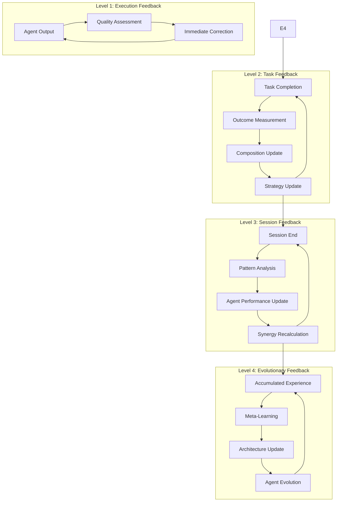

# Horde-Swarm Ultimate Learning Architecture
## The Self-Evolving Multi-Agent Intelligence System

**Status**: Vision Document
**Date**: 2026-02-04
**Version**: 1.0 - Ultimate Vision

---

## Executive Summary

This document presents the ultimate vision for horde-swarm: a continuously learning, self-improving multi-agent system that operates as an intelligence-generating organism. Unlike static multi-agent systems, horde-swarm learns which agent compositions work best, discovers new agent types, optimizes its own orchestration strategies, and evolves its capabilities through continuous feedback loops.

The architecture treats agent composition, orchestration patterns, and even the agent pool itself as learnable parameters subject to optimization.

---

## 1. The Learning Architecture Overview

### 1.1 Core Philosophy: Everything is Learnable

```
Traditional Multi-Agent System          Horde-Swarm Learning System
--------------------------             ---------------------------
Static agent pool    ------>           Dynamic agent evolution
Fixed compositions   ------>           Learned optimal teams
Manual orchestration ------>           Self-optimizing strategies
Rule-based routing   ------>           Predictive routing models
Pre-defined patterns ------>           Discovered emergent patterns
```

### 1.2 The Five Learning Loops

```mermaid
graph TB
    subgraph "Loop 1: Composition Learning"
        A1[Task Features] --> B1[Predict Optimal Team]
        B1 --> C1[Execute & Measure]
        C1 --> D1[Update Composition Model]
        D1 --> A1
    end

    subgraph "Loop 2: Strategy Learning"
        A2[Context + Goal] --> B2[Select Pattern]
        B2 --> C2[Execute Pattern]
        C2 --> D2[Measure Outcome]
        D2 --> E2[Update Pattern Weights]
        E2 --> A2
    end

    subgraph "Loop 3: Agent Evolution"
        A3[Performance Data] --> B3[Identify Gaps]
        B3 --> C3[Generate New Agent]
        C3 --> D3[Validate Agent]
        D3 --> E3[Add to Pool]
        E3 --> A3
    end

    subgraph "Loop 4: Meta-Learning"
        A4[Learning History] --> B4[Extract Principles]
        B4 --> C4[Update Learning Rules]
        C4 --> D4[Apply to All Loops]
        D4 --> A4
    end

    subgraph "Loop 5: Emergence Detection"
        A5[System Behavior] --> B5[Pattern Detection]
        B5 --> C5[Novel Strategy?]
        C5 -->|Yes| D5[Isolate & Test]
        D5 --> E5[Formalize Pattern]
        E5 --> A5
        C5 -->|No| A5
    end
```



---

## 2. Loop 1: Composition Learning - Which Agents Work Best Together

### 2.1 The Composition Prediction Model

```python
@dataclass
class TaskFingerprint:
    """
    Rich feature extraction from any task for ML-based composition prediction.
    """
    # Semantic features
    embedding: np.ndarray  # 768-dim sentence embedding of task
    intent_vector: np.ndarray  # Multi-label intent classification

    # Structural features
    complexity_score: float  # 0-1 estimated complexity
    domain_tags: List[str]  # Multi-domain classification
    estimated_duration: timedelta
    required_capabilities: List[str]

    # Contextual features
    urgency_level: int  # 1-5
    risk_level: int  # 1-5
    user_history_pattern: str  # Pattern ID from user behavior model

    # Temporal features
    time_of_day: int  # Hour (0-23)
    day_of_week: int  # 0-6
    seasonal_context: str  # Q1-Q4, holidays, etc.


class CompositionPredictor(nn.Module):
    """
    Neural network that predicts optimal agent compositions.

    Architecture: Transformer-based encoder for task understanding
                  GNN for agent interaction modeling
                  Multi-objective output for team selection
    """

    def __init__(self, num_agents: int, max_team_size: int = 5):
        super().__init__()

        # Task encoder: Transform task fingerprint to latent representation
        self.task_encoder = TransformerEncoder(
            d_model=512,
            nhead=8,
            num_layers=6
        )

        # Agent interaction graph: Models how agents work together
        self.agent_gnn = GraphNeuralNetwork(
            in_channels=256,
            hidden_channels=512,
            out_channels=256,
            num_layers=3
        )

        # Composition scorer: Scores potential team compositions
        self.composition_scorer = nn.Sequential(
            nn.Linear(512 + 256, 512),
            nn.ReLU(),
            nn.Dropout(0.2),
            nn.Linear(512, max_team_size),
            nn.Sigmoid()
        )

        # Role assignment head: Assigns roles within the team
        self.role_assigner = nn.TransformerDecoder(
            d_model=256,
            nhead=8,
            num_layers=4
        )

    def forward(self, task: TaskFingerprint, available_agents: List[Agent]) -> CompositionPrediction:
        # Encode task
        task_embedding = self.task_encoder(task.embedding)

        # Build agent interaction graph
        agent_graph = self.build_agent_graph(available_agents)
        agent_embeddings = self.agent_gnn(agent_graph)

        # Score all possible compositions (using beam search)
        best_compositions = self.beam_search_compositions(
            task_embedding,
            agent_embeddings,
            beam_width=10
        )

        # Assign roles for top composition
        roles = self.role_assigner(
            task_embedding.unsqueeze(0),
            agent_embeddings[best_compositions[0].agent_indices]
        )

        return CompositionPrediction(
            agents=[available_agents[i] for i in best_compositions[0].agent_indices],
            roles=roles,
            confidence=best_compositions[0].score,
            predicted_success_rate=best_compositions[0].success_prob,
            predicted_duration=best_compositions[0].duration_estimate
        )
```

### 2.2 Continuous Composition Learning Pipeline

```python
class CompositionLearningEngine:
    """
    Continuously learns optimal agent compositions from execution outcomes.
    """

    def __init__(self):
        self.predictor = CompositionPredictor(num_agents=20)
        self.experience_buffer = ReplayBuffer(capacity=100000)
        self.online_learning_rate = 0.001

    async def learn_from_execution(self, execution: SwarmExecution) -> LearningUpdate:
        """
        Update composition model based on actual execution results.
        """
        # Calculate outcome metrics
        outcome = self.calculate_outcome(execution)

        # Create training example
        example = TrainingExample(
            task_fingerprint=execution.task_fingerprint,
            selected_composition=execution.composition,
            actual_outcome=outcome,
            counterfactual_outcomes=await self.estimate_counterfactuals(execution)
        )

        # Add to experience buffer
        self.experience_buffer.add(example)

        # Online update (immediate learning)
        self.online_update(example)

        # Periodic batch update (deep learning)
        if self.should_batch_update():
            await self.batch_update()

        return LearningUpdate(
            composition_adjustment=self.suggest_composition_adjustment(example),
            confidence_delta=outcome.confidence - execution.predicted_confidence,
            new_insights=self.extract_insights(example)
        )

    def calculate_outcome(self, execution: SwarmExecution) -> OutcomeMetrics:
        """
        Multi-dimensional outcome measurement.
        """
        return OutcomeMetrics(
            # Quality metrics
            success=execution.success,
            quality_score=self.assess_output_quality(execution),
            user_satisfaction=self.get_user_feedback(execution),

            # Efficiency metrics
            actual_duration=execution.duration,
            token_usage=execution.token_count,
            api_cost=execution.cost,

            # Collaboration metrics
            agent_coordination_score=self.measure_coordination(execution),
            information_flow_efficiency=self.analyze_communication(execution),
            conflict_resolution_quality=self.assess_conflict_handling(execution),

            # Innovation metrics
            novel_solutions_generated=self.count_novel_solutions(execution),
            creative_approaches_used=self.identify_creativity(execution)
        )

    async def estimate_counterfactuals(self, execution: SwarmExecution) -> List[Counterfactual]:
        """
        Estimate what would have happened with different compositions.
        Uses simulation and historical similarity.
        """
        counterfactuals = []

        # Get alternative compositions that were considered
        alternatives = execution.considered_compositions[1:]

        for alt in alternatives:
            # Find similar historical executions
            similar = await self.find_similar_executions(
                task=execution.task,
                composition=alt
            )

            if similar:
                # Use historical average as counterfactual estimate
                counterfactuals.append(Counterfactual(
                    composition=alt,
                    estimated_outcome=self.average_outcomes(similar),
                    confidence=len(similar) / 10  # Confidence based on sample size
                ))
            else:
                # Use model prediction for novel compositions
                prediction = self.predictor.predict(execution.task_fingerprint, alt.agents)
                counterfactuals.append(Counterfactual(
                    composition=alt,
                    estimated_outcome=prediction,
                    confidence=0.5  # Lower confidence for simulated outcomes
                ))

        return counterfactuals
```

### 2.3 Agent Synergy Discovery

```python
class SynergyDiscoveryEngine:
    """
    Discovers emergent synergies between agents that aren't obvious from individual capabilities.
    """

    def __init__(self):
        self.interaction_graph = nx.Graph()
        self.synergy_matrix = np.zeros((MAX_AGENTS, MAX_AGENTS))

    def analyze_pairwise_synergies(self, executions: List[SwarmExecution]) -> SynergyMap:
        """
        Discover which agent pairs work better together than individually.
        """
        synergies = {}

        for execution in executions:
            if len(execution.agents) < 2:
                continue

            # Calculate actual performance
            actual_performance = execution.outcome.quality_score

            # Estimate individual performances from historical data
            individual_estimates = []
            for agent in execution.agents:
                solo_performance = self.estimate_solo_performance(
                    agent, execution.task_fingerprint
                )
                individual_estimates.append(solo_performance)

            # Synergy = actual - sum of individuals (with normalization)
            expected_performance = np.mean(individual_estimates)
            synergy_score = (actual_performance - expected_performance) / expected_performance

            # Update pairwise synergy scores
            for i, agent1 in enumerate(execution.agents):
                for agent2 in execution.agents[i+1:]:
                    pair_key = tuple(sorted([agent1.id, agent2.id]))
                    self.update_synergy_score(pair_key, synergy_score, execution.task_fingerprint)

        return self.extract_synergy_patterns()

    def discover_emergent_capabilities(self) -> List[EmergentCapability]:
        """
        Find capabilities that only emerge from specific agent combinations,
        not present in individual agents.
        """
        emergent = []

        # Cluster task types by outcome quality
        task_clusters = self.cluster_by_outcome()

        for cluster in task_clusters:
            # Find common agent combinations in high-performing clusters
            frequent_teams = self.find_frequent_teams(cluster.executions)

            for team in frequent_teams:
                # Check if team can solve tasks that individuals cannot
                team_capabilities = self.infer_team_capabilities(team, cluster)
                individual_capabilities = self.sum_individual_capabilities(team)

                novel_capabilities = team_capabilities - individual_capabilities

                if novel_capabilities:
                    emergent.append(EmergentCapability(
                        agent_combination=team,
                        capabilities=novel_capabilities,
                        task_types=cluster.task_types,
                        confidence=cluster.confidence
                    ))

        return emergent
```

---

## 3. Loop 2: Strategy Learning - Optimizing Orchestration Patterns

### 3.1 Adaptive Pattern Selection

```python
class AdaptiveOrchestrationEngine:
    """
    Learns which orchestration patterns work best for different contexts.
    Goes beyond static pattern selection to dynamic pattern evolution.
    """

    def __init__(self):
        self.pattern_performance_model = PatternPerformanceModel()
        self.dynamic_pattern_generator = DynamicPatternGenerator()
        self.pattern_evolution_history = []

    async def select_or_evolve_pattern(
        self,
        task: Task,
        composition: AgentComposition,
        context: ExecutionContext
    ) -> OrchestrationStrategy:
        """
        Either select from known patterns or evolve a new one.
        """
        # Get pattern recommendations from learned model
        pattern_scores = self.pattern_performance_model.predict(
            task=task,
            composition=composition,
            context=context
        )

        best_known_score = max(pattern_scores.values())

        # If best known pattern has low confidence, try evolving
        if best_known_score < 0.7:
            evolved_pattern = await self.dynamic_pattern_generator.evolve_pattern(
                base_pattern=max(pattern_scores, key=pattern_scores.get),
                task=task,
                composition=composition,
                context=context
            )

            # A/B test: evolved vs best known
            return await self.ab_test_patterns(
                pattern_a=max(pattern_scores, key=pattern_scores.get),
                pattern_b=evolved_pattern,
                task=task
            )

        return OrchestrationStrategy(
            pattern=max(pattern_scores, key=pattern_scores.get),
            parameters=self.optimize_parameters(
                pattern=max(pattern_scores, key=pattern_scores.get),
                task=task,
                composition=composition
            )
        )

    async def evolve_pattern(
        self,
        base_pattern: SwarmPattern,
        task: Task,
        composition: AgentComposition,
        context: ExecutionContext
    ) -> SwarmPattern:
        """
        Evolve a new pattern by combining and mutating existing patterns.
        """
        # Genetic algorithm-style evolution
        population = self.initialize_population(base_pattern, size=20)

        for generation in range(10):
            # Evaluate fitness of each pattern variant
            fitness_scores = await self.evaluate_pattern_fitness(
                population, task, composition, context
            )

            # Select top performers
            survivors = self.select_survivors(population, fitness_scores, survival_rate=0.3)

            # Crossover: combine successful patterns
            offspring = self.crossover_patterns(survivors, num_offspring=10)

            # Mutation: random modifications
            mutated = self.mutate_patterns(offspring, mutation_rate=0.1)

            population = survivors + mutated

        # Return best evolved pattern
        best_pattern = max(population, key=lambda p: fitness_scores.get(p.id, 0))
        return best_pattern


class PatternPerformanceModel:
    """
    Neural model that predicts how well each pattern will perform
    given task characteristics and agent composition.
    """

    def __init__(self):
        self.context_encoder = ContextualPatternEncoder()
        self.performance_predictor = PatternPerformancePredictor()
        self.attention_mechanism = PatternAttentionLayer()

    def predict(
        self,
        task: Task,
        composition: AgentComposition,
        context: ExecutionContext
    ) -> Dict[SwarmPattern, float]:
        """
        Predict success probability for each pattern.
        """
        # Encode the full context
        context_embedding = self.context_encoder.encode(
            task=task,
            composition=composition,
            execution_context=context,
            historical_patterns=self.get_similar_pattern_executions(task, composition)
        )

        # Calculate pattern-specific attention
        pattern_attention = self.attention_mechanism(
            context_embedding,
            available_patterns=SwarmPattern.all_patterns()
        )

        # Predict performance for each pattern
        scores = {}
        for pattern in SwarmPattern.all_patterns():
            score = self.performance_predictor.predict(
                context_embedding=context_embedding,
                pattern=pattern,
                attention_weight=pattern_attention[pattern]
            )
            scores[pattern] = score

        return scores
```

### 3.2 Real-Time Strategy Adaptation

```python
class RealTimeStrategyAdapter:
    """
    Adapts orchestration strategy in real-time based on execution feedback.
    """

    def __init__(self):
        self.execution_monitor = ExecutionMonitor()
        self.adaptation_policies = self.load_adaptation_policies()

    async def monitor_and_adapt(self, execution: ActiveExecution) -> AdaptationDecision:
        """
        Continuously monitor execution and adapt strategy if needed.
        """
        while execution.status == "running":
            # Get current execution state
            state = await self.execution_monitor.get_state(execution)

            # Detect anomalies or opportunities
            anomalies = self.detect_anomalies(state)
            opportunities = self.detect_opportunities(state)

            if anomalies or opportunities:
                # Evaluate adaptation options
                adaptations = self.generate_adaptation_options(
                    state, anomalies, opportunities
                )

                # Select best adaptation
                best_adaptation = self.select_adaptation(adaptations, execution)

                if best_adaptation.expected_improvement > 0.2:  # 20% improvement threshold
                    await self.apply_adaptation(execution, best_adaptation)

            await asyncio.sleep(1)  # 1-second monitoring interval

    def detect_anomalies(self, state: ExecutionState) -> List[Anomaly]:
        """
        Detect when execution is deviating from expected trajectory.
        """
        anomalies = []

        # Check for agent bottlenecks
        for agent_state in state.agent_states:
            if agent_state.time_on_task > agent_state.expected_duration * 2:
                anomalies.append(Anomaly(
                    type="agent_bottleneck",
                    severity="high",
                    agent=agent_state.agent_id,
                    description=f"Agent {agent_state.agent_id} is taking 2x expected time"
                ))

        # Check for communication breakdown
        if state.messages_in_last_minute < state.expected_message_rate * 0.5:
            anomalies.append(Anomaly(
                type="communication_breakdown",
                severity="medium",
                description="Message rate below expected threshold"
            ))

        # Check for quality degradation
        if state.intermediate_quality_scores and \
           state.intermediate_quality_scores[-1] < 0.5:
            anomalies.append(Anomaly(
                type="quality_degradation",
                severity="high",
                description="Intermediate output quality declining"
            ))

        return anomalies

    def generate_adaptation_options(
        self,
        state: ExecutionState,
        anomalies: List[Anomaly],
        opportunities: List[Opportunity]
    ) -> List[AdaptationOption]:
        """
        Generate possible adaptations to address issues or capitalize on opportunities.
        """
        options = []

        for anomaly in anomalies:
            if anomaly.type == "agent_bottleneck":
                options.extend([
                    AdaptationOption(
                        action="add_support_agent",
                        target=anomaly.agent,
                        expected_improvement=0.3,
                        risk="coordination_overhead"
                    ),
                    AdaptationOption(
                        action="decompose_task",
                        target=anomaly.agent,
                        expected_improvement=0.25,
                        risk="integration_complexity"
                    ),
                    AdaptationOption(
                        action="escalate_to_specialist",
                        target=anomaly.agent,
                        expected_improvement=0.4,
                        risk="context_switch_cost"
                    )
                ])

            elif anomaly.type == "communication_breakdown":
                options.append(AdaptationOption(
                    action="inject_facilitator",
                    expected_improvement=0.35,
                    risk="additional_overhead"
                ))

        for opportunity in opportunities:
            if opportunity.type == "parallelization_opportunity":
                options.append(AdaptationOption(
                    action="parallelize_subtasks",
                    target=opportunity.subtasks,
                    expected_improvement=0.5,
                    risk="race_conditions"
                ))

        return options
```

---

## 4. Loop 3: Agent Evolution - Discovering New Agent Types

### 4.1 Automated Agent Discovery

```python
class AgentDiscoveryEngine:
    """
    Discovers when new agent types would be valuable and creates them.
    """

    def __init__(self):
        self.capability_gap_analyzer = CapabilityGapAnalyzer()
        self.agent_generator = AgentGenerator()
        self.agent_validator = AgentValidator()

    async def discover_new_agents(self, execution_history: List[SwarmExecution]) -> List[AgentPrototype]:
        """
        Analyze execution history to identify opportunities for new agent types.
        """
        new_agent_candidates = []

        # Analysis 1: Recurring capability gaps
        capability_gaps = self.capability_gap_analyzer.identify_recurring_gaps(
            execution_history
        )

        for gap in capability_gaps:
            if gap.frequency > 5 and gap.impact_score > 0.7:
                # High-impact recurring gap - candidate for new agent
                agent_prototype = await self.design_agent_for_gap(gap)
                new_agent_candidates.append(agent_prototype)

        # Analysis 2: Agent overload patterns
        overloaded_agents = self.identify_overloaded_agents(execution_history)

        for agent_id, overload_pattern in overloaded_agents.items():
            # Agent is doing too many things - consider specialization
            specialized_agents = await self.design_specializations(
                base_agent=agent_id,
                overload_pattern=overload_pattern
            )
            new_agent_candidates.extend(specialized_agents)

        # Analysis 3: Emerging task clusters
        task_clusters = self.cluster_tasks_by_similarity(execution_history)

        for cluster in task_clusters:
            if cluster.size > 10 and cluster.cohesion > 0.8:
                # Distinct task cluster - candidate for specialized agent
                agent_prototype = await self.design_agent_for_cluster(cluster)
                new_agent_candidates.append(agent_prototype)

        # Validate and rank candidates
        validated = []
        for candidate in new_agent_candidates:
            validation = await self.agent_validator.validate_design(candidate)
            if validation.is_viable:
                candidate.viability_score = validation.score
                validated.append(candidate)

        return sorted(validated, key=lambda x: x.viability_score, reverse=True)

    async def design_agent_for_gap(self, gap: CapabilityGap) -> AgentPrototype:
        """
        Design a new agent to fill a specific capability gap.
        """
        # Analyze what capabilities are needed
        required_capabilities = self.infer_required_capabilities(gap)

        # Study successful examples from history
        successful_approaches = await self.study_successful_approaches(gap)

        # Generate agent specification
        specification = AgentSpecification(
            name=self.generate_agent_name(gap),
            primary_capabilities=required_capabilities,
            secondary_capabilities=self.infer_secondary_capabilities(gap),
            system_prompt=self.generate_system_prompt(
                gap, required_capabilities, successful_approaches
            ),
            tools=self.select_tools_for_capabilities(required_capabilities),
            model_config=self.optimize_model_config(required_capabilities),
            delegation_rules=self.define_delegation_rules(gap)
        )

        return AgentPrototype(
            specification=specification,
            rationale=f"Addresses recurring gap: {gap.description}",
            expected_impact=gap.impact_score,
            training_requirements=self.estimate_training_requirements(specification)
        )

    def generate_system_prompt(
        self,
        gap: CapabilityGap,
        capabilities: List[str],
        successful_approaches: List[Approach]
    ) -> str:
        """
        Generate an optimized system prompt for the new agent.
        """
        # Use meta-learning: extract patterns from successful approaches
        common_patterns = self.extract_common_patterns(successful_approaches)

        prompt_template = f"""You are {{name}}, a specialized AI agent focused on {gap.domain}.

CORE CAPABILITIES:
{self.format_capabilities(capabilities)}

APPROACH PRINCIPLES:
{self.format_principles(common_patterns)}

WORKING STYLE:
- You excel at tasks requiring {gap.primary_skill}
- You collaborate effectively with other specialists
- You know when to escalate and when to solve independently

OUTPUT STANDARDS:
- Produce work that meets {gap.quality_criteria}
- Follow established patterns: {common_patterns.best_practices}
- Always validate your work against {gap.validation_criteria}
"""

        return prompt_template


class AgentGenerator:
    """
    Generates new agent implementations from specifications.
    """

    async def generate_agent(self, prototype: AgentPrototype) -> GeneratedAgent:
        """
        Generate a complete agent implementation from a prototype.
        """
        spec = prototype.specification

        # Generate the agent class
        agent_code = self.generate_agent_class(spec)

        # Generate test suite
        test_suite = self.generate_test_suite(spec)

        # Generate documentation
        documentation = self.generate_documentation(spec)

        # Generate training data
        training_data = await self.generate_training_data(spec)

        return GeneratedAgent(
            code=agent_code,
            tests=test_suite,
            documentation=documentation,
            training_data=training_data,
            deployment_config=self.generate_deployment_config(spec)
        )

    def generate_agent_class(self, spec: AgentSpecification) -> str:
        """
        Generate Python code for the agent class.
        """
        code = f'''
class {spec.name}Agent(BaseAgent):
    """
    {spec.name} - Specialized agent for {spec.primary_capabilities[0]}

    Auto-generated on {datetime.now().isoformat()}
    Expected impact: {spec.expected_impact}
    """

    AGENT_ID = "{spec.name.lower()}"
    CAPABILITIES = {spec.primary_capabilities}

    def __init__(self, config: AgentConfig = None):
        super().__init__(config)
        self.system_prompt = """{spec.system_prompt}"""
        self.tools = self.initialize_tools()
        self.delegation_rules = {spec.delegation_rules}

    async def execute(self, task: Task, context: ExecutionContext) -> ExecutionResult:
        """
        Execute a task using specialized capabilities.
        """
        # Pre-processing
        prepared_task = self.prepare_task(task)

        # Capability-specific execution
        if self.can_handle_directly(prepared_task):
            result = await self.execute_directly(prepared_task, context)
        else:
            # Delegate to appropriate sub-agents
            result = await self.orchestrate_subtasks(prepared_task, context)

        # Post-processing and validation
        validated_result = self.validate_output(result)

        return validated_result

    {self.generate_capability_methods(spec)}

    {self.generate_delegation_logic(spec)}
'''
        return code
```

### 4.2 Agent Specialization and Splitting

```python
class AgentSpecializationEngine:
    """
    Identifies when agents should be split into specialized variants.
    """

    def analyze_agent_for_splitting(self, agent_id: str, executions: List[SwarmExecution]) -> Optional[SplitRecommendation]:
        """
        Analyze if an agent is handling too many disparate task types.
        """
        # Get all tasks handled by this agent
        agent_tasks = [e for e in executions if agent_id in [a.id for a in e.agents]]

        if len(agent_tasks) < 20:
            return None  # Not enough data

        # Cluster tasks by characteristics
        task_clusters = self.cluster_tasks(agent_tasks)

        # Check if clusters are distinct enough to warrant specialization
        if len(task_clusters) < 2:
            return None  # No clear specialization opportunities

        # Measure cluster separation
        cluster_separation = self.measure_cluster_separation(task_clusters)

        if cluster_separation < 0.7:
            return None  # Clusters too similar

        # Calculate potential benefit
        current_performance = self.calculate_current_performance(agent_tasks)
        projected_performance = self.project_specialized_performance(task_clusters)

        improvement_potential = (projected_performance - current_performance) / current_performance

        if improvement_potential < 0.2:
            return None  # Not enough improvement potential

        return SplitRecommendation(
            original_agent=agent_id,
            proposed_specializations=[
                self.design_specialization(cluster) for cluster in task_clusters
            ],
            expected_improvement=improvement_potential,
            migration_plan=self.create_migration_plan(agent_id, task_clusters)
        )

    def design_specialization(self, cluster: TaskCluster) -> AgentSpecialization:
        """
        Design a specialized agent variant for a task cluster.
        """
        # Extract common patterns from cluster
        common_patterns = self.extract_common_patterns(cluster.tasks)

        # Identify unique capabilities needed
        unique_capabilities = self.identify_unique_capabilities(cluster)

        # Generate specialized prompt
        specialized_prompt = self.generate_specialized_prompt(
            base_agent=cluster.base_agent,
            task_patterns=common_patterns,
            capabilities=unique_capabilities
        )

        return AgentSpecialization(
            name=f"{cluster.base_agent}_{cluster.cluster_id}",
            focus_area=cluster.primary_domain,
            specialized_prompt=specialized_prompt,
            tools=self.select_specialized_tools(cluster),
            example_tasks=[t.description for t in cluster.sample_tasks],
            performance_projection=cluster.projected_performance
        )
```

---

## 5. Loop 4: Meta-Learning - Learning How to Learn

### 5.1 Meta-Learning Engine

```python
class MetaLearningEngine:
    """
    Learns general principles from learning experiences that improve all learning loops.
    """

    def __init__(self):
        self.principle_extractor = PrincipleExtractor()
        self.learning_optimizer = LearningOptimizer()
        self.meta_policy_network = MetaPolicyNetwork()

    async def extract_learning_principles(self, learning_history: List[LearningEvent]) -> List[LearningPrinciple]:
        """
        Extract general principles from learning history.
        """
        principles = []

        # Principle 1: What makes compositions successful?
        composition_principles = self.analyze_composition_success_patterns(learning_history)
        principles.extend(composition_principles)

        # Principle 2: When do strategies succeed or fail?
        strategy_principles = self.analyze_strategy_patterns(learning_history)
        principles.extend(strategy_principles)

        # Principle 3: How do agents best learn new skills?
        skill_learning_principles = self.analyze_skill_learning_patterns(learning_history)
        principles.extend(skill_learning_principles)

        # Principle 4: What indicates a task will be hard?
        difficulty_indicators = self.extract_difficulty_indicators(learning_history)
        principles.extend(difficulty_indicators)

        return self.rank_principles_by_validity(principles, learning_history)

    def analyze_composition_success_patterns(self, history: List[LearningEvent]) -> List[LearningPrinciple]:
        """
        Extract principles about what makes agent compositions work.
        """
        principles = []

        # Find cases where unexpected compositions succeeded
        surprising_successes = [
            e for e in history
            if e.event_type == "composition_success"
            and e.surprise_score > 0.7
        ]

        for success in surprising_successes:
            # Analyze what made this composition work
            analysis = self.analyze_success_factors(success)

            principle = LearningPrinciple(
                domain="composition",
                statement=f"{analysis.key_factor} is critical when {analysis.context}",
                confidence=analysis.confidence,
                supporting_evidence=analysis.evidence,
                applicability_conditions=analysis.conditions,
                suggested_action=f"Prioritize {analysis.recommendation} in similar contexts"
            )
            principles.append(principle)

        return principles

    async def optimize_learning_process(self) -> LearningOptimization:
        """
        Use meta-learning to improve the learning process itself.
        """
        # Analyze which learning strategies work best
        strategy_effectiveness = self.analyze_learning_strategies()

        # Optimize hyperparameters for each learning loop
        optimizations = []

        for loop in ["composition", "strategy", "agent_evolution", "emergence"]:
            best_params = self.meta_optimize_hyperparameters(
                loop=loop,
                history=self.get_loop_history(loop),
                strategy_effectiveness=strategy_effectiveness
            )
            optimizations.append(LearningOptimization(
                target_loop=loop,
                new_parameters=best_params,
                expected_improvement=strategy_effectiveness[loop].projected_improvement
            ))

        return optimizations

    def meta_optimize_hyperparameters(
        self,
        loop: str,
        history: List[LearningEvent],
        strategy_effectiveness: Dict[str, StrategyEffectiveness]
    ) -> Hyperparameters:
        """
        Use population-based training to find optimal hyperparameters.
        """
        # Define hyperparameter search space
        search_space = self.get_hyperparameter_space(loop)

        # Initialize population
        population = self.initialize_population(search_space, size=20)

        for generation in range(50):
            # Evaluate each hyperparameter set
            fitness_scores = []
            for params in population:
                score = self.evaluate_hyperparameters(
                    params, history, strategy_effectiveness[loop]
                )
                fitness_scores.append(score)

            # Evolve population
            population = self.evolve_population(
                population, fitness_scores,
                mutation_rate=0.1,
                crossover_rate=0.3
            )

        # Return best hyperparameters
        best_idx = np.argmax(fitness_scores)
        return population[best_idx]
```

### 5.2 Cross-Domain Transfer Learning

```python
class TransferLearningEngine:
    """
    Transfers learnings from one domain to accelerate learning in another.
    """

    def identify_transfer_opportunities(self, source_domain: str, target_domain: str) -> List[TransferOpportunity]:
        """
        Identify what can be transferred from source to target domain.
        """
        opportunities = []

        # Structural similarity analysis
        structural_similarity = self.compute_structural_similarity(source_domain, target_domain)

        if structural_similarity > 0.6:
            # Similar task structures - transfer composition patterns
            opportunities.append(TransferOpportunity(
                type="composition_pattern",
                source=source_domain,
                target=target_domain,
                confidence=structural_similarity,
                adaptation_required=self.estimate_adaptation(source_domain, target_domain)
            ))

        # Capability overlap analysis
        capability_overlap = self.compute_capability_overlap(source_domain, target_domain)

        if capability_overlap > 0.5:
            # Overlapping capabilities - transfer agent configurations
            opportunities.append(TransferOpportunity(
                type="agent_configuration",
                source=source_domain,
                target=target_domain,
                confidence=capability_overlap,
                adaptation_required=self.estimate_capability_adaptation(source_domain, target_domain)
            ))

        # Strategy transfer
        strategy_transfer_potential = self.analyze_strategy_transfer(source_domain, target_domain)

        if strategy_transfer_potential > 0.4:
            opportunities.append(TransferOpportunity(
                type="orchestration_strategy",
                source=source_domain,
                target=target_domain,
                confidence=strategy_transfer_potential,
                adaptation_required=self.estimate_strategy_adaptation(source_domain, target_domain)
            ))

        return opportunities

    def transfer_composition_model(
        self,
        source_model: CompositionPredictor,
        target_domain: str,
        adaptation_data: List[Task]
    ) -> CompositionPredictor:
        """
        Transfer a composition model to a new domain with minimal data.
        """
        # Fine-tune with domain adaptation techniques
        target_model = copy.deepcopy(source_model)

        # Domain adversarial training to align feature spaces
        target_model = self.domain_adversarial_finetune(
            model=target_model,
            source_domain=source_model.domain,
            target_domain=target_domain,
            adaptation_data=adaptation_data
        )

        # Few-shot learning on target domain examples
        if len(adaptation_data) < 10:
            target_model = self.few_shot_adapt(
                model=target_model,
                examples=adaptation_data,
                meta_parameters=self.load_meta_parameters()
            )

        return target_model
```

---

## 6. Loop 5: Emergence Detection - Discovering Novel Strategies

### 6.1 Emergent Behavior Detection

```python
class EmergenceDetectionEngine:
    """
    Detects novel, effective behaviors that emerge from agent interactions.
    """

    def __init__(self):
        self.behavior_tracker = BehaviorTracker()
        self.novelty_detector = NoveltyDetector()
        self.effectiveness_evaluator = EffectivenessEvaluator()

    async def monitor_for_emergence(self, execution: SwarmExecution) -> Optional[EmergentBehavior]:
        """
        Monitor execution for emergent behaviors.
        """
        # Track all agent interactions
        interaction_patterns = self.behavior_tracker.extract_patterns(execution)

        for pattern in interaction_patterns:
            # Check if pattern is novel
            novelty_score = self.novelty_detector.score_novelty(pattern)

            if novelty_score > 0.8:  # Highly novel
                # Check if pattern is effective
                effectiveness = self.effectiveness_evaluator.evaluate(pattern, execution)

                if effectiveness.score > 0.7:  # Effective
                    return EmergentBehavior(
                        pattern=pattern,
                        novelty_score=novelty_score,
                        effectiveness_score=effectiveness.score,
                        context=execution.context,
                        reproducibility_estimate=self.estimate_reproducibility(pattern)
                    )

        return None

    def extract_patterns(self, execution: SwarmExecution) -> List[InteractionPattern]:
        """
        Extract interaction patterns from execution.
        """
        patterns = []

        # Message flow patterns
        message_patterns = self.analyze_message_flows(execution.messages)
        patterns.extend(message_patterns)

        # Turn-taking patterns
        turn_patterns = self.analyze_turn_taking(execution.agent_actions)
        patterns.extend(turn_patterns)

        # Tool usage patterns
        tool_patterns = self.analyze_tool_collaboration(execution.tool_usage)
        patterns.extend(tool_patterns)

        # Synthesis patterns
        synthesis_patterns = self.analyze_synthesis_approaches(execution.synthesis_steps)
        patterns.extend(synthesis_patterns)

        return patterns


class NovelStrategyFormalizer:
    """
    Converts detected emergent behaviors into formal, reusable strategies.
    """

    async def formalize_strategy(self, emergent: EmergentBehavior) -> FormalizedStrategy:
        """
        Convert an emergent behavior into a formal strategy.
        """
        # Generalize the pattern
        generalized = self.generalize_pattern(emergent.pattern)

        # Define applicability conditions
        conditions = self.infer_applicability_conditions(emergent)

        # Create execution template
        template = self.create_execution_template(generalized)

        # Define parameters
        parameters = self.identify_parameters(generalized)

        # Generate documentation
        documentation = self.generate_strategy_documentation(emergent, generalized)

        return FormalizedStrategy(
            name=self.generate_strategy_name(emergent),
            description=documentation.description,
            applicability_conditions=conditions,
            execution_template=template,
            parameters=parameters,
            expected_outcomes=self.project_outcomes(emergent),
            validation_tests=self.generate_validation_tests(emergent)
        )

    def generalize_pattern(self, pattern: InteractionPattern) -> GeneralizedPattern:
        """
        Generalize a specific pattern into a reusable form.
        """
        # Abstract specific agent names to roles
        role_based = self.abstract_to_roles(pattern)

        # Abstract specific content to content types
        type_based = self.abstract_to_content_types(role_based)

        # Identify invariant structure
        invariant_structure = self.extract_invariant_structure(type_based)

        # Define variation points
        variation_points = self.identify_variation_points(pattern, invariant_structure)

        return GeneralizedPattern(
            structure=invariant_structure,
            variation_points=variation_points,
            constraints=self.infer_constraints(pattern),
            success_indicators=self.extract_success_indicators(pattern)
        )
```

---

## 7. The Feedback Architecture

### 7.1 Multi-Level Feedback Loops



### 7.2 Feedback Integration System

```python
class FeedbackIntegrationSystem:
    """
    Integrates feedback from all levels into coherent learning updates.
    """

    def __init__(self):
        self.feedback_buffers = {
            "execution": CircularBuffer(size=10000),
            "task": CircularBuffer(size=1000),
            "session": CircularBuffer(size=100),
            "evolutionary": CircularBuffer(size=10)
        }
        self.integration_model = FeedbackIntegrationModel()

    async def process_feedback(self, feedback: Feedback) -> LearningUpdate:
        """
        Process feedback and generate appropriate learning updates.
        """
        # Route to appropriate buffer
        self.feedback_buffers[feedback.level].add(feedback)

        # Generate level-specific update
        if feedback.level == "execution":
            update = await self.process_execution_feedback(feedback)
        elif feedback.level == "task":
            update = await self.process_task_feedback(feedback)
        elif feedback.level == "session":
            update = await self.process_session_feedback(feedback)
        else:
            update = await self.process_evolutionary_feedback(feedback)

        # Propagate to higher levels if significant
        if self.is_significant(feedback):
            await self.propagate_to_higher_level(feedback)

        return update

    async def consolidate_feedback(self) -> ConsolidatedLearning:
        """
        Periodically consolidate feedback across all levels.
        """
        # Extract patterns from each level
        execution_patterns = self.extract_patterns(self.feedback_buffers["execution"])
        task_patterns = self.extract_patterns(self.feedback_buffers["task"])
        session_patterns = self.extract_patterns(self.feedback_buffers["session"])
        evolutionary_patterns = self.extract_patterns(self.feedback_buffers["evolutionary"])

        # Cross-level pattern correlation
        correlations = self.find_cross_level_correlations(
            execution_patterns,
            task_patterns,
            session_patterns,
            evolutionary_patterns
        )

        # Generate consolidated learning directives
        directives = []

        for correlation in correlations:
            if correlation.strength > 0.7:
                directive = self.create_learning_directive(correlation)
                directives.append(directive)

        return ConsolidatedLearning(
            directives=directives,
            priority=self.calculate_priority(directives),
            expected_impact=self.project_impact(directives)
        )
```

---

## 8. Memory and Knowledge Architecture

### 8.1 Hierarchical Knowledge Store

```python
@dataclass
class HordeSwarmKnowledgeGraph:
    """
    Comprehensive knowledge storage for the learning system.
    """

    # Level 1: Episodic Memory (specific experiences)
    executions: List[SwarmExecution]
    feedback_events: List[FeedbackEvent]

    # Level 2: Semantic Memory (generalized knowledge)
    composition_rules: List[CompositionRule]
    strategy_templates: List[StrategyTemplate]
    agent_profiles: List[AgentProfile]

    # Level 3: Procedural Memory (how to do things)
    orchestration_procedures: List[OrchestrationProcedure]
    learning_procedures: List[LearningProcedure]

    # Level 4: Meta-Cognitive Memory (knowledge about knowledge)
    learning_principles: List[LearningPrinciple]
    domain_models: List[DomainModel]
    uncertainty_estimates: UncertaintyModel


class KnowledgeConsolidationEngine:
    """
    Consolidates experiences into higher-level knowledge.
    """

    async def consolidate(self, knowledge: HordeSwarmKnowledgeGraph) -> ConsolidatedKnowledge:
        """
        Run consolidation process to extract general knowledge from experiences.
        """
        # Sleep-phase consolidation (analogous to human sleep)
        if self.should_consolidate():
            # Extract patterns from recent experiences
            patterns = self.pattern_extraction(knowledge.executions[-1000:])

            # Generalize to rules
            new_rules = self.generalize_to_rules(patterns)

            # Integrate with existing knowledge
            integrated = self.integrate_rules(knowledge.composition_rules, new_rules)

            # Update semantic memory
            knowledge.composition_rules = integrated

            # Clear episodic buffer (selective forgetting)
            knowledge.executions = self.selective_retain(knowledge.executions)

        return ConsolidatedKnowledge(
            updated_graph=knowledge,
            new_rules_added=len(new_rules),
            consolidation_quality=self.assess_quality(knowledge)
        )
```

### 8.2 Neo4j Schema for Learning

```cypher
// Execution nodes with rich features
(:Execution {
    id: uuid,
    task_embedding: vector,  // For similarity search
    task_features: map,      // Structured task characteristics
    composition: [string],   // Agent IDs in team
    pattern: string,
    outcome: map,           // Success, quality, duration, cost
    timestamp: datetime
})

// Learned composition rules
(:CompositionRule {
    id: uuid,
    condition_features: map,  // When this rule applies
    recommended_composition: [string],
    confidence: float,
    success_rate: float,
    sample_size: int,
    created_at: datetime,
    last_validated: datetime
})

// Strategy effectiveness tracking
(:StrategyProfile {
    id: uuid,
    pattern: string,
    context_features: map,
    effectiveness_distribution: map,  // By outcome dimension
    average_duration: duration,
    average_cost: float,
    usage_count: int
})

// Agent capability evolution
(:AgentEvolution {
    id: uuid,
    agent_id: string,
    version: int,
    capabilities: [string],
    performance_history: [map],
    specialization_degree: float
})

// Emergent behavior records
(:EmergentBehavior {
    id: uuid,
    pattern_description: string,
    detection_context: map,
    novelty_score: float,
    effectiveness_score: float,
    formalized_strategy: string,
    validation_status: string
})

// Relationships
(:Execution)-[:USES_COMPOSITION]->(:CompositionRule)
(:Execution)-[:USES_STRATEGY]->(:StrategyProfile)
(:CompositionRule)-[:EVOLVED_FROM]->(:Execution)
(:EmergentBehavior)-[:FORMALIZED_INTO]->(:StrategyProfile)
(:AgentEvolution)-[:SUCCEEDED_BY]->(:AgentEvolution)
```

---

## 9. Implementation Architecture

### 9.1 System Components

```python
class HordeSwarmLearningSystem:
    """
    Main orchestrator for the continuous learning system.
    """

    def __init__(self):
        # Learning engines
        self.composition_learner = CompositionLearningEngine()
        self.strategy_learner = StrategyLearningEngine()
        self.agent_evolver = AgentEvolutionEngine()
        self.meta_learner = MetaLearningEngine()
        self.emergence_detector = EmergenceDetectionEngine()

        # Knowledge management
        self.knowledge_graph = HordeSwarmKnowledgeGraph()
        self.consolidation_engine = KnowledgeConsolidationEngine()

        # Feedback system
        self.feedback_integrator = FeedbackIntegrationSystem()

        # Execution integration
        self.orchestrator = AdaptiveOrchestrator()

    async def run_learning_cycle(self):
        """
        Main learning loop that continuously improves the system.
        """
        while True:
            # Collect new experiences
            new_executions = await self.collect_recent_executions()

            # Process through all learning loops
            await asyncio.gather(
                self.composition_learner.learn_from_executions(new_executions),
                self.strategy_learner.learn_from_executions(new_executions),
                self.emergence_detector.scan_for_emergence(new_executions)
            )

            # Periodic deeper learning
            if self.should_run_deep_learning():
                await self.run_deep_learning_cycle()

            # Knowledge consolidation
            if self.should_consolidate():
                self.knowledge_graph = await self.consolidation_engine.consolidate(
                    self.knowledge_graph
                )

            # Meta-learning
            if self.should_meta_learn():
                await self.meta_learner.extract_and_apply_principles(
                    self.knowledge_graph
                )

            await asyncio.sleep(60)  # 1-minute cycle

    async def execute_with_learning(self, task: Task) -> ExecutionResult:
        """
        Execute a task while collecting learning data.
        """
        # Use learned models for composition and strategy
        composition = await self.composition_learner.predict_optimal_composition(task)
        strategy = await self.strategy_learner.select_strategy(task, composition)

        # Execute with monitoring
        execution = await self.orchestrator.execute(task, composition, strategy)

        # Feed results back to learning system
        await self.feedback_integrator.process_feedback(
            ExecutionFeedback(execution=execution)
        )

        return execution.result
```

### 9.2 Deployment Architecture

```
┌─────────────────────────────────────────────────────────────────────────┐
│                         HORDE-SWARM LEARNING SYSTEM                      │
├─────────────────────────────────────────────────────────────────────────┤
│                                                                          │
│  ┌─────────────────┐  ┌─────────────────┐  ┌─────────────────┐          │
│  │   API Gateway   │  │   WebSocket     │  │   Event Bus     │          │
│  │   (FastAPI)     │  │   (Real-time)   │  │   (Redis)       │          │
│  └────────┬────────┘  └────────┬────────┘  └────────┬────────┘          │
│           │                    │                    │                    │
│           └────────────────────┼────────────────────┘                    │
│                                ▼                                         │
│  ┌─────────────────────────────────────────────────────────────┐        │
│  │              ORCHESTRATION LAYER                             │        │
│  │  ┌─────────────┐ ┌─────────────┐ ┌─────────────────────┐   │        │
│  │  │ Composition │ │  Strategy   │ │   Agent Selection   │   │        │
│  │  │  Predictor  │ │   Selector  │ │      Engine         │   │        │
│  │  └─────────────┘ └─────────────┘ └─────────────────────┘   │        │
│  └─────────────────────────────────────────────────────────────┘        │
│                                │                                         │
│                                ▼                                         │
│  ┌─────────────────────────────────────────────────────────────┐        │
│  │              LEARNING LAYER                                  │        │
│  │  ┌──────────┐ ┌──────────┐ ┌──────────┐ ┌──────────────┐   │        │
│  │  │ Compo-   │ │ Strategy │ │  Agent   │ │   Meta-      │   │        │
│  │  │ sition   │ │  Learner │ │ Evolver  │ │  Learner     │   │        │
│  │  │ Learner  │ │          │ │          │ │              │   │        │
│  │  └──────────┘ └──────────┘ └──────────┘ └──────────────┘   │        │
│  └─────────────────────────────────────────────────────────────┘        │
│                                │                                         │
│                                ▼                                         │
│  ┌─────────────────────────────────────────────────────────────┐        │
│  │              KNOWLEDGE LAYER                                 │        │
│  │  ┌──────────────┐  ┌──────────────┐  ┌──────────────┐       │        │
│  │  │   Neo4j      │  │   Vector     │  │   Model      │       │        │
│  │  │   (Graph)    │  │   Store      │  │   Registry   │       │        │
│  │  │              │  │   (Pinecone) │  │   (MLflow)   │       │        │
│  │  └──────────────┘  └──────────────┘  └──────────────┘       │        │
│  └─────────────────────────────────────────────────────────────┘        │
│                                                                          │
└─────────────────────────────────────────────────────────────────────────┘
```

---

## 10. Success Metrics and Evaluation

### 10.1 Learning Effectiveness Metrics

| Metric | Description | Target |
|--------|-------------|--------|
| **Composition Accuracy** | % of optimal compositions selected | >90% |
| **Strategy Appropriateness** | % of appropriate pattern selection | >95% |
| **Learning Velocity** | Time to reach performance threshold | <100 tasks |
| **Transfer Efficiency** | Performance on new domains | >70% of native |
| **Emergence Detection Rate** | Novel effective behaviors found | >1/week |
| **Agent Evolution Success** | New agents that improve performance | >80% |

### 10.2 System Health Metrics

| Metric | Description | Target |
|--------|-------------|--------|
| **Prediction Confidence** | Model confidence in predictions | >0.8 |
| **Feedback Loop Latency** | Time from execution to learning | <5 min |
| **Knowledge Consolidation Quality** | Coherence of consolidated knowledge | >0.85 |
| **Exploration/Exploitation Balance** | Ratio of novel vs proven strategies | 20/80 |
| **Catastrophic Forgetting** | Performance retention on old tasks | >95% |

---

## 11. Conclusion

This architecture transforms horde-swarm from a static multi-agent system into a continuously evolving intelligence organism. By treating every aspect of the system as learnable - from agent compositions to orchestration strategies to the agents themselves - the system achieves compounding returns on experience.

The five learning loops work synergistically:
- **Composition Learning** ensures the right agents work together
- **Strategy Learning** optimizes how they collaborate
- **Agent Evolution** creates new capabilities when needed
- **Meta-Learning** improves the learning process itself
- **Emergence Detection** captures novel effective behaviors

Together, these loops create a system that not only performs tasks but continuously improves its ability to perform tasks, discovering new capabilities and strategies that were never explicitly programmed.

---

## Appendix: Key Algorithms

### A.1 Thompson Sampling for Composition Selection

```python
class ThompsonCompositionSelector:
    """
    Uses Thompson sampling to balance exploration and exploitation
    in agent composition selection.
    """

    def select_composition(self, task: Task, available_agents: List[Agent]) -> AgentComposition:
        """
        Select composition using Thompson sampling.
        """
        # Get posterior distributions for each possible composition
        posteriors = {}

        for composition in self.generate_candidate_compositions(available_agents):
            # Get historical performance for this composition on similar tasks
            similar_tasks = self.find_similar_tasks(task)
            historical = self.get_historical_performance(composition, similar_tasks)

            # Model as Beta distribution (conjugate prior for Bernoulli)
            successes = sum(1 for h in historical if h.success)
            failures = len(historical) - successes

            # Sample from posterior
            posterior = np.random.beta(1 + successes, 1 + failures)
            posteriors[composition] = posterior

        # Select composition with highest sample
        return max(posteriors, key=posteriors.get)
```

### A.2 Population-Based Training for Strategy Evolution

```python
class PopulationBasedTraining:
    """
    Evolves orchestration strategies using population-based training.
    """

    def evolve_strategies(self, population: List[Strategy], executions: List[Execution]):
        """
        Evolve strategy population based on performance.
        """
        # Evaluate fitness
        fitness_scores = [self.evaluate_fitness(s, executions) for s in population]

        # Exploit: Copy weights from better performers
        for i, (strategy, fitness) in enumerate(zip(population, fitness_scores)):
            # Find better performer
            better = [(s, f) for s, f in zip(population, fitness_scores) if f > fitness]

            if better:
                best_better = max(better, key=lambda x: x[1])
                if fitness < best_better[1] * 0.9:  # Significantly worse
                    # Copy hyperparameters from better strategy
                    strategy.hyperparameters = best_better[0].hyperparameters
                    strategy.lineage.append(f"copied_from_{best_better[0].id}")

        # Explore: Perturb hyperparameters
        for strategy in population:
            if random.random() < 0.2:  # 20% mutation rate
                strategy.hyperparameters = self.perturb(strategy.hyperparameters)
                strategy.lineage.append(f"perturbed_{datetime.now()}")

        return population
```

---

**Document End**
