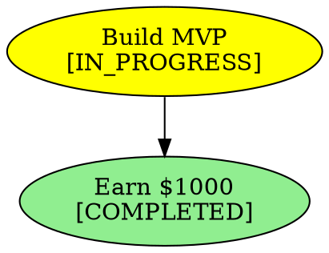

# Multi-Goal DAG Orchestration - Implementation Summary

## Overview

This implementation provides Python patterns for multi-goal orchestration in Kurultai's Task Dependency Engine. The solution addresses:

1. **Goal vs Task Classes**: Hierarchical design with proper inheritance
2. **Relationship Types**: Semantic edges (ENABLES, SYNERGISTIC, CONFLICTS_WITH, etc.)
3. **Detection Algorithm**: Hybrid rule-based + LLM relationship detection
4. **Graph Execution**: NetworkX-based execution with parallelization
5. **State Management**: Progress aggregation and persistent tracking

---

## File Structure

```
tools/
├── multi_goal_orchestration.py      # Main implementation (~1000 LOC)
├── test_multi_goal_orchestration.py # Comprehensive tests
└── MULTI_GOAL_PATTERNS.md           # Detailed patterns documentation
```

---

## Quick Start

### Basic Usage

```python
from multi_goal_orchestration import (
    GoalOrchestrator,
    RelationshipType,
    Priority
)

# Create orchestrator
orchestrator = GoalOrchestrator("my_project")

# Add goals
revenue = orchestrator.add_goal(
    title="Earn $1000 MRR",
    description="Generate recurring revenue",
    success_criteria=["Launch product", "Get 10 customers"],
    priority=Priority.HIGH
)

# Add tasks
mvp = orchestrator.add_task(
    title="Build MVP",
    task_type="code",
    priority=Priority.HIGH
)

# Create relationships
orchestrator.decompose(revenue.id, task_ids=[mvp.id])
orchestrator.relate(mvp.id, revenue.id, RelationshipType.ENABLES)

# Execute
await orchestrator.execute(max_parallel=2)
```

### Auto-Detecting Relationships

```python
# Auto-detect relationship between two goals
goal1 = orchestrator.add_goal("Fix authentication bug")
goal2 = orchestrator.add_goal("Write API docs")

# Automatically determines relationship type
relationship = orchestrator.auto_relate(goal1, goal2)
# Returns: RelationshipType.INDEPENDENT
```

---

## Key Design Patterns

### 1. Class Hierarchy

```
BaseNode (abstract)
    ├── TaskNode      # Atomic executable units
    └── GoalNode      # High-level objectives
```

- **BaseNode**: Common properties (id, title, status, priority)
- **TaskNode**: Binary progress (0% or 100%)
- **GoalNode**: Aggregating progress from children

### 2. Relationship Types

| Type | Direction | Meaning |
|------|-----------|---------|
| `ENABLES` | A -> B | A must complete before B starts |
| `SUBGOAL_OF` | A -> B | A is a component of B |
| `SYNERGISTIC` | A <-> B | Should be merged into unified plan |
| `CONFLICTS_WITH` | A <-> B | Cannot both execute (mutual exclusion) |
| `REINFORCES` | A <-> B | Better when executed together |
| `INDEPENDENT` | A, B | No coordination needed |

### 3. Fluent Edge API

```python
from multi_goal_orchestration import edge

# Readable relationship creation
edge(goal_a, goal_b).enables()
edge(goal_a, goal_b).synergistic(strategy="merge")
edge(goal_a, goal_b).conflicts()
edge(goal_a, goal_b).reinforces(boost_factor=1.5)

# With chaining
edge(goal_a, goal_b) \
    .synergistic() \
    .with_weight(2.0) \
    .with_metadata(confidence=0.9) \
    .build()
```

---

## Detection Strategies

### Keyword-Based (Fastest)

```python
from multi_goal_orchestration import RelationshipDetection

detector = RelationshipDetection()

# Detects based on keyword patterns
relationship = detector.detect(goal1, goal2)
# Speed: ~1ms, Accuracy: 60-70%, Cost: Free
```

### Embedding-Based (Balanced)

```python
from multi_goal_orchestration import EmbeddingSimilarity

detector = RelationshipDetection(
    similarity_metric=EmbeddingSimilarity()
)

# Uses sentence transformers for semantic similarity
# Speed: ~50ms, Accuracy: 75-85%, Cost: Free (local)
```

### LLM-Based (Most Accurate)

```python
from multi_goal_orchestration import LLMRelationshipDetector

detector = LLMRelationshipDetector(
    api_key="sk-ant-...",
    model="claude-3-haiku-20240307"
)

relationship = await detector.detect(goal1, goal2)
# Speed: ~1000ms, Accuracy: 90-95%, Cost: ~$0.001/call
```

---

## Graph Execution

### Topological Execution

```python
from multi_goal_orchestration import TopologicalExecutor

executor = TopologicalExecutor()
orchestrator.executor = executor

# Executes level-by-level:
# Level 0: [A, B]  (no dependencies)
# Level 1: [C]      (depends on A)
# Level 2: [D]      (depends on C)
await orchestrator.execute(max_parallel=4)
```

### Synergy-Aware Execution

```python
from multi_goal_orchestration import SynergyExecutor

executor = SynergyExecutor()
orchestrator.executor = executor

# Merges synergistic goals before execution
await orchestrator.execute()
```

---

## Integration with Existing Code

### With DelegationProtocol

```python
from tools.delegation_protocol import DelegationProtocol
from multi_goal_orchestration import TopologicalExecutor, TaskNode

async def execute_with_delegation(task: TaskNode):
    """Execute task via delegation protocol."""
    result = protocol.delegate_task(
        task_description=task.title,
        context={"task_id": task.id},
        priority=task.priority.name.lower()
    )
    return result

executor = TopologicalExecutor(executor=execute_with_delegation)
```

### With Neo4j

```python
from openclaw_memory import OperationalMemory

# Create goal in Neo4j
memory.create_goal(goal)

# Update progress
memory.update_goal_progress(goal.id, goal.progress_fraction())

# Query by status
pending = memory.get_goals_by_status("pending")
```

---

## State Management

### Progress Calculation

```python
# Goal progress aggregates from children
goal = GoalNode(
    title="Parent Goal",
    contributing_tasks=["task1", "task2"],
    contributing_subgoals=["subgoal1"]
)

progress = goal.progress_fraction()
# Returns weighted average of:
# - Completed tasks / total tasks
# - Subgoal progress values
```

### Status Tracking

```python
# Get overall status
status = orchestrator.get_status()
# {
#     "goals": {"total": 5, "pending": 2, "completed": 3},
#     "tasks": {"total": 15, "pending": 5, "completed": 10},
#     "execution_order": [...],
#     "ready_nodes": [...]
# }

# Get progress for specific goal
progress = orchestrator.get_progress(goal_id)
# {"goal-123": 0.6}  # 60% complete
```

---

## Visualization

```python
# Generate DOT format for Graphviz
dot = orchestrator.visualize("output.dot")
# Can be rendered with: dot -Tpng output.dot -o output.png
```

Example output:


---

## Testing

```bash
# Run tests
pytest tools/test_multi_goal_orchestration.py -v

# Run with coverage
pytest tools/test_multi_goal_orchestration.py --cov=tools.multi_goal_orchestration

# Run specific test
pytest tools/test_multi_goal_orchestration.py::TestGoalOrchestrator::test_add_goal -v
```

---

## Performance Considerations

| Operation | Complexity | Notes |
|-----------|------------|-------|
| Add node | O(1) | Direct insertion |
| Add edge | O(1) | Direct insertion |
| Validate DAG | O(V + E) | Cycle detection via DFS |
| Execution order | O(V + E) | Topological sort |
| Progress calc | O(depth) | Recursive for nested goals |
| Keyword detect | O(1) | String matching |
| LLM detect | O(1)* | *External API call |

### Optimization Tips

1. **Cache progress**: Store computed progress, invalidate on changes
2. **Batch detection**: Detect all relationships in one LLM call
3. **Async execution**: Use `max_parallel` for concurrent task execution
4. **Pre-filter**: Use keyword detection before LLM calls

---

## Example Scenarios

### Scenario 1: Independent Goals (Parallel)

```python
orchestrator = GoalOrchestrator("independent")

fix_bug = orchestrator.add_goal("Fix authentication bug")
write_docs = orchestrator.add_goal("Write API documentation")

# Auto-detected as INDEPENDENT
orchestrator.auto_relate(fix_bug, write_docs)

# Both execute in parallel
await orchestrator.execute(max_parallel=2)
```

### Scenario 2: Sequential Goals

```python
orchestrator = GoalOrchestrator("sequential")

research = orchestrator.add_goal("Market research")
prototype = orchestrator.add_goal("Build prototype")
launch = orchestrator.add_goal("Launch product")

orchestrator.relate(research.id, prototype.id, RelationshipType.ENABLES)
orchestrator.relate(prototype.id, launch.id, RelationshipType.ENABLES)

# Executes in order: research -> prototype -> launch
await orchestrator.execute()
```

### Scenario 3: Synergistic Goals

```python
orchestrator = GoalOrchestrator("synergy")

revenue = orchestrator.add_goal("Earn $1000 MRR")
community = orchestrator.add_goal("Build community")

orchestrator.relate(
    revenue.id,
    community.id,
    RelationshipType.SYNERGISTIC
)

# Merges into unified strategy
orchestrator.executor = SynergyExecutor()
await orchestrator.execute()
```

---

## Dependencies

```
networkx      >= 3.0    # Graph operations
pydantic      >= 2.0    # Serialization
sentence-transformers (optional)  # Semantic similarity
anthropic     (optional) # LLM-based detection
pytest        >= 7.0     # Testing
pytest-asyncio >= 0.21  # Async test support
```

Install:
```bash
pip install networkx pydantic pytest pytest-asyncio
pip install sentence-transformers  # Optional, for semantic similarity
```

---

## Next Steps

1. **Neo4j Integration**: Persist graph structure in OperationalMemory
2. **Webhook Support**: Notify on goal completion
3. **UI Visualization**: Integrate with steppe-visualization
4. **Retry Logic**: Handle transient failures
5. **Rollback**: Revert failed executions

---

## API Reference

### GoalOrchestrator

| Method | Description |
|--------|-------------|
| `add_goal(title, ...)` | Create a new goal |
| `add_task(title, ...)` | Create a new task |
| `relate(source, target, type)` | Create relationship |
| `auto_relate(goal1, goal2)` | Auto-detect relationship |
| `decompose(goal_id, ...)` | Decompose goal into tasks/subgoals |
| `execute(max_parallel)` | Execute the DAG |
| `get_progress(goal_id)` | Get progress for goal(s) |
| `get_status()` | Get overall status |
| `visualize(path)` | Generate DOT visualization |
| `to_dict()` | Serialize to dictionary |

### MultiGoalDAG

| Method | Description |
|--------|-------------|
| `add_node(node)` | Add node to graph |
| `add_edge(edge)` | Add edge to graph |
| `get_node(id)` | Get node by ID |
| `validate()` | Check for cycles |
| `execution_order()` | Get topological order |
| `get_ready_nodes()` | Get executable nodes |
| `detect_cycles()` | Find all cycles |

---

## License

Part of the Molt/Kublai project. See main project LICENSE.
