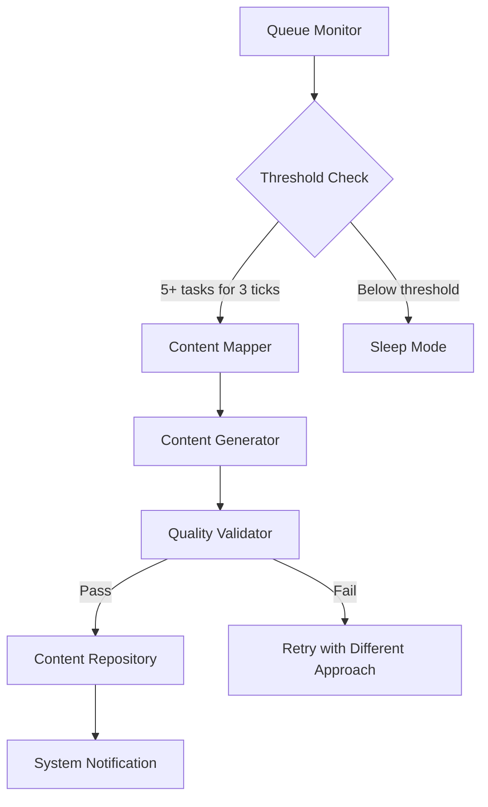

# Chagatai Activation System Design

## Overview

Chagatai Activation System (CAS) - A conservative proactive monitoring system that detects queue depth imbalances and activates content creation capabilities to reduce system backlog.

## Architecture



## Components

### 1. Queue Monitor
**Responsibilities:**
- Polls all agent queue depths every 5 minutes
- Tracks trends over 3 consecutive measurement cycles
- Identifies agents with backlog exceeding 5 tasks

**Implementation:**
```python
def monitor_queues():
    agents = ['jochi', 'ogedei', 'temujin', 'mongke']
    queue_depths = get_queue_depths(agents)

    # Check for sustained backlog
    overloaded_agents = []
    for agent, depth in queue_depths.items():
        if depth >= 5 and agent in overloaded_agents:
            overloaded_agents.append(agent)

    return len(overloaded_agents) >= 1  # Activation trigger
```

### 2. Content Mapper
**Responsibilities:**
- Identifies documentation gaps based on system state
- Maps content types to specific needs
- Prioritizes content based on urgency and impact

**Content Types:**
- **API Documentation**: For new endpoints and changes
- **Tutorial Guides**: For complex features requiring explanation
- **Troubleshooting**: For common error patterns
- **System Overviews**: For architectural changes

### 3. Content Generator
**Responsibilities:**
- Uses pre-defined templates for consistent quality
- Generates content based on mapped needs
- Maintains brand voice and style consistency

**Template Structure:**
```markdown
# [Document Type]: [Title]

## Overview
[Concise description]

## Key Concepts
- Concept 1: [Explanation]
- Concept 2: [Explanation]

## Examples
[Practical examples]

## Common Issues
[Typical problems and solutions]
```

### 4. Quality Validator
**Responsibilities:**
- Validates content completeness and accuracy
- Checks for consistency with existing documentation
- Ensures technical correctness

**Validation Rules:**
- All sections present and filled
- Technical terms properly defined
- Code examples executable and tested
- References to other documents current

## Activation Protocol

### Trigger Conditions
1. **Queue Depth**: Any agent has 5+ tasks for 3 consecutive ticks
2. **Timing**: Only during peak hours (8:00-17:00 local time)
3. **Cooldown**: 30-minute minimum between activations
4. **Capacity**: Chagatai must be idle (0 running tasks)

### Safety Safeguards
- **Rate Limiting**: Maximum 2 activations per hour
- **Content Limits**: Maximum 3 content pieces per activation
- **Quality Gates**: Content must pass validation before deployment
- **Rollback Capability**: All content reversible within 24 hours

## Implementation Plan

### Phase 1: Core Monitoring (Week 1)
- Implement queue depth polling
- Set up activation threshold logic
- Create basic notification system

### Phase 2: Content Mapping (Week 2)
- Develop content type classification
- Build gap detection algorithms
- Create priority scoring system

### Phase 3: Content Generation (Week 3)
- Develop template library
- Implement content generation logic
- Set up quality validation

### Phase 4: Integration Testing (Week 4)
- Test with simulated backlog scenarios
- Monitor system stability
- Tune thresholds and parameters

## Success Metrics

### Primary Metrics
- **Throughput**: Chagatai tasks completed per hour (target: 5-10)
- **Reduction**: Average queue depth reduction (target: 20%)
- **Quality**: Content pass rate on first validation (target: 80%+)
- **Stability**: System error rate during operation (target: <1%)

### Secondary Metrics
- **Activation Frequency**: Times per hour system activates
- **Content Volume**: Documents produced per activation
- **Queue Balance**: Standard deviation of agent queue depths
- **Response Time**: Time from detection to content completion

## Risk Mitigation

### High-Risk Scenarios
1. **False Positives**
   - Mitigation: Require 3 consecutive ticks above threshold
   - Monitoring: Track activation frequency and abort if excessive

2. **Resource Exhaustion**
   - Mitigation: Rate limiting and cooldown periods
   - Monitoring: Track memory and CPU usage during activations

3. **Quality Degradation**
   - Mitigation: Mandatory validation before deployment
   - Monitoring: Track validation failure rates and refine templates

### Monitoring Dashboard
Key metrics to track in real-time:
- Queue depths across all agents
- Activation events and timing
- Content generation volume and quality
- System resource utilization

## Future Enhancements

### Phase 2: Machine Learning Optimization
- Predictive queue depth forecasting
- Dynamic threshold adjustment
- Content type optimization based on demand

### Phase 3: Cross-Agent Coordination
- Collaborative task redistribution
- Shared workload management
- Predictive resource allocation

### Phase 4: Advanced Content Management
- Automated content lifecycle management
- Intelligent content pruning and updates
- Personalized content delivery based on user needs