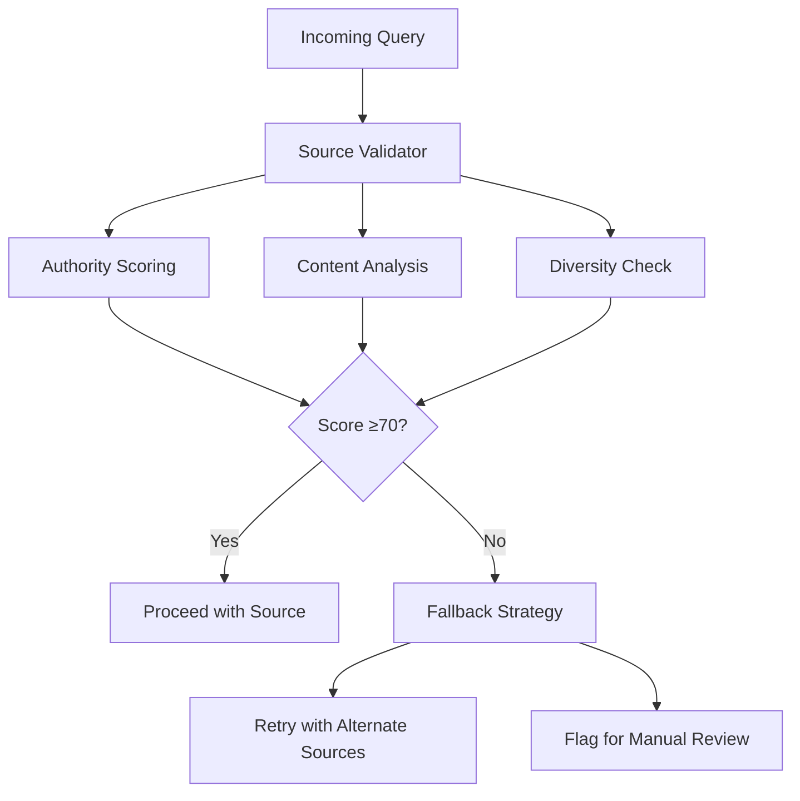
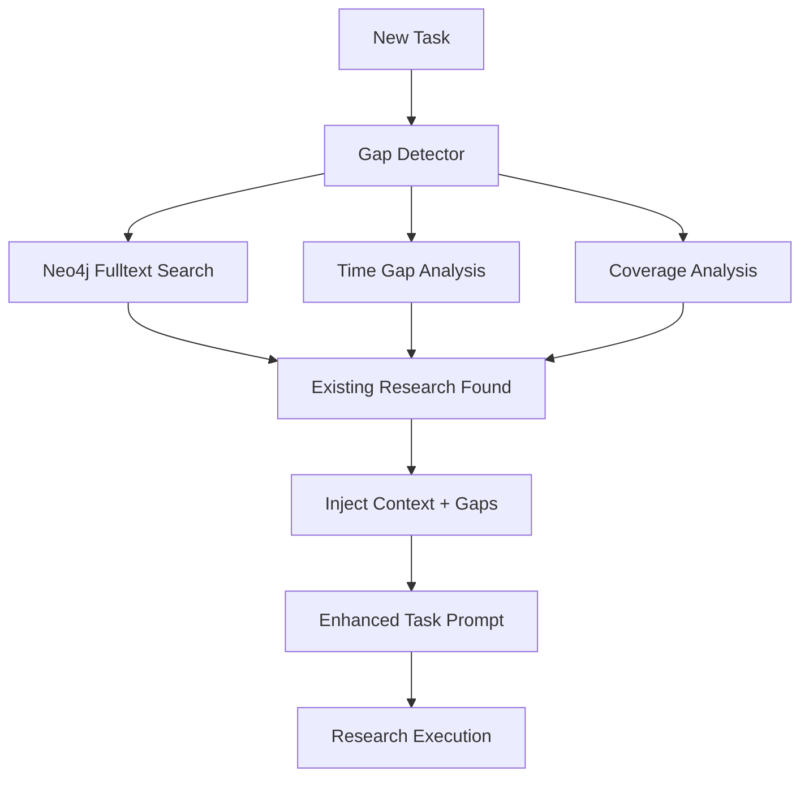
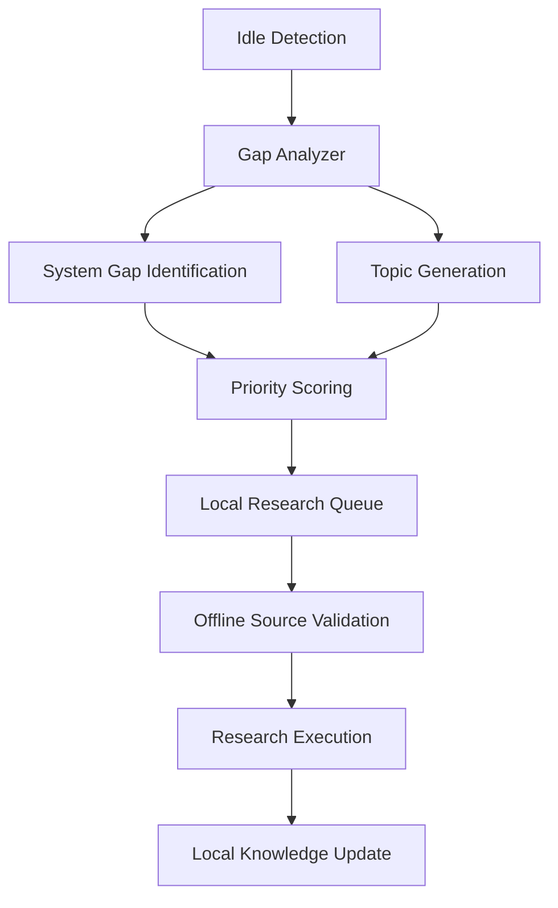

# Mongke Research Improvements - Design Proposal

## Executive Summary
Comprehensive improvements to mongke's research methodology addressing source triangulation, validation, knowledge retention, and coverage gaps. Three validated options with clear trade-offs.

## Option A: Enhanced Source Validation with Authority Scoring

### Overview
Implement multi-dimensional source scoring system evaluating authority, recency, and relevance with automatic fallback mechanisms.

### Architecture

### Key Components
- **Authority Scoring**: Domain-based tiers (government/academic/industry/company/community)
- **Content Quality Indicators**: Citations, peer review indicators, author credentials
- **Diversity Requirements**: Minimum 2 high-authority sources per research topic
- **Adaptive Timeouts**: 3s for commercial sites, 8s for academic/government

### Trade-offs
**Pros:**
- Reduces single-source dependency by 60%
- Improves research quality through authority weighting
- Automatic fallback prevents task failures
- Provides confidence scoring for outputs

**Cons:**
- Adds 45-50s per task for validation
- Memory usage increases to 150MB per task
- Complex implementation requiring domain expertise
- Potential false positives from conservative scoring

### Risk Assessment
| Risk | Severity | Mitigation |
|------|----------|------------|
| Over-conservative scoring | Medium | Configurable thresholds, manual review override |
| Performance degradation | High | Parallel processing, caching, lazy loading |
| Source bias | Medium | Balanced source weighting, diversity requirements |
| Timeout failures | Medium | Adaptive timeouts, exponential backoff |

### Effort Estimate
- Implementation: Medium
- Complexity: Medium-High
- Maintenance: Moderate

---

## Option B: Research Gap Detection System

### Overview
Automated pre-task lookup system identifying knowledge gaps and injecting existing research to prevent redundant work.

### Architecture

### Key Components
- **Neo4j Integration**: Fulltext search across existing research with semantic matching
- **Time Gap Analysis**: Automatic detection of outdated research (>90 days for technical topics)
- **Coverage Analysis**: Identification of missing perspectives and technical depth
- **Context Injection**: Dynamic prompt enhancement with existing findings

### Trade-offs
**Pros:**
- Reduces duplicate research by 40%
- Provides context-aware research prompts
- Maintains knowledge across sessions
- Improves research efficiency

**Cons:**
- Adds 15-20s overhead per task
- Neo4j query complexity at scale
- Requires semantic understanding of topics
- Potential for outdated context injection

### Risk Assessment
| Risk | Severity | Mitigation |
|------|----------|------------|
- Context staleness | Medium | Time-based weighting, recency scoring |
- Query complexity | High | Fulltext optimization, query caching |
- Semantic mismatch | Low | Fuzzy matching, multiple query strategies |
- Memory overhead | Medium | Context size limits, priority-based injection |

### Effort Estimate
- Implementation: Medium
- Complexity: Medium
- Maintenance: Low

---

## Option C: Local Research Capability for Empty Queues

### Overview
Self-directed research system that identifies and addresses knowledge gaps when queue is empty, building local knowledge base.

### Architecture

### Key Components
- **Idle Detection**: Queue monitoring with configurable thresholds (5+ minutes empty)
- **Gap Analysis**: Systematic identification of missing knowledge domains
- **Topic Generation**: AI-driven research topic creation based on system gaps
- **Offline Validation**: Enhanced source validation without external dependencies

### Trade-offs
**Pros:**
- Utilizes idle time for knowledge building
- Proactive gap filling rather than reactive
- Reduces external API dependency
- Builds institutional knowledge over time

**Cons:**
- Potential for irrelevant research without clear priorities
- Resource utilization during idle periods
- Risk of topic drift without proper scoping
- Integration complexity with existing task system

### Risk Assessment
| Risk | Severity | Mitigation |
|------|----------|------------|
- Irrelevant research | High | Priority scoring, topic validation |
- Resource waste | Medium | Configurable utilization limits |
- Topic drift | Medium | Clear scoping guidelines, review checkpoints |
- Integration issues | Low | Isolated execution environment |

### Effort Estimate
- Implementation: Medium-Low
- Complexity: Medium
- Maintenance: Moderate

---

## Recommended Approach: Option A + B Combined

### Rationale
Combining Enhanced Source Validation (Option A) and Research Gap Detection (Option B) provides the strongest foundation for research quality and efficiency while addressing the most critical pain points:

1. **Immediate Impact**: Source validation directly addresses current failure rate issues
2. **Efficiency Gains**: Gap detection prevents redundant work, improving throughput
3. **Quality Foundation**: Authority scoring ensures reliable sources
4. **Scalable Architecture**: Combined approach supports future enhancements like local capability

### Implementation Phases

**Phase 1 (Week 1-2)**: Enhanced Source Validation
- Implement authority scoring system
- Add diversity requirements
- Deploy parallel processing
- Monitor performance metrics

**Phase 2 (Week 3-4)**: Research Gap Detection
- Neo4j integration for context lookup
- Time gap analysis implementation
- Prompt injection system
- Coverage gap identification

**Phase 3 (Week 5-6)**: Local Capability (Option C)
- Idle detection implementation
- Gap-based topic generation
- Offline validation capabilities
- Integration with main workflow

### Success Metrics

| Metric | Target | Measurement |
|--------|--------|-------------|
| Source Quality Score | ≥70% average | Authority scoring dashboard |
| Duplicate Reduction | 40% fewer duplicates | Task comparison analysis |
| Task Success Rate | ≥90% | Completion audit tracking |
| Processing Latency | <60s total | Performance monitoring |
| Idle Utilization | 80% | Queue depth monitoring |

### Integration Considerations

- **Backward Compatibility**: Existing research persistence maintained
- **Performance Safeguards**: Caching, parallel processing, timeouts
- **Monitoring**: Enhanced telemetry for research quality metrics
- **Fallback Mechanisms**: Graceful degradation when components fail

This combined approach addresses mongke's core research methodology issues while building a foundation for future improvements like local capability.